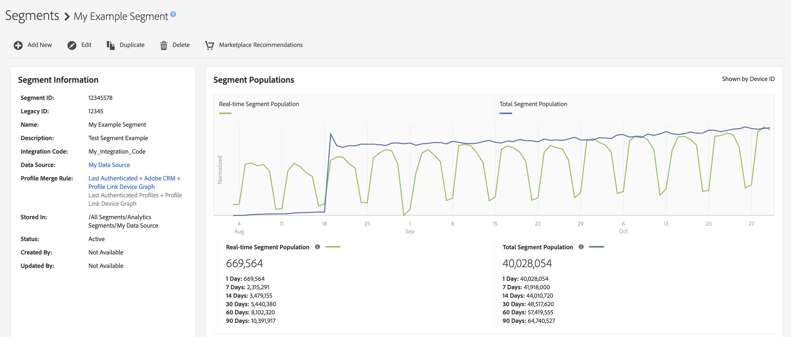
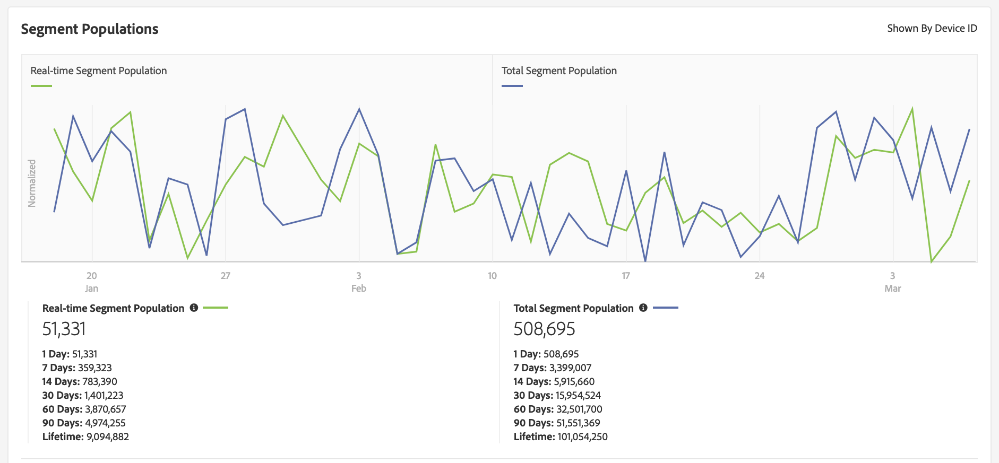
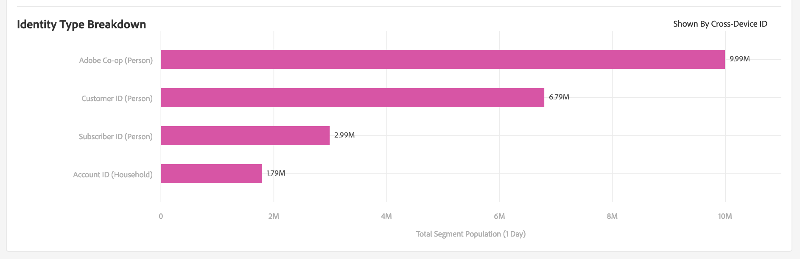

# Segment Details Page {#segment-summary-view}

The details page for an individual segment provides an overview of the segment details, such as the segment name, ID, performance metrics, rules that define the segment, and the destination mappings. To view these details, go to **[!UICONTROL Audience Data]** > **[!UICONTROL Segments]** and click the name of the segment you want to work with.

## Segment Management Tools {#segment-management-tools}

The top of the segment details page hosts the tools that you can use to manage your segments:

1. **[!UICONTROL Add New]**: Use this option to activate the [!UICONTROL Segment Builder] and create new segments.
2. **[!UICONTROL Edit]**: Use this option to change the configuration of the current segment.
3. **[!UICONTROL Duplicate]**: Use this option to create a copy of the current segment.
4. **[!UICONTROL Delete]**: Use this option to remove the current segment from your Audience Manager account.
5. **[!UICONTROL Marketplace Recommendations]**: Use this option find similar segments to the one you're viewing, from [!UICONTROL Audience Marketplace] data feeds that you are not subscribed to. See [Audience Marketplace for Data Buyers](../audience-marketplace/marketplace-data-buyers/marketplace-data-buyers.md) to learn how to navigate the Marketplace and find similar segments.

## Segment Information {#basics}

Below the segment management tools you can find the following segment information:

1. **[!UICONTROL Basic Information]:** Shows required and optional details specified when the segment was created. See [Segment Builder](segment-builder.md) for a detailed overview of what these fields mean.
2. **[!UICONTROL Segment Graph]:** Displays performance data graphically and for fixed 1, 7, 14, 30, 60, and 90 day intervals. We explain segment population numbers in a [separate article](../../features/segments/segment-builder-data.md).

    

3. **[!UICONTROL Identity Type Breakdown ]:** The report shows the number of people or households that qualify for a segment by counting the number of cross-device IDs and/or External Device Graph IDs that are linked to the devices that qualified for the segment (shown by the [!UICONTROL Total Segment Population]). The cross-device IDs and External Device Graph IDs shown in this report are used to merge profiles with the profile merge rule the segment is using. This report is displayed only if you selected a cross-device data source or an External Device Graph in the profile merge rule that the segment is using.

   

    >[!NOTE]
    >
    >Audience Manager only displays the [!UICONTROL Identity Type Breakdown] report if you have cross-device IDs qualified for the segment.

    Watch the video below for an overview of [!UICONTROL Identity Type Breakdown].
    >[!VIDEO](https://video.tv.adobe.com/v/27977/)

4. **[!UICONTROL Segment Rules]:** Lists traits in the segment along with qualification rules.
5. **[!UICONTROL Destination Mappings]:** Lists destination mappings for the segment.
6. **[!UICONTROL Management Tools]:** Controls that let you create, edit, clone, and delete segments.