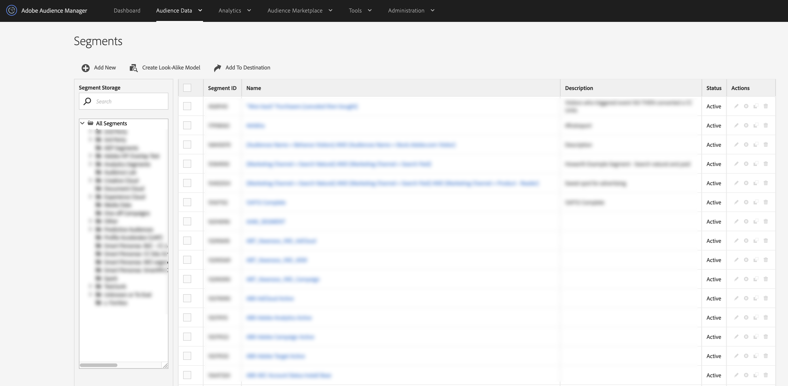

# Segments List View {#segments-list-view}

The [Segments dashboard](https://bank.demdex.com/portal/Segments/SegmentBuilder.ddx#list) is a centralized workspace for managing your audience segments. You can see the [!UICONTROL Segments] dashboard by navigating to **[!UICONTROL Audience Data]** > **[!UICONTROL Segments]**.

The [!UICONTROL Segments] page contains features and tools which help you:

* Create new segments;
* Edit and delete segments;
* Clone (duplicate) existing segments;
* See all your segments in a table with sortable columns;
* Manage segment storage;
* Search for segments by name.
