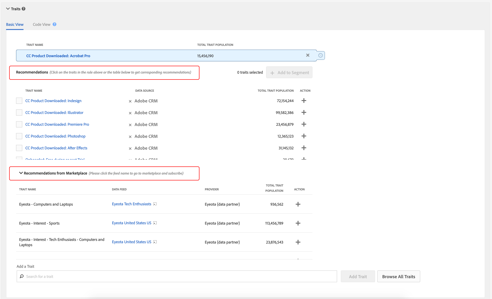
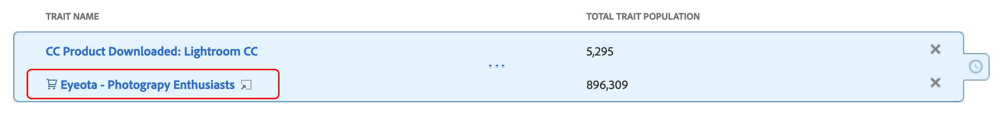
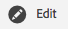
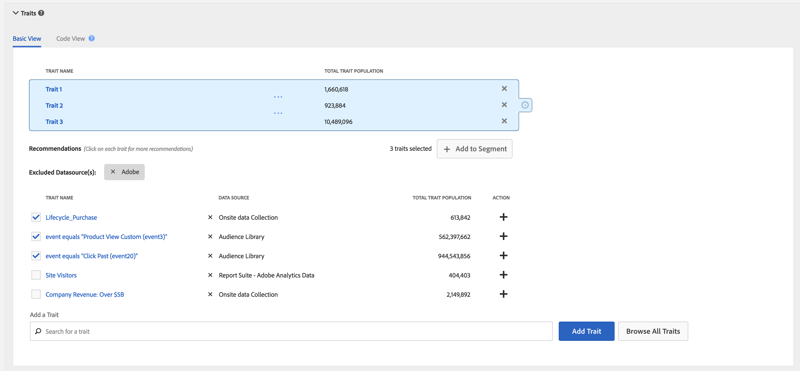
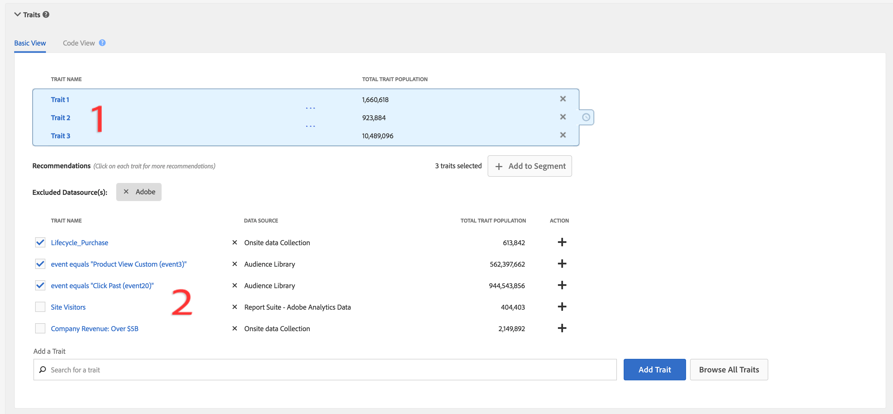
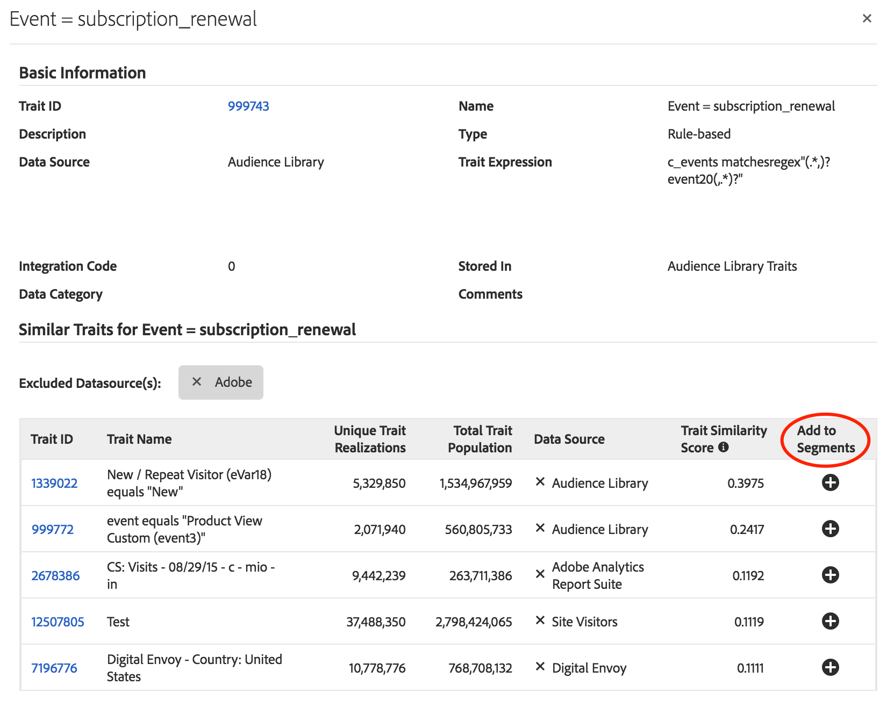
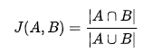
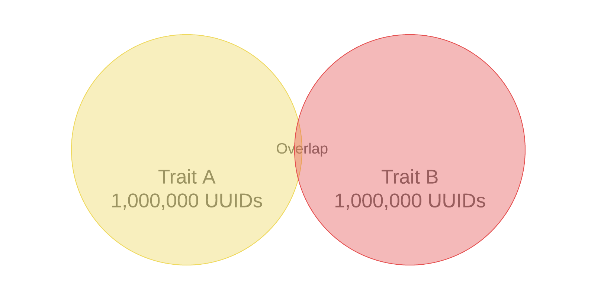
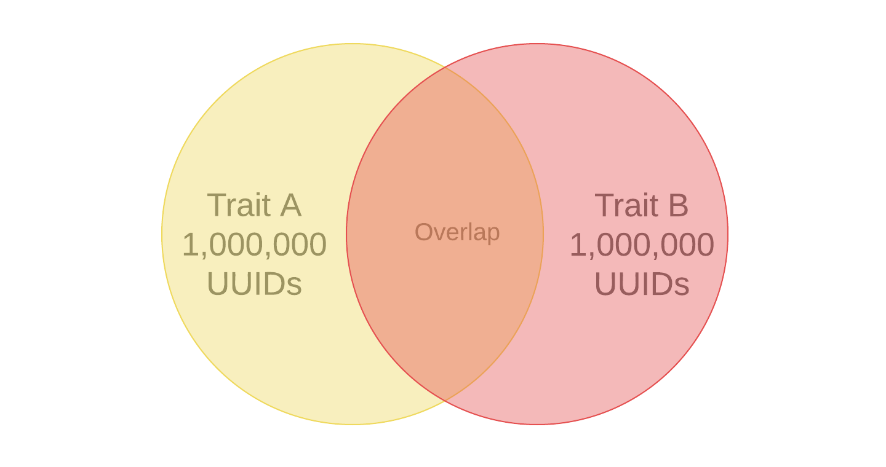

# Trait Recommendations

Get live trait recommendations as you build your segments, from your own first-party traits, and [!UICONTROL Audience Marketplace] data feeds.

## Video Demonstration

Start by watching the [!UICONTROL Trait Recommendations] video below, then read on for more information. The video demonstration shows you how to work with recommendations from your own first-party traits, as well as trait recommendations from [!UICONTROL Audience Marketplace] data feeds that *you are already subscribed to*.

>[!VIDEO](https://video.tv.adobe.com/v/26228/)

The next video outlines the workflow for [!UICONTROL Marketplace Recommendations], showing you how to add traits to your segments, based on recommendations from data feeds in [!UICONTROL Audience Marketplace]. These recommendations are based on data feeds that *you are not subscribed to*.

>[!VIDEO](https://video.tv.adobe.com/v/29363/)

## Overview

[!UICONTROL Trait Recommendations], powered by [!DNL Adobe Sensei], brings data science into your Audience Manager day-to-day workflows.
With [!UICONTROL Trait Recommendations], when you build or edit a segment in [Segment Builder](segment-builder.md), you get recommendations on additional traits you can include, that are similar to the traits in the segment rule.

Audience Manager shows you trait recommendations both from your first-party traits, in the **[!UICONTROL Recommendations]** section, and from **[!UICONTROL Audience Marketplace]**, in the **[!UICONTROL Recommendations from Marketplace]** section.

Add the recommended traits to your segment to increase your target audience.

**In a nutshell:**

* Audience Manager shows first party traits in the [!UICONTROL Recommendations] section. Marketplace recommendations from public and private feeds that you are not subscribed to are visible in the [!UICONTROL Recommendations from Marketplace] section. Click the feed name to go to [!UICONTROL Audience Marketplace] and subscribe.
* Audience Manager shows a maximum of fifty traits similar to the one in the segment rule.
* You can filter out the data sources from which you don't want to see any recommendations.
* When calculating similarities, Audience Manager considers [UUIDs](../../reference/ids-in-aam.md) that qualified for the trait during the last 30 days.
* If you see the error message "No similar traits found. Trait(s) may be too new.", this means that either there was no activity for that trait in the last 30 days, or Audience Manager has not yet updated the recommendations for that trait. Please try again in 24 hours.

## Use Cases

With [!UICONTROL Trait Recommendations], you can improve your workflows, depending on how you use Audience Manager:

* As a marketer, you can quickly find audiences interested in complementary products with the help of similar traits, so that you can increase your reach.
* If you use Audience Manager as a publisher, with [!UICONTROL Trait Recommendations], you can understand audience behavior and build better segments for ad sales or user acquisition.
* As an [!UICONTROL Audience Marketplace] data buyer, I want to discover relevant third-party data without browsing through a large number of feeds.
* As an [!UICONTROL Audience Marketplace] data provider, I want to recommend relevant data to buyers so that I can benefit from optimal and relevant subscriptions.

## Differences Between Trait Recommendations and Algorithmic Models

### Algorithmic Models

[!UICONTROL Algorithmic Models] not only finds the most influential traits, but also scores users based on those traits and assigns each user an individual score. You then create algorithmic traits to target your users. With accuracy and reach controls in the [!UICONTROL Trait Builder], you can specify which users amongst all those who have the influential traits you want to target.

[!UICONTROL Algorithmic Models] enables you to select users at different accuracy levels and test in [!UICONTROL Audience Lab] which group of users converts better. See the detailed use case in [Compare Models in Audience Lab](../../features/audience-lab/audience-lab-use-cases.md#compare-models).

In [!UICONTROL Algorithmic Models], the model runs every 8 days and refreshes the users qualified for algorithmic traits.

### Trait Recommendations

[!UICONTROL Trait Recommendations] is a quick way to get insights on other traits which are similar to the ones you are using in a segment.

You should use [!UICONTROL Trait Recommendations] when:

* You need quick insights while building a segment;
* You are using the segments for short campaigns or when you want to quickly suppress audience who converts;
* You are trying to maximize reach.

## Workflow

When building or editing a segment in [Segment Builder](segment-builder.md), you can explore traits similar to the traits in the segment rule. The [Segment Builder](segment-builder.md) workflow is very similar for new and existing segments:

### New Segments

1. Go to **Audience Data > Segments**, and click **Add New**.
1. In the **Traits** drop-down box, add at least one trait to the segment rule.
1. You can see first-party recommended traits and [!UICONTROL Audience Marketplace] trait recommendations from feeds that you are subscribed to, in the **[!UICONTROL Recommendations]** section. The **[!UICONTROL Recommendations from Marketplace]** section shows you trait recommendations from feeds that you are not subscribed to. All of these recommendations are similar to the traits you added to the segment rule. Scroll down to see all recommended traits.
1. (Optional) To exclude recommended first-party traits from certain data sources, click the **X** symbol for the data sources you want to exclude.

    >[!NOTE]
    >
    >The excluded data sources are shown just above the list of recommended traits. Click **X** in the grey box to remove the exclusions and see results from the respective data sources again.
1. To add recommended traits to the segment rule, click the **+** symbol.

>[!IMPORTANT]
>
>When adding [!UICONTROL Marketplace] traits to a segment, the traits are only used for segment estimation, until you subscribe to the corresponding data feed. Traits that come from data feeds that you are not subscribed to are marked with a shopping cart icon in the trait list. Click the trait name to go to the data feed page and subscribe to it.
>
>
>
>You can save a segment with third party traits only after you susbcribe to the corresponding data feeds.

### Existing Segments

1. Go to **[!UICONTROL Audience Data] > [!UICONTROL Segments]**, select the segment you want to edit and click .
1. Scroll down to the [!UICONTROL Traits] drop-down box.
1. You can see recommended traits, that are similar to the traits already in the segment rule. Scroll down to see all recommended traits.
1. (Optional) To exclude recommended traits from certain data sources, click the **X** symbol for the data sources you want to exclude.

   >[!NOTE]
   >
   >The excluded data sources are shown just above the list of recommended traits. Click **X** in the grey box to remove the exclusions and see results from the respective data sources again.
1. To add recommended traits to the segment rule, click the **+** symbol.

When you create or edit a segment and add a trait to the segment rule, you see a maximum of fifty recommended traits, similar to the one you have added. If the segment rule contains more than one trait, Audience Manager uses a round robin method to show the best match for each trait, then the second-best match for each trait, and so on, for the largest fifty traits by population, in the segment rule.

For example, when there are three traits in the segment rule, as shown below, the recommended traits are:

1. Best match for trait 3 (the trait with the largest population);
1. Best match for trait 1;
1. Best match for trait 2;
1. Second-best match for trait 3;
1. Second-best match for trait 1, and so on until you get to fifty traits.

To get recommendations for a specific trait, you can click on the traits in the segment rule (1) or in the recommended traits view (2).

Clicking on a first-party trait opens a pop-up window, as shown in the image below. If the recommended traits are not part of the segment, you can add them to the segment by pressing **+**.

>[!TIP]
>
>The excluded data sources from the main page are considered while generating recommendations within the trait information pop-up window. And, if you exclude data sources in this view, the exclusions apply to the main page.

>[!NOTE]
>
>Recommended traits can be your first-party traits or third party traits from data feeds that you are subscribed to in [!UICONTROL Audience Marketplace].

## How it Works

To produce trait recommendations, Audience Manager computes the [Jaccard similarity](https://en.wikipedia.org/wiki/Jaccard_index) between the target trait and every other trait that your account has access to, including third-party data. Audience Manager then displays up to fifty traits that have the highest similarity.

## Trait Similarity Score {#trait-similarity-score}

Audience Manager calculate the [!UICONTROL Trait Similarity Score] between two traits by computing the intersection and union in terms of the number of [!UICONTROL UUID]s and then divide the two. For two traits A and B, the calculation looks like this:

See, also, the two examples below.

### Example 1 - Low Trait Similarity Score

Given two traits A and B, let's say each of the traits has a population of 1,000,000 [!UICONTROL UUID]s, 25,000 [!UICONTROL UUID]s of which qualify for both traits.
Using the formula above, this will result in: 25,000 / 1,975,000 = 0.012. This is a low [!UICONTROL Trait Similarity Score], the two traits are very dissimilar.

### Example 2 - Trait Similarity Score

If the same traits A and B had 400,000 [!UICONTROL UUID]s that qualify for both traits, the [!UICONTROL Trait Similarity Score] is much higher:
400,000 / 1,600,000 = 0.25

### How to Interpret the Trait Similarity Score

Use the table below as a rough guide to trait similarity. This guide is based on the similarity scores observed across a majority of the traits.

| [!UICONTROL Trait Similarity Score] | Significance |
---------|----------|
 0.1 and above | High similarity between traits |
 0.03 - 0.1 | Medium similarity between traits |
 0.01 - 0.03 | Low similarity between traits |
 0 - 0.01 | Very low similarity between traits |

## Role-Based Access Control ( RBAC)

For companies using [!UICONTROL Role-Based Access Controls] ([!UICONTROL RBAC]), you need to have permission to create and edit segments in order to see recommended traits. The trait recommendations that you see are only the ones from data sources that you have access to via [!UICONTROL RBAC].

>[!IMPORTANT]
>
>To add [!UICONTROL Marketplace Recommendations] to a segment, users must first subscribe to the corresponding data feeds. Only users with administrator privileges can subscribe to [!UICONTROL Audience Marketplace] data feeds.

Read more about [!UICONTROL RBAC] controls [here](../administration/administration-overview.md).

## Limitations

* Currently, Audience Manager does not show folder traits as recommended traits. Read more about folder traits [here](../traits/manage-folder-traits.md).
* When displaying Trait Recommendations, Audience Manager does not take into account [!DNL Boolean] operators ([!DNL AND], [!DNL OR], [!DNL NOT]) in segment rules.
