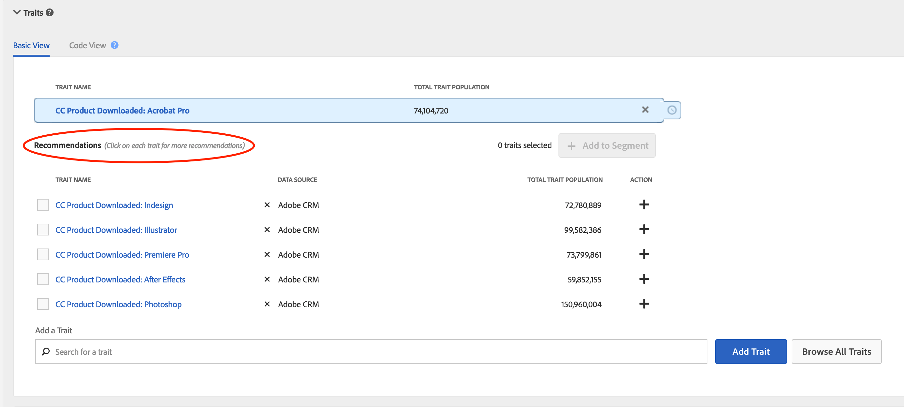

# Trait Recommendations

Get live trait recommendations as you build your segments.

## Overview

Trait Recommendations, powered by Adobe Sensei, brings data science into your Audience Manager day-to-day workflows.
With Trait Recommendations, when you build or edit a segment in [Segment Builder](segment-builder.md), you get recommendations on additional traits you can include, that are similar to the traits in the segment rule. Add the recommended traits to your segment to increase your target audience.

**In a nutshell:**

* Audience Manager shows first party traits and third party traits from your currently subscribed data feeds as recommended traits.
* Audience Manager shows a maximum of five traits similar to the one in the segment rule.
* You can filter out the data sources from which you don't want to see any recommendations.
* When calculating similarities, Audience Manager considers [UUIDs](../../reference/ids-in-aam.md) that qualified for the trait during the last 30 days.
* If you see the error message "No similar traits found. Trait(s) may be too new.", this means that either there was no activity for that trait in the last 30 days, or Audience Manager has not yet updated the recommendations for that trait. Please try again in 24 hours.

## Workflow

When building or editing a segment in [Segment Builder](segment-builder.md), you can explore traits similar to the traits in the segment rule. The Segment builder workflow is very similar for new and existing segments:

### New Segments

1. In **Audience Data > Segments**, select **Add New**.
2. In the **Traits** drop-down box, add at least one trait to the segment rule.
3. You can now see recommended traits that are similar to the traits you added to the segment rule.
4. (Optional) To exclude recommended traits from certain data sources, click the **X** symbol for the data sources you want to exclude.

> [!NOTE]
> 
>The excluded data sources are shown just above the list of recommended traits. Press **X** in the grey box to remove the exclusions and see results from the respective data sources again.

5. To add recommended traits to the segment rule, click the **+** symbol.

### Existing Segments

1. In Audience Data > Segments, select the segment you want to edit and press .
2. Scroll down to the Traits drop-down box.
3. You can see recommended traits, that are similar to the traits already in the segment rule.
4. (Optional) To exclude recommended traits from certain data sources, click the **X** symbol for the data sources you want to exclude.

> [!NOTE]
> 
>The excluded data sources are shown just above the list of recommended traits. Press **X** in the grey box to remove the exclusions and see results from the respective data sources again.

5. To add recommended traits to the segment rule, click the **+** symbol.

When you create or edit a segment and add a trait to the segment rule, you see a maximum of five recommended traits, similar to the one you have added. If the segment rule contains more than one trait, we use a round robin method to show the best match for each trait, then the second-best match for each trait, and so on, for the largest five traits by population, in the segment rule.

For example, when there are three traits in the segment rule, as shown below, the recommended traits are:

1. Best match for trait 3 (the trait with the largest population);
2. Best match for trait 1;
3. Best match for trait 2;
4. Second-best match for trait 3;
5. Second-best match for trait 1.

To get recommendations for a specific trait, you can click on the traits in the segment rule (1) or in the recommended traits view (2).

If the recommended traits are not part of the segment, you can add them to the segment by pressing **+**.

> [!TIP]
> 
>The excluded data sources from the main page are considered while generating recommendations within the trait information pop-up window. And, if you exclude data sources in this view, the exclusions apply to the main page.

 &nbsp;

> [!NOTE]
> 
> Recommended traits can be your first-party traits or third party traits from feeds that you are subscribed to.

## How it Works

To produce trait recommendations, we compute the [Jaccard similarity](https://en.wikipedia.org/wiki/Jaccard_index) between the target trait and every other trait that your account has access to, including third-party data. We then display up to five traits that have the highest similarity. 

## Trait Similarity Score

We calculate the Trait Similarity Score between two traits by computing the intersection and union in terms of the number of UUIDs and then divide the two. For two traits A and B, the calculation looks like this:

See, also, the two examples below.

**Example 1 - Low Trait Similarity Score**

Given two traits A and B, let's say each of the traits has a population of 1,000,000 UUIDs, 25,000 UUIDs of which qualify for both traits.
Using the formula above, we'll have: 25,000 / 1,975,000 = 0.012. This is a low Trait Similarity Score, the two traits are very dissimilar.

**Example 2 - High Trait Similarity Score** 

If the same traits A and B had 400,000 UUIDs that qualify for both traits, the Trait Similarity Score is much higher:
400,000 / 1,600,000 = 0.25

**How to Interpret the Trait Similarity Score**

Use the table below as a rough guide to trait similarity. This guide is based on the similarity scores we have observed across a majority of the traits.

Trait Similarity Score | Significance |
---------|----------|
 0.1 and above | High similarity between traits |
 0.03 - 0.1 | Medium similarity between traits |
 0.01 - 0.03 | Low similarity between traits |
 0 - 0.01 | Very low similarity between traits |

## Role-Based Access Control (RBAC) 

For companies using Role-Based Access Controls (RBAC), you need to have permission to create and edit segments in order to see recommended traits. And, the recommended traits you see are only the ones from data sources that you have access to via RBAC. Read more about RBAC controls [here](../administration/administration-overview.md).

## Limitations

* Currently, Audience Manager does not show folder traits as recommended traits. Read more about folder traits [here](../traits/manage-folder-traits.md).
* When displaying Trait Recommendations, Audience Manager does not take into account Boolean operators (AND, OR, NOT) in segment rules.