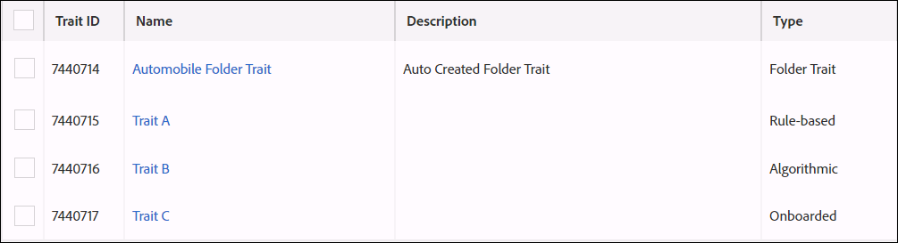

# Folder Traits: About {#folder-traits-about}

[!UICONTROL Folder traits] let you automatically aggregate traits that reside within the same folder and all child folders into a targetable segment.

## Benefits of Using Folder Traits {#section_1CF315E0BC734FD69B0725F2ADBA1B1B}

A [!UICONTROL folder trait] contains all the traits in a parent folder and its associated child folders. This lets you automatically segment and target your users at different folder levels. For example, let's say you have a folder structure like this:

* Electronics (parent)
    * Laptops (child)
        * Brands (grandchild)

[!UICONTROL Folder traits] qualify all the users in these folders in an automatically created [!DNL Electronics] [!UICONTROL Folder Trait] (based on the name of the parent folder). And, this process repeats itself as you move down the file structure. In this case, folder traits capture all of the users in the Laptops and Brands folders in an automatically created Laptops [!UICONTROL Folder Trait].

[!UICONTROL Folder traits] are selectable in segment expressions. Selecting a [!UICONTROL folder trait] is equivalent to selecting all the traits within that folder and its subfolders with an [!UICONTROL OR] grouping.

## Folder Traits Realization - Recency and Frequency {#section_7BBCE65C238C467599ECCACC4597D296}

The frequency count of a folder trait is the sum of realizations of the traits in its folder and its child folders. The illustration below shows traits A, B and C, which live in the Automobile folder. Consider that each of the traits have the following realizations:

* Trait A: 5
* Trait B: 1
* Trait C: 1

In this case, the [!DNL ]Automobile [!UICONTROL Folder Trait] has 7 realizations.

## Folder Trait Reporting {#section_FF4A75E342A043F3914873CC0657E0EE}

[!UICONTROL Folder traits] capture all the users from the traits in the folder structure below them. If you move a trait from a folder to another folder, the change propagates to our [data collection servers](../../reference/system-components/components-data-collection.md#concept_66CFFEBF5E8B41ED94082D562A93506E) just like a trait rule change. The reporting updates in the next reporting run to reflect this change across the reporting date ranges (1, 7, 14, 30, 60, 90, lifetime). The old reporting numbers from the previous days will not change.

## Role-Based Access Controls ( RBAC) Permissions {#section_FB11C9F6F6F542328A6F1F22C40C2220}

For companies using [!UICONTROL Role-Based Access Controls] ([!UICONTROL RBAC]), your users with the appropriate [!UICONTROL RBAC] permissions are able to change the data source associated to the [!UICONTROL folder trait]. A user must belong to a group with either of the following:

* `READ` and `WRITE` group permissions to a trait data source.
* `VIEW_ALL_TRAITS` and `EDIT_ALL_TRAITS` wild card permissions for trait data sources.

Learn how to assign [!UICONTROL RBAC] permissions in our [administration documentation](../../features/administration/administration-overview.md#create-group).

## Limits and Other Considerations {#section_9680EBC0F862495B9E3272D001395794}

|  Item  | Description  |
|---|---|
|  Trait type  | [!UICONTROL Onboarded traits] and [!UICONTROL algorithmic traits] contribute at most 1 realization to a [!UICONTROL folder trait]'s frequency.  |
|  Moving traits between folders  |Moving a trait from a folder to another will disqualify that trait from the first folder trait and qualify it for the second [!UICONTROL folder trait]. This means that if you delete or move a trait from the folder, the users in the trait's population will be unsegmented from the segments using the folder trait as a segment expression.  |
|  System variables  | [!UICONTROL Folder traits] cannot be realized in event calls using the `d_sid` parameter.  |
|  Reporting  | [!UICONTROL Folder traits] are autocalculated traits and do not appear in **[!UICONTROL Overlap Reports]**.  |