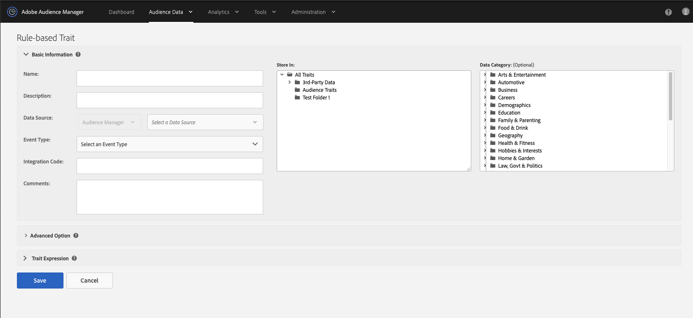
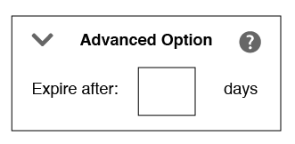

# Create Rules-Based or Onboarded Traits {#create-rules-based-or-onboarded-traits}

Describes set up steps and features specific to the [!UICONTROL rules-based] and [!UICONTROL onboarded] trait creation process.

<!-- c_tb_rules_traits.xml -->

## Basic Information for Traits {#basics}

In [!UICONTROL Trait Builder], the [!UICONTROL Basic Information] settings let you create new, or edit existing traits. The [!UICONTROL Basic Information] settings are the same for rules-based, onboarded and algorithmic traits. To create a new trait, provide a name (avoid special characters), a data source, and select a storage folder. Other [!UICONTROL Basic Information] fields are optional.

<!-- c_tb_basics.xml -->

### Basic Information Fields Defined

<table id="table_42AEC7A5B22346C5BB996D2D36C56229"> 
 <thead> 
  <tr> 
   <th colname="col1" class="entry"> Interface Element </th> 
   <th colname="col2" class="entry"> Explanation </th> 
  </tr> 
 </thead>
 <tbody> 
  <tr> 
   <td colname="col1"> <b> Name</b> </td> 
   <td colname="col2"> 
The trait name. Required. 
 
Maximum length: 255 characters. 
 
 
Note: When naming traits, avoid these special characters: 
      <ul id="ul_AB38A333F21A4AA9B5656CBA69BA65E3"> 
       <li id="li_0E5033B540BC41E799075845388E85A7">Commas </li> 
       <li id="li_B1A6C3E3FB98473A91E4675EE09460F0">Dashes </li> 
       <li id="li_579302FE34B64FE0AE3C751012839229">Hyphens </li> 
       <li id="li_44890F738CC64E449CC2545D701ECBC7">Tabs </li> 
       <li id="li_C203837501A94342923C99A7DAD1ED61">Vertical bar or pipe symbol </li> 
      </ul> 
 
 
This helps reduce processing errors when you set up an <a href="../../integration/sending-audience-data/batch-data-transfer-explained/inbound-file-contents.md"> inbound data file transfer</a>. 
 </td> 
  </tr> 
  <tr> 
   <td colname="col1"> <b> Description</b> </td> 
   <td colname="col2"> A few words to help describe the trait's purpose or function. Optional. </td> 
  </tr> 
  <tr> 
   <td colname="col1"> <b> Data Source</b> </td> 
   <td colname="col2"> Associates the trait with a specific data provider. Required. 
Use the first drop-down menu to filter between Audience Manager data sources, Adobe Analytics report suites, or both. Then, use the second drop-down menu to choose your data source.

 If you don't have any Adobe Analytics report suites, the data source type selector is disabled and you can only see your Audience Manager data sources.
  </td> 
  </tr>
   <tr> 
   <td colname="col1"> <b> Event Type</b> </td> 
   <td colname="col2"> Assigns the trait to a type or category, usually according to function (e.g. conversion, site visitor, partner, page view, etc.). Optional. 
 To learn how to create conversion traits, see the <a href="https://docs.adobe.com/content/help/en/audience-manager-learn/tutorials/build-and-manage-audiences/traits-and-segments/creating-conversion-traits.html">Creating Conversion Traits in Audience Manager video</a>. 
</td> 
  </tr> 
  <tr> 
   <td colname="col1"> <b> Integration Code</b> </td> 
   <td colname="col2"> A field for an ID, SKU, or other value used by your internal business processes. Optional. </td> 
  </tr> 
  <tr> 
   <td colname="col1"> <b> Comments</b> </td> 
   <td colname="col2"> General notes about a trait. Optional. </td> 
  </tr> 
  <tr> 
   <td colname="col1"> <b> Store In</b> </td> 
   <td colname="col2"> Determines which storage folder the trait belongs to. Required. </td> 
  </tr> 
  <tr> 
   <td colname="col1"> <b> Data Category</b> </td> 
   <td colname="col2"> Classifies traits according to commonly understood categories. 
Note:  Traits belong to a single category only. Optional. 
 </td> 
  </tr> 
 </tbody> 
</table>

## Set a Trait Expiration Interval {#set-expiration-interval}

In [!UICONTROL Trait Builder], the [!UICONTROL Advanced Options] lets you set a time-to-live ([!DNL TTL]) interval for a trait. [!DNL TTL] defines how many days a qualified visitor remains in a trait (120 days is default). When set to 0, trait membership never expires.

<!-- t_tb_ttl.xml -->

### Set the TTL for a trait

1. Expand the [!UICONTROL Advanced Options] section and enter a number to set a [!DNL TTL] value for the trait.
2. Click **[!UICONTROL Save]**.
    

>[!MORE_LIKE_THIS]
>
>* [Segment Time to Live Explained](../../features/traits/segment-ttl-explained.md)
