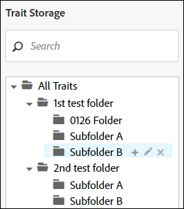
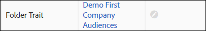

# Manage Folder Traits {#manage-folder-traits}

Create, edit, and delete folder traits.

## Create a Folder Trait {#create-folder-trait}

A [!UICONTROL folder trait] is created automatically when you create a new folder in your taxonomy.

<!-- create-folder-trait.xml -->

1. Go to **[!UICONTROL Audience Data > Traits]** to navigate to the **Traits** dashboard.
1. In the [!UICONTROL Trait Storage] window, hover over:
    
    * "All Traits" text to add a new root level folder.
    * An existing parent folder to add a new subordinate folder.
    
    
    
1. Click the + icon to create the folder. Note that you can create a maximum of 2.000 folders in your taxonomy. See the [usage limits](../../features/administration/usage-limits.md) documentation for more information.
1. Name the folder and click **Save**. For example, a folder named Electronics will have a folder trait named 'Electronics Folder Trait'. You can view and select the new folder trait in the traits dashboard.
1. The new folder trait is automatically assigned to the [!DNL Audience Manager] generated data source. Your users with appropriate [!UICONTROL Role-Based Access Control ([!DNL RBAC])] permissions can change the data source in the edit folder trait workflow. See [Edit a Folder Trait](../../features/traits/manage-folder-traits.md#edit-folder-trait).

## Edit a Folder Trait {#edit-folder-trait}

Describes how you can edit a [!UICONTROL folder trait].

<!-- edit-folder-trait.xml -->

1. In the [!UICONTROL Traits] dashboard, hover over the **[!UICONTROL Actions]** column for the folder trait you want to edit.
1. Click the pencil to edit the trait.

   

1. The **[!UICONTROL Edit]** workflow allows you to change the data source for folder traits. Select your desired data source and click **[!UICONTROL Save]**. Data sources are sorted numerically, by [!DNL DPID], in the drop-down box.

   If your company uses [!UICONTROL Role-Based Access Rights (RBAC)], you or your users need [access permissions](../../features/traits/about-folder-traits.md#role-based-access-controls) to traits data sources.

>[!NOTE]
>
>You cannot directly rename a folder trait. [Rename its associated storage folder](../../features/traits/trait-storage.md#rename-delete-trait-storage-folder) in order to change the name of the folder trait.

## Delete a Folder Trait {#delete-folder-trait}

Delete a folder trait by deleting the storage folder that the trait belongs to.

<!-- delete-folder-trait.xml -->

1. **Audience Data > Traits** to navigate to the **Traits** dashboard.
1. In the [!UICONTROL Trait Storage] window, delete a folder by hovering over it and clicking the X icon.

   

>[!NOTE]
>
>You cannot delete a folder trait, if it is used in a segment expression. Navigate to the [trait view](../../features/traits/trait-details-page.md) section to see which segments use the folder trait. Then, click on the segment name to open the [segment summary view](../../features/segments/segment-summary-view.md), which allows you to remove traits from segment expressions.