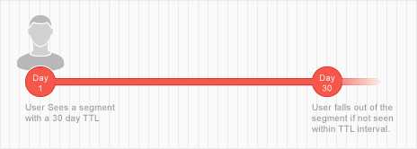

# Segment Time to Live Explained {#segment-time-to-live-explained}

How trait [!UICONTROL time-to-live] ([!DNL TTL]) interval affects segment membership.

<!-- segment-ttl-explained.xml -->

## Time to Live

[!DNL TTL] defines how long a site visitor remains in a segment after the last trait qualification event. [!DNL TTL] is set on traits and not on segments. Visitors fall out of a segment if they do not see a qualifying trait before the end of the [!DNL TTL] interval. The default [!DNL TTL] for new traits is 120 days. When set to 0 days, the trait never expires. [Set the TTL value](../../features/traits/create-onboarded-rule-based-traits.md#set-expiration-interval) when you create or edit a trait in the [!UICONTROL Advanced Options] section of the trait creation interface.

## [!DNL TTL] and Dropping Out of a Segment

A user falls out of a segment if they do not see any of its traits within the [!DNL TTL] interval. For example, if you have a 1-trait segment with a 30 days [!DNL TTL], the user will drop out of that segment if they do not see the trait again within the 30 days.

## [!DNL TTL] and Segment Renewal

The [!DNL TTL] resets, and the user remains in a segment, if they see that segment’s trait within the [!DNL TTL] period. Also, because most segments contain multiple traits with their own [!DNL TTL] periods, a user can remain in a segment (and reset the [!DNL TTL] interval) as long as they keep seeing any traits associated with a segment. For example, say you have Segment 1 composed of Trait A (30 day [!DNL TTL]) and Trait B (15 day [!DNL TTL]). Assuming the user sees each trait only once, the illustration below outlines the [!DNL TTL] renewal process and total in-segment duration.

## [!DNL Audience Manager] TTLs are Independent of Third-Party TTL Settings

Remember, the [!DNL TTL] set on your [!DNL Audience Manager] pixel operates independently from the [!DNL TTL] set on other pixels used by third parties ([!DNL DSP]s, ad networks, etc.).

>[!MORE_LIKE_THIS]
>
>* [Set a Trait Expiration Interval](../../features/traits/create-onboarded-rule-based-traits.md#set-expiration-interval)
