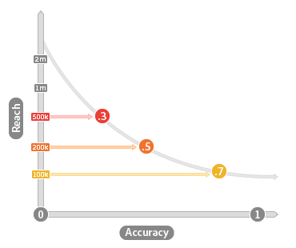

# Accuracy and Reach {#accuracy-and-reach}

Describes the relationship between accuracy and reach in algorithmic traits.

<!-- c_accuracy_reach.xml -->

## Accuracy vs Reach: About

It's important to understand the relationship between accuracy and reach when working with algorithmic traits. Accuracy is represented by a scored value that reflects how similar users are to your baseline. The accuracy scale ranges from 0 (least accurate) to 1 (most accurate). Reach is simply a value that represents the number of unique users you would like to include in a trait. Reach and accuracy are inversely related. Accurate traits reach fewer users and traits with greater reach are less accurate. The following image illustrates this concept.

## Accuracy and Reach Affect Audience Size

Your business goals should help you make the right decisions about accuracy and reach when working with algorithmic traits. If accuracy is your goal, note that a trait's population can increase or decrease across model runs. Population changes are the results of the algorithm making decisions during each evaluation period. Sometimes, the algorithm finds more qualified users during a processing cycle and, during others, it may find fewer. Results are determined by the baseline data used to create the model and new visitors and trait qualifications that have come since the previous model run. By contrast, when working with reach, the user population count remains constant. For example, if you want to reach 10,000 users, the algorithm will make sure it always hits that number for each model run.

## General Use Cases for Accuracy vs Reach

The focus on accuracy or reach depends on what you want to achieve with a particular segment. The following table may help you evaluate accuracy vs reach when creating a trait.  

|  Trait Decision Favors  | Helps Find  |
|---|---|
| **Accuracy** | Users similar to baseline customers in your model. Useful for targeted campaigns when you want to reach a specific audience.  |
| **Reach** | A specific number of users for each data run. Useful for brand campaigns when you're interested in reaching an audience of a specific size.  |
