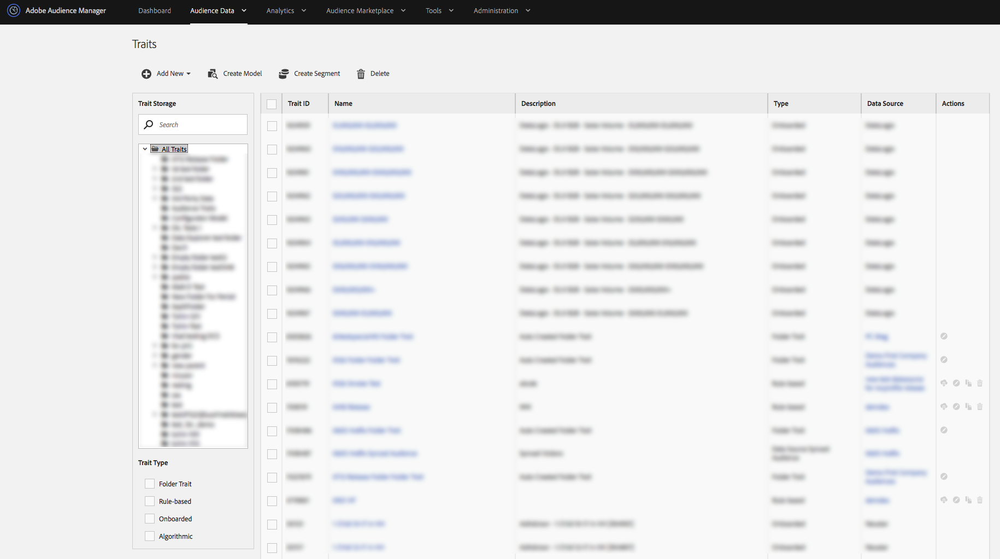

# Traits Dashboard {#traits-dashboard}

The traits dashboard is a centralized workspace for managing traits. You can see the [!UICONTROL Traits] dashboard by navigating to **[!UICONTROL Audience Data]** > **[!UICONTROL Traits]**.

<!-- c_tb_dashboard.xml -->

The [!UICONTROL Traits] dashboard contains features and tools that help you:

1. See all your traits and related details in a table with columns you can sort.
2. Review and work with [Active Audience Traits and Data Source Synced Traits](../../features/traits/client-activity-synced-audience-traits.md).
3. Create, edit, and delete traits.
4. View and manage trait storage folders.
5. Search for traits by name, ID, description or data source. Click on a folder while searching to limit results to that folder and its subfolders.
6. Filter traits by trait type (onboarded, rules-based, algorithmic, folder traits).