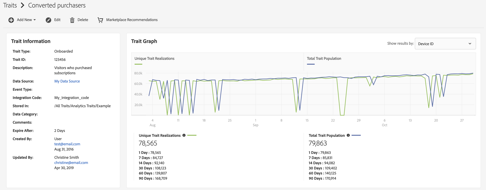
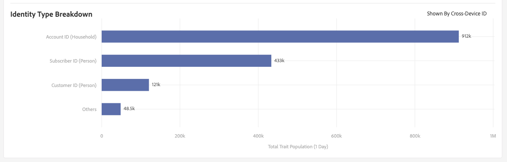
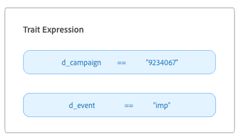
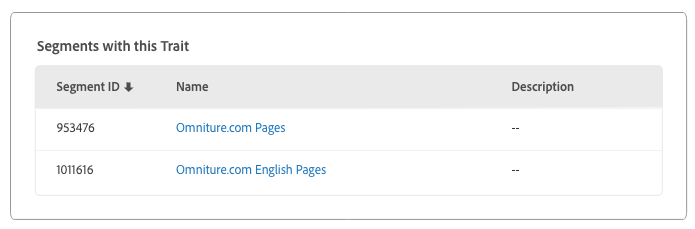

# Trait Details Page {#trait-details-page}

The details page for an individual trait provides an overview of the trait details, such as the trait name, ID, performance metrics, expressions that define the trait, segments it belongs to, and the trait audit log. To view these details, go to **[!UICONTROL Audience Data]** > **[!UICONTROL Traits]** and click the name of the trait you want to work with.

## Trait Management Tools {#trait-management-tools}

The top of the trait details page hosts the tools that you can use to manage your traits:

1. **[!UICONTROL Add New]**: Use this option to create new rule-based, algorithmic, or onboarded traits.
2. **[!UICONTROL Edit]**: Use this option to change the configuration of the current trait.
3. **[!UICONTROL Delete]**: Use this option to remove the current trait from your Audience Manager account.
4. **[!UICONTROL Marketplace Recommendations]**: Use this option find similar traits to the one you're viewing, from [!UICONTROL Audience Marketplace] data fees that you are not subscribed to. See [Audience Marketplace for Data Buyers](../audience-marketplace/marketplace-data-buyers/marketplace-data-buyers.md) to learn how to navigate the Marketplace and find similar traits.

## Trait Information {#basics}

The [!UICONTROL Trait Information] section shows details about required and optional fields you completed when building the trait. This includes things like the trait type, trait ID, description, data source, and other metadata. These details vary depending on trait type (folder, onboarded, or rule-based).

## Trait Graph {#trait-graph}

The [!UICONTROL Trait Graph] provides at-a-glance performance metrics for your selected trait. Hold your cursor over a trend line to see additional data for the selected trait.

[!UICONTROL Unique Trait Realizations] represent a count of unique users that added this trait to their profile over the given time range. The [!UICONTROL Total Trait Population] indicates the number of unique users currently qualified for this trait.

For rule-based traits, trait qualification happens in real-time, as users qualify for a trait in their browser.

For onboarded traits, trait qualification happens after an inbound file is processed, i.e. the inbound file is [fed into Audience Manager](../../faq/faq-inbound-data-ingestion.md) and that is when the trait qualification happens.

The [!UICONTROL Trait Graph] shows you the following information:

* **[!UICONTROL Show results by]**
  * **[!UICONTROL Cross-Device ID]**: select this option to see results for traits that are collecting data for authenticated profiles. When you select this option, you only see data on the [!UICONTROL Cross-Device ID] report, and no data will be present under the [!UICONTROL Device ID] report.
  * **[!UICONTROL Device ID]**: select this option to see results for traits that are collecting data for device profiles. When you select this option, you only see data on the [!UICONTROL Device ID] report, and no data will be present under the [!UICONTROL Cross-Device ID] report.
  
    

* **[!UICONTROL Unique Trait Realizations]**: A count of unique users that added this trait to their profile over the given time range.
* **[!UICONTROL Total Trait Population]**: The number of unique users currently qualified for this trait.

* **[!UICONTROL Identity Type Breakdown]**: The first three entries show the top three cross-device data sources with the highest population count that have qualified for the trait, in descending order. The fourth entry shows the sum of all the other [!DNL DPUUIDs] ([!DNL CRM IDs]) that qualified for the trait, from the cross-device data sources that are not in the top three. This report appears only if you select Cross-device ID in the [!UICONTROL Show Results By] drop-down menu at the top right side of the page. The default drop-down option is [!UICONTROL Device ID], where this report is not displayed.

    

    >[!NOTE]
    >
    >Audience Manager only displays the [!UICONTROL Identity Type Breakdown] report if you have cross-device IDs qualified for the trait.

    >[!VIDEO](https://video.tv.adobe.com/v/27977/)

## Trait Expression {#trait-expression}

The [!UICONTROL Trait Expression] section shows you the criteria users must meet to qualify for the trait. These rules are set when you [create or edit a trait](../../features/traits/about-trait-builder.md).

## Trait Segments {#trait-segments}

The [!UICONTROL Segments with this Trait] section lists all the segments the selected trait belongs to. You can click on a segment name to see details about that segment.

## Trait Audit/History Log {#trait-audit-history}

For rule-based and onboarded traits, the [!UICONTROL Trait Expression Change History] shows you the last 10 changes made to trait expression rules and who made them. If your trait has more than 10 changes, click **[!UICONTROL Export to CSV]** to download the entire audit log. The audit log is not available for folder or algorithmic traits.

>[!NOTE]
>
>[!UICONTROL Not Available] in the [!UICONTROL By User] column means the account for that user has been deleted.

