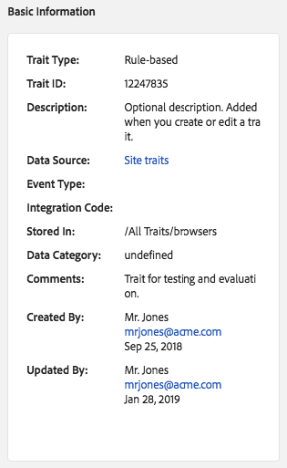
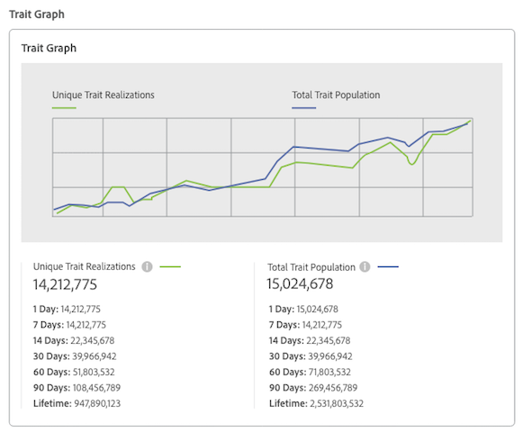

# Trait Details Page {#trait-details-page}

The details page for an individual trait provides overview of information like the trait name, ID, performance metrics, expressions that define the trait, segments it belongs to, and the trait audit log. To vew these details, go to [!UICONTROL Audience Data > Traits] and click the name of the trait you want to work with.

## Basic Information {#section_4437F7E7D981446F8A7789141916528F}

The [!UICONTROL Basic Information] section shows details about required and optional fields you completed when building the trait. This includes things like the trait ID, description, data source, and other metadata. These details vary depending on trait type (folder, onboarded, or rule-based).

## Trait Graph {#section_97532A84A37246ABA7EE6149CF0FBE72}

The [!UICONTROL Trait Graph] provides at-a-glance performance metrics for your selected trait. Hold your cursor over a trend line to see additional data for the selected trait.

[!UICONTROL Unique Trait Realizations] represent a count of unique users that added this trait to their profile over the given time range. The [!UICONTROL Total Trait Population] indicates the number of unique users currently qualified for this trait.

* For rule-based traits, trait qualification happens in real-time, as users qualify for a trait in their browser. 
* For onboarded traits, trait qualification happens after an inbound file is processed, i.e. the inbound file is [fed into Audience Manager](../../faq/faq-inbound-data-ingestion.md#concept_CA81A40C5DD643F899490355C737CE9C) and that is when the trait qualification happens.

## Trait Expression {#section_97757AB8844F4466BA5DB1E8356146FC}

The [!UICONTROL Trait Expression] section shows you the criteria users must meet to qualify for the trait. These rules are set when you [create or edit a trait](../../features/traits/about-trait-builder.md#concept_BCDC4BCAEB4A4879AFA4A9B98D9ED369).

## Trait Segments {#section_D44E252E719640DC8A821B697332B4AC}

The [!UICONTROL Segments with this Trait] section lists all the segments the selected trait belongs to. You can click on a segment name to see details about that segment.

## Trait Audit/History Log {#section_3CA094050D3B4093A336F28D5EF3459F}

For rule-based and onboarded traits, the [!UICONTROL Trait Expression Change History] shows you the last 10-changes made to a trait's expression rules and who made them. If your trait has more than 10 changes, click **[!UICONTROL Export to CSV]** to download the entire audit log. The audit log is not available for folder or algorithmic traits.

>[!NOTE]
>
>[!UICONTROL Not Available] in the [!UICONTROL By User] column means the account for that user has been deleted.

