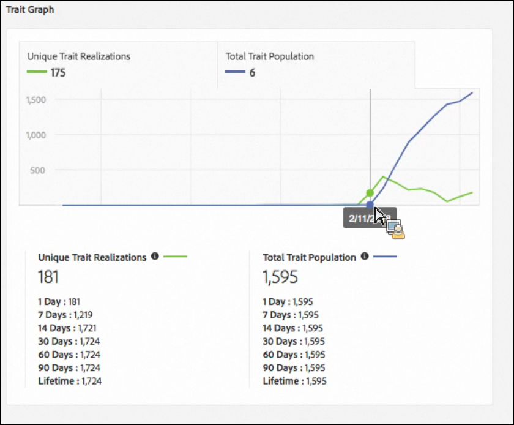

# Trait Qualification Reference {#trait-qualification-reference}

Trait qualification, or trait realization, is treated differently in Audience Manager, depending on trait type. See the table below for detailed information on trait qualification.

## Trait Qualification by Trait Type {#trait-type}

<table id="table_14CD705F376B44EEA9A6C011984356F0"> 
 <thead> 
  <tr> 
   <th colname="col1" class="entry"> Trait type </th> 
   <th colname="col2" class="entry"> Qualification criteria </th> 
  </tr> 
 </thead>
 <tbody> 
  <tr> 
   <td colname="col1"> 
Rule-based Traits 
 </td> 
   <td colname="col2"> 
Trait qualification happens in real-time, as users qualify for a trait in their browser. Your users will start qualifying for a rule-based trait approximately 4 hours after you <a href="../../features/traits/create-onboarded-rule-based-traits.md#create-rules-based-or-onboarded-traits"> create the trait</a> in the UI. 
 
Rule-based traits allow you to use <a href="../../features/segments/recency-and-frequency.md"> recency and frequency</a> controls for ad frequency capping and other use cases. 
 </td> 
  </tr> 
  <tr> 
   <td colname="col1"> 
Onboarded Traits 
 </td> 
   <td colname="col2"> 
Trait qualification happens after an inbound file is processed, i.e. the inbound file is <a href="../../faq/faq-inbound-data-ingestion.md"> imported into Audience Manager</a> and that is when the trait qualification happens. You should wait approximately 4 hours after creating an onboarded trait before uploading an inbound file for processing.  
 
 For onboarded traits, the maximum number of qualifications for a user profile is 1. 
 </td> 
  </tr> 
  <tr> 
   <td colname="col1"> 
Algorithmic Traits 
 </td> 
   <td colname="col2"> 
For algorithmic traits, the maximum number of qualifications for a user profile is 1. 
 </td> 
  </tr> 
  <tr> 
   <td colname="col1"> 
Folder Traits 
 </td> 
   <td colname="col2"> 
A folder trait sums up the trait qualifications of the traits it contains. 
 
Read <a href="../../features/traits/about-folder-traits.md"> Folder Traits: About</a> for more information. 
 </td> 
  </tr>
  <tr> 
   <td colname="col1"> 
Active Audience Traits and Data Source Synced Traits 
 </td> 
   <td colname="col2"> 
An  Active Audience trait contains all of the devices under management in your  Audience Manager account. 
 
 Data Source Synced Traits track all of the users associated with a data source. 
 
Read more about <a href="../../features/traits/client-activity-synced-audience-traits.md"> Active Audience Traits and Data Source Synced Traits</a>. 
 </td>
  </tr>
 </tbody>
</table>

## Unique Trait Realizations and Total Trait Population {#unique-trait-realizations}

The **[!UICONTROL Unique Trait Realizations]** count the number of your visitors that have added the trait to their profile, within different time ranges.

The **[!UICONTROL Total Trait Population]** represents the number of your visitors that have this trait on their profile.

Think of the numbers this way. In the image above, from the [Trait Details](../../features/traits/trait-details-page.md) view, 181 represents the number of active devices, that visited your properties yesterday. The [!UICONTROL Total Trait Population] of 1,595 represents the amount of users currently qualified for this trait. The [!UICONTROL Total Trait Population] figure is meant to show the total amount of users who could be used for segmentation/targeting. Typically, users will remain part of a trait for 120 days.

Because we run two different computational jobs to calculate the two populations, the [!UICONTROL Total Trait Population] always lags behind the [!UICONTROL Unique Trait Realizations] by 24 hours. In the graph above, you can see 175 [!UICONTROL Unique Trait Realizations] and a [!UICONTROL Total Trait Population] of 6 for February 11. The 175 profiles are added to the [!UICONTROL Total Trait Population] on the following day.

To further drive the point home, if you experienced a spike of 10,000 visitors right now, they would show up in tomorrow's [!UICONTROL Unique Trait Realizations], but would only show up 24 hours later in the [!UICONTROL Total Trait Population].

## Trait Qualification Limit {#trait-qualification-limit}

We enforce a limit of 150,000 trait qualifications for each user profile, whether it is an authenticated profile ( [DPUUID](../../reference/ids-in-aam.md)) or a device ID ( [UUID](../../reference/ids-in-aam.md)). Note that while the DPUUIDs are unique to a specific instance of [!DNL Audience Manager], UUIDs are shared across the [!DNL Audience Manager] platform. For [!UICONTROL UUID]s, we impose a fairness policy when storing trait qualifications. An algorithm ensures that an equal share of the [!UICONTROL UUID] profile is made available for every instance of [!DNL Audience Manager].
