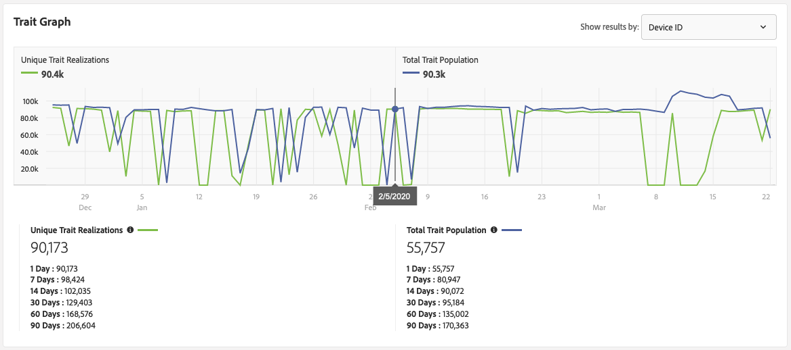
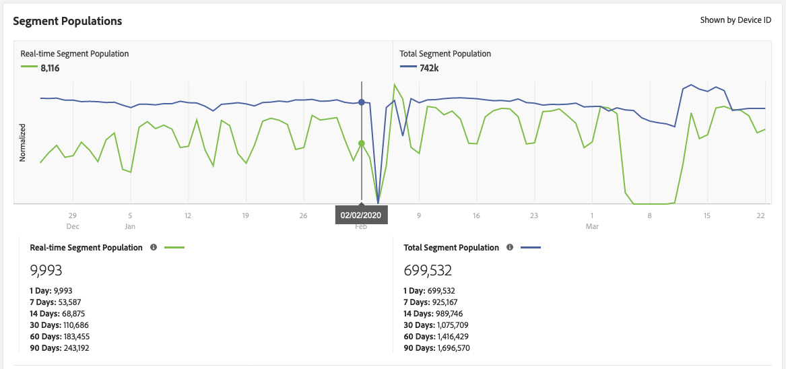

# Trait Qualification Reference {#trait-qualification-reference}

Trait qualification, or trait realization, is treated differently in Audience Manager, depending on trait type. See the table below for detailed information on trait qualification.

## Trait Qualification by Trait Type {#trait-type}

|Trait Type | Qualification Criteria|
|---|---|
|Rule-based Traits | Trait qualification happens in real-time, as users qualify for a trait in their browser. Your users will start qualifying for a rule-based trait approximately 4 hours after you [create the trait](create-onboarded-rule-based-traits.md#create-rules-based-or-onboarded-traits) in the UI. Rule-based traits allow you to use [recency and frequency](../segments/recency-and-frequency.md) controls for ad frequency capping and other use cases.|
|Onboarded Traits | Trait qualification happens after an inbound file is processed, i.e. the inbound file is [imported into Audience Manager](../../faq/faq-inbound-data-ingestion.md) and that is when the trait qualification happens. You should wait approximately 4 hours after creating an onboarded trait before uploading an inbound file for processing. For onboarded traits, the maximum number of qualifications for a user profile is 1. |
|Algorithmic Traits | For algorithmic traits, the maximum number of qualifications for a user profile is 1.|
|Folder Traits | A folder trait sums up the trait qualifications of the traits it contains. Read [Folder Traits: About](about-folder-traits.md) for more information. |
|Active Audience Traits and Data Source Synced Traits | An [!UICONTROL Active Audience] trait contains all of the devices under management in your Audience Manager account. [!UICONTROL Data Source Synced Traits] track all of the users associated with a data source. Read more about [Active Audience Traits and Data Source Synced Traits](client-activity-synced-audience-traits.md).|

## Unique Trait Realizations and Total Trait Population {#unique-trait-realizations}

Depending on the type of results that you want the graph to show (filtered by [!UICONTROL Device ID] or [!UICONTORL Cross-Device ID]), the metrics have different meanings:

When filtering the results by [!UICONTROL Device ID]:

* The [!UICONTROL Unique Trait Realizations] counts the number of your anonymous device visitors that have added the trait to their profile, within different time ranges.
* The [!UICONTROL Total Trait Population] counts the total number of your anonymous device visitors that have the trait on their profile.

When filtering the results by [!UICONTROL Cross-Device ID]:

* The [!UICONTROL Unique Trait Realizations] count the number of your authenticated visitors that have added the trait to their profile, within different time ranges.
* The [!UICONTROL Total Trait Population] counts the total number of your authenticated visitors that have this trait on their profile.

Think of the numbers this way. In the image above, from the [Trait Details](../../features/traits/trait-details-page.md) view, 90,173 represents the number of active devices, that visited your properties yesterday. The [!UICONTROL Total Trait Population] of 55,757 represents the amount of users currently qualified for this trait. The [!UICONTROL Total Trait Population] figure is meant to show the total amount of users who could be used for segmentation/targeting. Typically, users will remain part of a trait for 120 days.

Because we run two different computational jobs to calculate the two populations, the [!UICONTROL Total Trait Population] always lags behind the [!UICONTROL Unique Trait Realizations] by 24 hours. In the graph above, you can see about 90,400 [!UICONTROL Unique Trait Realizations] and a [!UICONTROL Total Trait Population] of about 90,300 for February 5th. The 90,400 profiles are added to the [!UICONTROL Total Trait Population] on the following day.

To further drive the point home, if you experienced a spike of 10,000 visitors right now, they would show up in tomorrow's [!UICONTROL Unique Trait Realizations], but would only show up 24 hours later in the [!UICONTROL Total Trait Population].

Any change in trait realizations reflects in segment populations.

## Real-time Segment Population and Total Segment Population {#real-time-segment}

The [!UICONTROL Real-time Segment Population] counts the number of devices that have qualified for the selected segment and have reached your properties, within the selected time interval.

The [!UICONTROL Total Segment Population] counts the number of devices that have qualified for the selected segment within the selected time range. The [!UICONTROL 1 Day] report represents the most up to date segment population count.

Think of the numbers this way. In the image above, from the [Segment Details](../../features/segments/segment-summary-view.md) view, 9,993 represents the number of active devices, that visited your properties yesterday, and qualified for the segment. The [!UICONTROL Total Segment Population] of 699,532 represents the total number of devices currently qualified for this segment. The [!UICONTROL Total Segment Population] figure is meant to show the total number of devices that could be used for segmentation/targeting.

Because we run two different computational jobs to calculate the two populations, the [!UICONTROL Total Segment Population] always lags behind the [!UICONTROL Real-time Segment Population] by 24 hours. In the graph above, you can see a 8,116 [!UICONTROL Real-time Segment Population] and a [!UICONTROL Total Segment Population] of 742,000 for February 2nd. The 8,116 profiles are added to the [!UICONTROL Total Segment Population] on the following day.

To further drive the point home, if you experienced a spike of 10,000 visitors right now, they would show up in tomorrow's [!UICONTROL Real-time Segment Population], but would only show up 24 hours later in the [!UICONTROL Total Segment Population].

## Trait Qualification Limit {#trait-qualification-limit}

We enforce a limit of 150,000 trait qualifications for each user profile, whether it is an authenticated profile ([DPUUID](../../reference/ids-in-aam.md)) or a device ID ([UUID](../../reference/ids-in-aam.md)). Note that while the DPUUIDs are unique to a specific instance of [!DNL Audience Manager], UUIDs are shared across the [!DNL Audience Manager] platform. For [!UICONTROL UUID]s, we impose a fairness policy when storing trait qualifications. An algorithm ensures that an equal share of the [!UICONTROL UUID] profile is made available for every instance of [!DNL Audience Manager].
