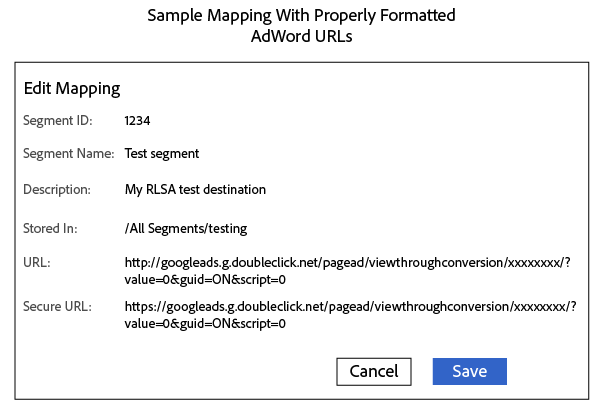

# Send Segments to a Google Ads Remarketing List {#send-segments-to-a-google-adwords-remarketing-list}

This procedure requires a [!DNL Google Ads] remarketing list, pixel code, and an Audience Manager [!DNL URL] destination. It is also known as a remarketing list for search ads ([!DNL RLSA]) integration. Applies to paid search only.

>[!IMPORTANT]
>Please note that this is not a productized integration of the two systems.

To set up a [!DNL Google Ads] remarketing list as an [!DNL Audience Manager] URL destination:

1. In your [!DNL Google Ads] account, [create a website re-marketing list](https://support.google.com/adwords/answer/2454064?hl=en) and write down your conversion ID.
1. Use the following URL as a template for the Base URL and Secure URL. Replace the xxxxxxxx section with your conversion ID.

   ```
    //googleads.g.doubleclick.net/pagead/viewthroughconversion/xxxxxxxx/?value=0&guid=ON&script=0&data=%ALIAS%
   ```

1. In Audience Manager, [Create a URL destination](../../features/destinations/create-url-destination.md) or edit an existing destination. Use the following settings when creating the destination:
   * Type: URL
   * Serialize: Enabled
   * Delimiter: Semicolon (;)

1. In the [!UICONTROL Segment Mappings] section of your [!DNL URL] destination, add the code from step 2 to the [!DNL URL] and [!DNL Secure URL] fields. Prefix the code with `http:` and `https:` in the [!DNL URL] and [!DNL Secure URL] fields, respectively.

   >[!IMPORTANT]
   >
   >Replace encoded ampersands `&` with un-encoded ampersands `&`

   Unsecure [!DNL URL] code:

   ```
    http://googleads.g.doubleclick.net/pagead/viewthroughconversion/xxxxxxxx/?
    value=0&guid=ON&script=0&data=%ALIAS%
   ```

   Secure [!DNL URL] code:

   ```
    https://googleads.g.doubleclick.net/pagead/viewthroughconversion/xxxxxxxx/?
    value=0&guid=ON&script=0&data=%ALIAS%
   ```

1. Click **[!UICONTROL Save]**.

   >[!NOTE]
   >
   >If you're working with multiple segments, get a new pixel for each segment you want to map to a Google Ads destination. This ensures the data is applied to the appropriate remarketing list.

1. When mapping a new segment to this destination in Audience Manager, define the mapping as `aam=segmentID` and replace `segmentID` with the ID of your segment.
1. When defining a bucket in [!DNL Google Ads], create a rule that matches the mapping defined at step 6.

A completed mapping could look similar to this:



>[!MORE_LIKE_THIS]
>
>* [Destinations](../../features/destinations/destinations.md)
>* [Create a URL Destination](../../features/destinations/create-url-destination.md)
>* [About AdWords Remarketing Lists](https://support.google.com/adwords/answer/2472738)
>* [How AdWords Remarketing Works](https://support.google.com/adwords/answer/2454000)
