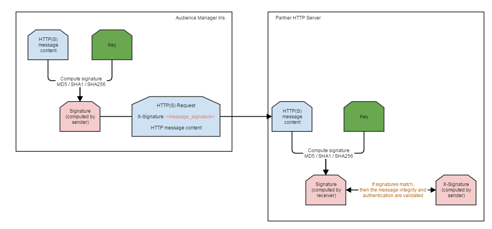

# Digitally Signed `HTTP(S)` Requests {#digitally-signed-http-requests}

Audience Manager requires the `HTTP(S)` server-to-server requests to be digitally signed for validity. This document describes how you can sign `HTTP(S)` requests with private keys.

## Overview {#overview}

<!-- digitally_signed_http_requests.xml -->

Using a private key provided by you and shared with [!DNL Audience Manager], we can digitally sign the `HTTP(S)` requests that are sent between [IRIS](../../../reference/system-components/components-data-action.md#iris) and your HTTP(S) server. This ensures:

* **Authenticity**: only the sender that has the private key ([!UICONTROL IRIS]) can send valid `HTTP(S)` messages to the partner.
* **Message integrity**: with this approach, even on `HTTP`, you are protected from a man in the middle attack where the messages get distorted.

[!UICONTROL IRIS] has built-in support to rotate the keys with zero downtime, as shown in the [Rotating the private key](../../../integration/receiving-audience-data/real-time-outbound-transfers/digitally-signed-http-requests.md#rotate-private-key) section below.

## Information you need to provide {#info-to-provide}

For an `HTTP(S)` real-time server-to-server destination, contact your [!DNL Audience Manager] consultant and specify:

* The key used to sign the request.
* The name of the `HTTP(S)` header that will hold the generated signature (X-Signature in the example header below).
* Optional: the type of hash used for the signature (md5, sha1, sha256).

```
* Connected to partner.website.com (127.0.0.1) port 80 (#0)
> POST /webpage HTTP/1.1
> Host: partner.host.com
> Accept: */*
> Content-Type: application/json
> Content-Length: 20
> X-Signature: +wFdR/afZNoVqtGl8/e1KJ4ykPU=
POST message content
```

## How it works {#how-it-works}

1. [!UICONTROL IRIS] creates the `HTTP(S)` message to be sent to the partner.
1. [!UICONTROL IRIS] creates a signature based on the `HTTP(S)` message and the private key communicated by the partner.
1. [!UICONTROL IRIS] sends the `HTTP(S)` request to the partner. This message contains the signature and the actual message, as seen in the example above.
1. The partner server receives the `HTTP(S)` request. It reads the message body and the signature received from [!UICONTROL IRIS].
1. Based on the message body received and the private key, the partner server recalculates the signature. See the [How to calculate the signature](../../../integration/receiving-audience-data/real-time-outbound-transfers/digitally-signed-http-requests.md#calculate-signature) section just below on how to achieve this.
1. Compare the signature created on the partner server (receiver) with the one received from [!UICONTROL IRIS] (sender).
1. If the signatures match, then the **authenticity** and **message integrity** have been validated. Only the sender, who has the private key, can send a valid signature (authenticity). Moreover, a man in the middle can't modify the message and generate a new valid signature, since they don't have the private key (message integrity).



## How to calculate the signature {#calculate-signature}

[!DNL HMAC] (Hash-based message authentication code) is the method used by [!UICONTROL IRIS] for message signing. Implementations and libraries are available basically in every programming language. [!DNL HMAC] has no known extension attacks. See an example in [!DNL Java] below:

```
// Message to be signed.
// For GET type HTTP(S) destinations, the message used for signing will be the REQUEST_PATH + QUERY_STRING
// For POST type HTTP(S) destinations, the message used for signing will be the REQUEST_BODY.
// String getData = "/from-aam-s2s?sids=1,2,3";
String postData = "POST message content";
// Algorithm used. Currently supported: HmacSHA1, HmacSHA256, HmacMD5.
String algorithm = "HmacSHA1";
// Private key shared between the partner and Adobe Audience Manager.
String key = "sample_partner_private_key";
  
// Perform signing.
SecretKeySpec signingKey = new SecretKeySpec(key.getBytes(), algorithm);
Mac mac = Mac.getInstance(algorithm);
mac.init(signingKey);
byte[] result = mac.doFinal(postData.getBytes());
  
String signature = Base64.encodeBase64String(result).trim(); 
// signature = +wFdR/afZNoVqtGl8/e1KJ4ykPU=
```

The RFC for the [!DNL HMAC] hash implementation is [https://www.ietf.org/rfc/rfc2104.txt](https://www.ietf.org/rfc/rfc2104.txt). A test site: [https://asecuritysite.com/encryption/hmac](https://asecuritysite.com/encryption/hmac) (note that you have to [convert](https://tomeko.net/online_tools/hex_to_base64.php?lang=en) the hex encoding to base64).

## Rotating the private key {#rotate-private-key}

To rotate the private key, partners must communicate the new private key to their [!DNL Adobe Audience Manager] consultant. The old key is removed from [!DNL Audience Manager] and [!UICONTROL IRIS] only sends the new signature header. The keys have been rotated.

## Data used for signing {#data-signing}

For `GET` type destinations, the message used for signing will be the *REQUEST_PATH + QUERY STRING* (e.g. */from-aam-s2s?sids=1,2,3*). IRIS does not take into account the hostname or `HTTP(S)` headers - these can be modified / misconfigured along the path or reported incorrectly.

For `POST` type destinations, the message used for signing is the *REQUEST BODY*. Again, headers or other request parameters are ignored.
