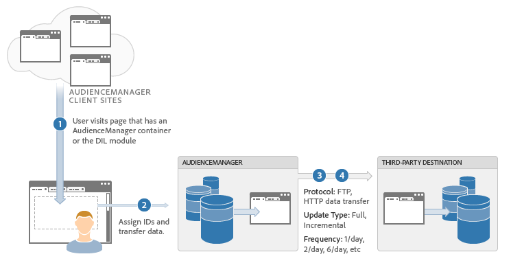

# Batch Data Transfer Process Described {#batch-data-transfer-process-described}

A general overview of how [!DNL Audience Manager] performs an asynchronous batch data exchange with a third-party vendor.

## Batch Data Integration

<!-- c_async.xml -->

The batch data integration process saves visitor information on our servers and synchronizes that material with data sent by a provider at regular intervals. The asynchronous data transfer process is useful when:

* Immediate data transfers are not required.
* Collecting data to build a large pool of segmented users.
* You want to reduce data discrepancies and `HTTP` calls from the browser.

## Data Integration Steps

1. A user visits a customer site.
1. [!DNL Audience Manager] and the third-party data provider assign the visitor a unique ID (usually with a cookie).
1. [!DNL Audience Manager] calls the third-party data provider to match visitor IDs.
1. A scheduled request, usually on a daily interval, exchanges visitor segment data between [!DNL Audience Manager] and your third-party data provider.
1. Whenever an inbound [!UICONTROL Server-to-Server] file is processed, a receipt is sent via email to partner solutions and, if configured, to the partner. For more information, see [Sample Message to Partners after Inbound Processing](../../../integration/sending-audience-data/batch-data-transfer-explained/inbound-receipt-message.md).
