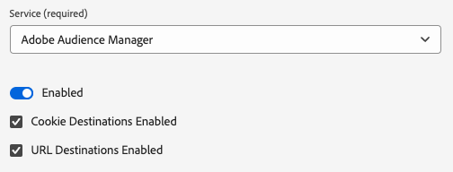
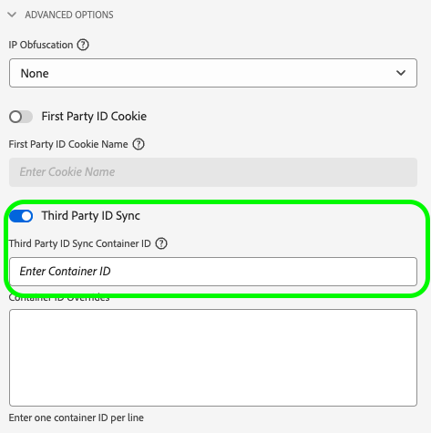

# Update your data collection library for Audience Manager from the AppMeasurement JavaScript library to the Web SDK JavaScript library

## Intended audience {#intended-audience}

This page is for Audience Manager and Adobe Analytics customers who use the [!DNL AppMeasurement] JavaScript library to send web data to Audience Manager.

Refer to the table below for guidance on migration steps to Web SDK, depending on your current data collection method.

|Your existing data collection method | Web SDK migration instructions |
|---------|----------|
| [!DNL AppMeasurement] JavaScript library | Follow the instructions in this guide. |
| [!DNL Audience Manager] [tag extension](https://experienceleague.adobe.com/en/docs/experience-platform/tags/extensions/client/audience-manager/overview) | Follow the instructions in [updating your data collection library from the Audience Manager tag extension to the Web SDK tag extension](dil-extension-to-web-sdk.md). |
| [!DNL AppMeasurement] JavaScript library + [!DNL Audience Manager] [DIL library](../dil/dil-overview.md) | Follow the instructions in [updating your data collection library from the Audience Manager tag extension to the Web SDK tag extension](dil-extension-to-web-sdk.md). |

## Migration overview {#overview}

Migrating from [!DNL AppMeasurement] to [Web SDK](https://experienceleague.adobe.com/en/docs/experience-platform/web-sdk/home) is primarily an Adobe Analytics migration. For Audience Manager customers, this migration also includes Audience Manager. Both must be migrated together. If you mainly work with Audience Manager, ensure you involve the Analytics team in this migration.

If you use [!DNL AppMeasurement] for Audience Manager data collection, you are currently using the [!DNL Server-side Forwarding (SSF)] approach to send Analytics data to Audience Manager. In this setup, the Analytics data collection request is forwarded to Audience Manager, which also handles the Audience Manager response to the page.

This has been the standard approach for many years and is likely your current setup. If your [!DNL AppMeasurement] library contains the `AudienceManagement` module and your data collection calls include the `/10/` path in the request (`/b/ss/examplereportsuite/10/`), then this guide is for you.

## Server-side Forwarding (SSF) versus Web SDK data flows {#data-flows}

Understanding the data flow differences between Analytics and Audience Manager when moving to Web SDK (and the Edge Network) is crucial for the instructions below. 

With server-side forwarding, the Analytics regional data collection node collects the data, transforms it into a signal accepted by Audience Manager, sends it to Audience Manager, and returns the Audience Manager response to the page. The [!DNL AudienceManagement] module in the [!DNL AppMeasurement] library then handles the response (e.g., dropping cookies, sending URL destinations). This process is called server-side forwarding because Analytics forwards the data to Audience Manager using Adobe servers.

With Web SDK, the Edge Network sends data to Analytics and Audience Manager in separate actions. The Web SDK is a single library that sends data to all solutions, and the Edge Network transforms solution-agnostic data points into solution-specific formats.

In this new data flow, all data is sent to an Edge Network [datastream](https://experienceleague.adobe.com/en/docs/experience-platform/datastreams/overview), which you can [configure](https://experienceleague.adobe.com/en/docs/experience-platform/datastreams/configure) to send data to Adobe solutions as needed. For Audience Manager, enabling the Audience Manager service on the datastream transforms [!DNL XDM] and Analytics data into signals accepted by Audience Manager. The Edge Network also returns the Audience Manager response to the page, where the Web SDK handles the response, similar to how [!DNL AppMeasurement] and the [!DNL AudienceManagement] module did.

## Tags versus non-Tags migration {#tags-vs-non-tags}

Whether you are using Tags with the [!DNL AppMeasurement] extension, the [!DNL AppMeasurement] library in another tag management system, or placing [!DNL AppMeasurement] directly on the page, the steps for migrating Audience Manager to the Web SDK are the same. Since the Audience Manager migration depends on the Analytics migration, the steps to migrate from [!DNL AppMeasurement] to Web SDK are determined during the Analytics migration.

That information is covered in the Analytics documentation for [Tags](https://experienceleague.adobe.com/en/docs/analytics/implementation/aep-edge/web-sdk/analytics-extension-to-web-sdk) or [JavaScript](https://experienceleague.adobe.com/en/docs/analytics/implementation/aep-edge/web-sdk/appmeasurement-to-web-sdk)-based implementations.

## XDM and the `data.__adobe.` nodes {#xdm-data-nodes}

One of the main functions of the [Web SDK](https://experienceleague.adobe.com/en/docs/experience-platform/web-sdk/home) is to send data to [Real-Time Customer Data Platform (RTCDP)](https://experienceleague.adobe.com/en/docs/experience-platform/rtcdp/home). To achieve this and still collect data for other Experience Cloud Solutions without a full re-implementation, solution-specific data is compartmentalized within the data collection server call. This call uses a standardized JSON schema called the [Experience Data Model (XDM)](https://experienceleague.adobe.com/en/docs/experience-platform/xdm/home)

Solution-agnostic elements, such as information about the browser and device, are sent to the Edge Network in a predetermined XDM structure. The Edge Network transforms this data to solution-specific formats. However, data that is specific to Target, Analytics, and Audience Manager is stored in a dedicated `data.__adobe` node within the XDM payload.

For example:

* The Analytics variable `s.eVar1` is represented in the XDM payload as `data.__adobe.analytics.evar1`. 
* A Target parameter related to customer loyalty status is stored as `data.__adobe.target.loyaltyStatus`.

Data in the `__adobe` node is sent to the respective solutions (like Analytics and Audience Manager) without being sent to Experience Platform, even if the Experience Platform service is enabled on the datastream. This means you can keep your current configurations for Analytics and Audience Manager while having the flexibility to map any necessary data elements to XDM schema elements for real-time use cases in Experience Platform using [Data Prep for Data Collection](https://experienceleague.adobe.com/en/docs/experience-platform/datastreams/data-prep).

For example, the Analytics `s.products` string, which is used to report cart contents during checkout, can still be sent to Analytics and Audience Manager in its original format. At the same time, you can use the elements of this string to create more intuitive XDM cart schemas for Experience Platform use cases.

Since most Audience Manager implementations rely on Analytics data forwarded to Audience Manager, many of your Audience Manager trait expressions are likely based on Analytics variables (`c_evar#`, `c_prop#`, and `c_events`). To avoid rebuilding trait expressions using XDM formats during migration, the Edge Network is configured by default to transform any Analytics variables found in the `data.__adobe.analytics` node into Audience Manager signals. This process is similar to the server-side forwarding workflow.

The Edge Network can perform this transformation because a single data collection call from the page is sent to a single datastream that feeds multiple Adobe solutions. Therefore, most migrations from [!DNL AppMeasurement] to Web SDK for both Analytics and Audience Manager will primarily use the `data.__adobe.analytics` node.

The Edge Network transforms device and browser data from the XDM payload and packet headers into Audience Manager signals. This allows you to continue using `h_` and `d_` platform keys in Audience Manager trait expressions.

## The `data.__adobe.audiencemanager` node {#data-note}

The `data.__adobe.audiencemanager` node is used for Audience Manager implementations that do not rely on Analytics. It stores custom Audience Manager key/value pairs that were previously sent via the [DIL library](../dil/dil-overview.md) library, as described in the [tag extension migration guide](dil-extension-to-web-sdk.md).

While the `data.__adobe.audiencemanager` node is not needed for the migration outlined in this guide, the new data flow explained here allows data to be sent to Audience Manager without being recorded in Analytics.

If you need to send a custom key/value pair to Audience Manager without including it in Analytics, you can use the `data.__adobe.audiencemanager` node. Any data set in this node will be appended to the Audience Manager-transformed Analytics data in the data collection server call.

## Advantages and disadvantages of this implementation path

Using this migration approach has both advantages and disadvantages. Carefully weigh each option to decide which approach is best for your organization.

| Advantages | Disadvantages |
| --- | --- |
| <ul><li>**Uses your existing implementation**: While this approach requires some implementation changes, it does not require a completely new implementation from scratch. You can use your existing data layer and code with minimal changes to implementation logic.</li><li>**Does not require a schema**: For this stage of migrating to the Web SDK, you don't need an XDM schema. Instead, you can populate the `data` object, which sends data straight to Audience Manager. Once migration to the Web SDK is complete, then you can create a schema for your organization and use datastream mapping to populate applicable XDM fields. If a schema were required at this stage of the migration process, your organization would be forced to use an Audience Manager XDM schema. Use of this schema makes it more difficult for your organization to use your own schema in the future.</li></ul> | <ul><li>**Implementation technical debt**: Since this approach uses a modified form of your existing implementation, it can be harder to track implementation logic and perform changes in the future when needed.</li><li>**Requires mapping to send data to Platform**: When your organization is ready to use Real-Time CDP, you must send data to a data set in Adobe Experience Platform. This action requires that every field in the `data` object be an entry in the datastream mapping tool that assigns it to an XDM schema field. Mapping only needs to be done once for this workflow, and it doesn't involve making implementation changes. However, it is an extra step that is not required when sending data in an XDM object.</li></ul> |

Adobe recommends following this implementation path in the following scenarios:

* You have an existing implementation using the Adobe Analytics AppMeasurement JavaScript library. If you have an implementation using the Audience Manager tag extension, follow [Migrate from the Audience Manager tag extension to the Web SDK tag extension](dil-extension-to-web-sdk.md) instead.
* You intend to use Real-Time CDP in the future, but do not want to replace your Audience Manager implementation with a Web SDK implementation from scratch. Replacing your implementation from scratch on the Web SDK requires the most effort, but also offers the most viable long-term implementation architecture. If your organization is willing to go through the effort of a clean Web SDK implementation, see the [Web SDK documentation](https://experienceleague.adobe.com/en/docs/experience-platform/web-sdk/home) for more details.

## Steps required to migrate to the Web SDK

Follow the steps below to migrate your data collection integration to Web SDK.

+++**1. Migrate your Analytics implementation**.

Work with your Analytics team to follow the steps for Analytics migration in either the [Tags](https://experienceleague.adobe.com/en/docs/analytics/implementation/aep-edge/web-sdk/analytics-extension-to-web-sdk) or [JavaScript](https://experienceleague.adobe.com/en/docs/analytics/implementation/aep-edge/web-sdk/appmeasurement-to-web-sdk)-based implementations. After you have migrated your Analytics implementation, continue to the following step.

+++

+++**2. Add the Audience Manager service to the datastream**

Add the Audience Manager service to the datastream that you created during step 1.

1. Navigate to [experience.adobe.com](https://experience.adobe.com) and log in using your credentials.
1. Use the home page or product selector in the top right to navigate to **[!UICONTROL Data Collection]**.
1. In the left navigation, select **[!UICONTROL Datastreams]**.
1. Select the datastream that you created as part of your Analytics migration in step 1.
1. Select **[!UICONTROL Add Service]**.
1. In the service drop-down menu, select **[!UICONTROL Audience Manager]**.
1. Check the **[!UICONTROL Cookie Destinations Enabled]** and **[!UICONTROL URL Destinations Enabled]** options. These options allow the Edge Network to return those Audience Manager destination types to the page. 
1. Make sure the **[!UICONTROL Enable XDM Flattened Fields]** is disabled. This option disables the automatic transformation of Analytics variables into Audience Manager signals. This option is designed to maintain backward compatibility for users who migrated to Web SDK before the Edge Network automatically transformed the Analytics data to Audience Manager signals.

    >[!NOTE]
    >
    >Migrating to Web SDK with the **[!UICONTROL Enabled XDM Flattened Fields]** option enabled requires that any data needed in Audience Manager formatted as XDM and all Audience Manager traits using props, eVars, or events be updated to look for XDM-formatted data instead. Adobe recommends leaving this option disabled. 

     {style="border:1px solid lightslategray"}

1. Select **[!UICONTROL Save]** to save the datastream configuration.

Your datastream is now ready to receive and pass along data to Audience Manager. Note the datastream ID, as this ID is required when configuring the Web SDK in code.

+++

+++**3. Enable Third-Party ID Syncs and set the Audience Manager Container ID**

1. Navigate to [experience.adobe.com](https://experience.adobe.com) and log in using your credentials.
1. Use the home page or product selector in the top right to navigate to **[!UICONTROL Data Collection]**.
1. In the left navigation, select **[!UICONTROL Datastreams]**.
1. Select the datastream that you created as part of your Analytics migration in step 1.
1. Select **[!UICONTROL Edit]** in the upper right corner of the datastream configuration page.
1. Expand the **[!UICONTROL Advanced Options]** drop down menu and enable the **[!UICONTROL Third Party ID Sync]** functionality if it is not already enabled. This option tells the Edge Network to return Partner ID Syncs for Audience Manager and Experience Platform data partners.    

     {style="border:1px solid lightslategray"}

1. In most cases, you can leave the **[!UICONTROL Third Party ID Sync Container ID]** field blank. It will it will default to `0`. However, if you prefer to ensure the right container ID is used, follow the next steps:
    * Open a browser window in incognito or private mode and navigate to a page that is part of the migration.
    * Use the developer tools of the browser to filter for the network call to `dpm.demdex.net/id`. This call will only fire on the first page of a first visit, which is why an incognito or private browser is needed.
    * View the payload of the request. If the `d_nsid` parameter is different than zero, copy it to the **[!UICONTROL Third Party ID Sync Container ID]** field.

1. Select **[!UICONTROL Save]**.

Your datastream is now ready to both send data to Audience Manager and pass the Audience Manager responses to the Web SDK.

+++

+++**4. Add customer IDs to the identity map**

Most Audience Manager implementations use [Profile Merge Rules](../features/profile-merge-rules/merge-rules-overview.md) in cross-device personalization scenarios and to help control what segments visitors can qualify for depending on their authentication state (logged in or logged out). Profile Merge Rules require a customer-owned identifier (CRM ID, account number, etc.) to be sent to Audience Manager on every data collection call after authentication. Previously, the `setCustomerIDs` function of the Visitor ID Service ([!DNL visitor.js]) was used to append customer IDs to each Analytics data collection call, which was then forwarded to Audience Manager.

With the Web SDK, these identities now need to be sent to the Edge Network using a special XDM construct called [IdentityMap](https://experienceleague.adobe.com/en/docs/experience-platform/xdm/field-groups/profile/identitymap). 

Passing identities correctly in an identity map requires understanding [identity namespaces](https://experienceleague.adobe.com/en/docs/experience-platform/identity/features/namespaces) and carefully considering which identities to pass, especially when sending data to an Experience Platform sandbox. [This article](https://experienceleague.adobe.com/en/docs/experience-cloud-kcs/kbarticles/ka-21305) outlines these considerations and instructions.  

Once you determine which identities to pass and when, follow the guides for using the [!UICONTROL Identity map] **[!UICONTROL Identity map]** [data element](https://experienceleague.adobe.com/en/docs/experience-platform/tags/extensions/client/web-sdk/data-element-types#identity-map) within Tags or manually set it as outlined in the [identity data overview](https://experienceleague.adobe.com/en/docs/experience-platform/web-sdk/identity/overview) to align with your Web SDK deployment strategy.

+++

## Configure Server-Side Forwarding and Audience Analytics in the Analytics Report Suite Manager UI {#configure-ssf-analytics}

If you are familiar with the Analytics [server-side forwarding](https://experienceleague.adobe.com/en/docs/analytics/admin/admin-tools/manage-report-suites/edit-report-suite/report-suite-general/server-side-forwarding/ssf) feature, you might wonder: "*Should I disable the server-side forwarding setting in the Analytics Report Suite Manager UI to prevent sending Analytics data to Audience Manager twice?*".

The answer is no, you should not disable this setting. Here's why:

When this setting is enabled and the [!DNL AudienceManagement] module is added to the [!DNL AppMeasurement] library on your page, all data sent to that report suite will also flow to Audience Manager.

To comply with GDPR privacy regulations, there are scenarios where data can be collected in Analytics but not in Audience Manager. Additionally, there are cases involving global report suites and region-specific use cases where some data collection calls should not be sent to Audience Manager. To solve this, Adobe introduced a server-side forwarding "off button".

As explained in the [Analytics and GDPR compliance page focused on server-side forwarding](https://experienceleague.adobe.com/en/docs/analytics/admin/admin-tools/manage-report-suites/edit-report-suite/report-suite-general/server-side-forwarding/ssf-gdpr), adding the `cm.ssf=1` context variable to an Analytics data collection server prevents that data collection call from being forwarded to Audience Manager.

There are two reasons why you should not disable this setting.

1. When the Audience Manager service is enabled on a datastream, the Edge Network appends the `cm.ssf` variable to all data collection requests sent to Analytics. This prevents the Analytics data from being sent to Audience Manager as well. Any Assurance logs used to validate the Analytics migration will show the `cm.ssf=1` variable when the Audience Manager service is enabled on the datastream.
1. This setting also enables the flow of data for the [!DNL Audience Analytics] integration. As outlined in the [Audience Analytics overview](https://experienceleague.adobe.com/en/docs/analytics/integration/audience-analytics/mc-audiences-aam), server-side forwarding is required for this integration because the Audience Manager response to the Analytics data collection server is added to the Analytics hit before processing. A similar process occurs within the Edge Network. When server-side forwarding is enabled, the Edge Network adds the necessary segments from the Audience Manager response to the data sent to Analytics.

In summary, it's important that this setting remains enabled so that Audience Analytics continues to function with a Web SDK implementation and no data will be double-counted in Audience Manager.
