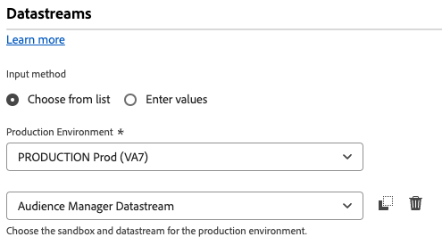
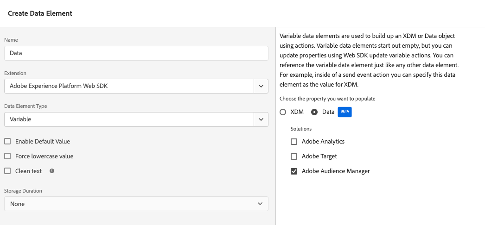

# Migrate from the Adobe Audience Manager tag extension to the Web SDK tag extension

This implementation path involves a methodical migration approach to move from the [Adobe Audience Manager tag extension](https://experienceleague.adobe.com/en/docs/experience-platform/tags/extensions/client/audience-manager/overview) to the [Web SDK tag extension](https://experienceleague.adobe.com/en/docs/experience-platform/tags/extensions/client/web-sdk/web-sdk-extension-configuration). Other implementation paths are covered on separate pages:

* [Migrate from AppMeasurement to the Web SDK](appmeasurement-to-web-sdk.md): Take a smooth and methodical approach to move from the AppMeasurement JavaScript library to the Web SDK JavaScript library.

## Advantages and disadvantages of this implementation path

Using this migration approach has both advantages and disadvantages. Carefully weigh each option to decide which approach is best for your organization.

| Advantages | Disadvantages |
| --- | --- |
| <ul><li>**No code changes on your site**: Since your implementation already has tags installed, all migration updates can be made in the tags interface.</li><li>**Uses your existing implementation**: This approach does not require a net-new implementation. While it does require new rule actions, you can reuse your existing data elements and rule conditions with minimal changes.</li><li>**Does not require a schema**: For this stage of migrating to the Web SDK, you don't need an XDM schema. Instead, you can populate the `data` object, which sends data straight to Adobe Audience Manager. Once migration to the Web SDK is complete, then you can create a schema for your organization and use datastream mapping to populate applicable XDM fields. If a schema were required at this stage of the migration process, your organization would be forced to use an Adobe Audience Manager XDM schema. Use of this schema makes it more difficult for your organization to use your own schema in the future.</li></ul> | <ul><li>**Implementation technical debt**: Since this approach uses a modified form of your existing implementation, it can be harder to track implementation logic and perform changes when needed. Custom code can be particularly difficult to debug.</li><li>**Requires mapping to send data to Platform**: When your organization is ready to use Real-Time CDP, you must send data to a data set in Adobe Experience Platform. This action requires that every field in the `data` object be an entry in the datastream mapping tool that assigns it to an XDM schema field. Mapping only needs to be done once for this workflow, and it doesn't involve making implementation changes. However, it is an extra step that is not required when sending data in an XDM object.</li></ul> |

Adobe recommends following this implementation path when you have an existing implementation using the Adobe Audience Manager tag extension.

## Steps required to migrate to the Web SDK

The following steps contain concrete goals to work towards. Select each step for detailed instructions on how to accomplish it.

+++**1. Create and configure a datastream**

Follow the instructions below to create a datastream in Adobe Experience Platform Data Collection. When you send data to this datastream, it forwards data to Audience Manager. In the future, this same datastream forwards data to Real-Time CDP.

1. Navigate to [experience.adobe.com](https://experience.adobe.com) and log in using your credentials.
1. Use the home page or product selector in the top right to navigate to **[!UICONTROL Data Collection]**.
1. In the left navigation, select **[!UICONTROL Datastreams]**.
1. Select **[!UICONTROL New Datastream]**.
1. Enter the desired name, then select **[!UICONTROL Save]**.
1. Once the datastream is created, select **[!UICONTROL Add Service]**.
1. In the service drop-down menu, select **[!UICONTROL Adobe Audience Manager]**.
1. Make sure the **[!UICONTROL Enable XDM Flattened Fields]** option is unchecked.

 {style="border:1px solid lightslategray"}

Your datastream is now ready to receive and pass along data to Audience Manager.

+++

+++**2. Add the Web SDK extension to your tag property**

This section prepares your tag for the bulk of the migration effort taking place in the next step.

1. Select the hamburger icon in the top left of the Adobe Experience Platform interface, then select **[!UICONTROL Tags]**.
1. Select the desired tag property.
1. In the left navigation of the tag property, select **[!UICONTROL Extensions]**.
1. Select **[!UICONTROL Catalog]** near the top to see a list of all available extensions.
1. Search for and select the **[!UICONTROL Adobe Experience Platform Web SDK]** extension, then select **[!UICONTROL Install]** on the right side.

     {style="border:1px solid lightslategray"}

1. The extension configuration settings appear. Locate the **[!UICONTROL Datastreams]** section, and select the sandbox that you are using and the datastream that you created in the previous step.

     {style="border:1px solid lightslategray"}

1. Select **[!UICONTROL Save]**.

Your tag property now has the Web SDK installed.

+++

+++**3. Create a data object data element**

The data object data element provides an intuitive framework to configure a payload that the Web SDK uses to send to a datastream. Most rules that you update in the following step interact with this data element.

1. In the left navigation of the tags interface, select **[!UICONTROL Data Elements]**.
1. Select **[!UICONTROL Add Data Element]**
1. Give the data element the following settings:
    * **[!UICONTROL Name]**: Anything you'd like, such as "Data layer" or "Data object"
    * **[!UICONTROL Extension]**: [!UICONTROL Adobe Experience Platform Web SDK]
    * **[!UICONTROL Data Element Type]**: [!UICONTROL Variable]
    * Check boxes can remain as they are.
1. On the right side, select the following settings:
    * Property radio button: **[!UICONTROL Data]**
    * **[!UICONTROL Solution]**: [!UICONTROL Audience Manager]
1. Select **[!UICONTROL Save]**.

 {style="border:1px solid lightslategray"}

Your tag property now has everything needed to update each rule.

+++

+++**4. Update rules to use the Web SDK extension instead of the Audience Manager extension**

This step contains the bulk of the effort required to migrate to the Web SDK, and requires knowledge of how your implementation works. An example is provided below of how to edit a typical tag rule. Update all tag rules in your implementation to replace all references to the Audience Manager extension with the Web SDK extension.

1. In the left navigation of the tags interface, select **[!UICONTROL Rules]**.
1. Select a rule to edit.
1. Select the action **[!UICONTROL Audience Manager - Set Variables]**
1. Note all Audience Manager variables set within this rule. Include both variables set in the drop-down menus and variables set within custom code.
1. Change the [!UICONTROL Action Configuration] to the following settings:
    * **[!UICONTROL Extension]**: [!UICONTROL Adobe Experience Platform Web SDK]
    * **[!UICONTROL Action type]**: Update variable
1. Ensure that your data object is selected in the drop-down on the right.
1. Set the Audience Manager variables to their same respective values as they were configured in the Audience Manager extension.
    * Variables set within the tags interface can directly translate to the same values.
    * String variables set within custom code require minimal adjustments. Instead of using the `s` object, use `data.__adobe.aam` instead. For example, `s.eVar1` would translate to `data.__adobe.aam.eVar1`.
    * Audience Manager configuration variables and method calls in custom code can require modified implementation logic. See each respective [variable](/help/implement/vars/overview.md) to determine how to achieve its equivalent using the Web SDK.
1. Once all rule logic is replicated using the Web SDK extension, select **[!UICONTROL Keep Changes]**.
1. Repeat these steps for every action configuration that uses the Audience Manager extension to set values. This step includes both variables set using the tags interface and variables set using custom code. Custom code blocks cannot reference the `s` object anywhere.

The above steps apply only to rules that set values. The following steps replace all actions that use the [!UICONTROL Action Configuration] [!UICONTROL Send Beacon].

1. Select a rule that sends a beacon.
1. Select the action **[!UICONTROL Adobe Analytics - Send Beacon]**.
1. Note the current value of the [!UICONTROL Tracking] radio button on the right ([`s.t()`](../../vars/functions/t-method.md) or [`s.tl()`](../../vars/functions/tl-method.md)).
1. Change the [!UICONTROL Action Configuration] to the following settings:
    * [!UICONTROL Extension]: [!UICONTROL Adobe Experience Platform Web SDK]
    * [!UICONTROL Action type]: [!UICONTROL Send event]
1. On the right, change the action settings to the following:
    * [!UICONTROL Type]: For `s.t()`, use **[!UICONTROL Web Webpagedetails Page Views]**. For `s.tl()`, use **[!UICONTROL Web Webinteraction Link Clicks]**. If you use [`s.tl()`](../../vars/functions/tl-method.md), you must also include the following fields in your data object. These fields are listed under [!UICONTROL Additional properties] when performing the [!UICONTROL Update variable] action configuration:
      * [Link name](../../vars/functions/tl-method.md)
      * [Link type](../../vars/functions/tl-method.md)
      * [Link URL](../../vars/config-vars/linkurl.md)
1. Select **[!UICONTROL Keep Changes]**.
1. Repeat these steps for every action configuration that uses Adobe Analytics to send a beacon.

+++

+++**5. Publish updated rules**

Publishing updated rules follows the same workflow as any other change to your tags configuration.

1. In the left navigation of the tags interface, select **[!UICONTROL Publishing Flow]**.
1. Select **[!UICONTROL Add Library]**.
1. Give this tag commit a name, such as "Upgrade to Web SDK".
1. Select **[!UICONTROL Add All Changed Resources]**.
1. Select **[!UICONTROL Save]**.
1. The publishing workflow displays an orange dot, indicating that it is building. Once the dot turns green, your changes are available in your development environment.
1. Test your changes in your development environment to ensure that all rules are firing properly, and that the data object is populating with expected values.
1. When ready, submit the library for approval, build to staging, then ultimately approve and publish to production.

 {style="border:1px solid lightslategray"}

+++

+++**6. Disable Audience Manager extension**

Once your tag implementation is fully migrated to the Web SDK, you can disable the Audience Manager extension.

1. In the left navigation of the tags interface, select **[!UICONTROL Extensions]**.
1. Locate and select the [!UICONTROL Audience Manager] extension. On the right, select **[!UICONTROL Disable]**.
1. Follow the same publishing workflow above to publish the removal of the [!UICONTROL Audience Manager] extension.
1. Once the extension is disabled in production, you can uninstall it entirely. Select the extension, select the three-dot menu on the right, then select **[!UICONTROL Uninstall]**.
1. Follow the same publishing workflow above to publish those changes to production.

+++

At this point, your Audience Manager implementation is fully migrated to the Web SDK and is prepared to move to Real-Time CDP in the future.
