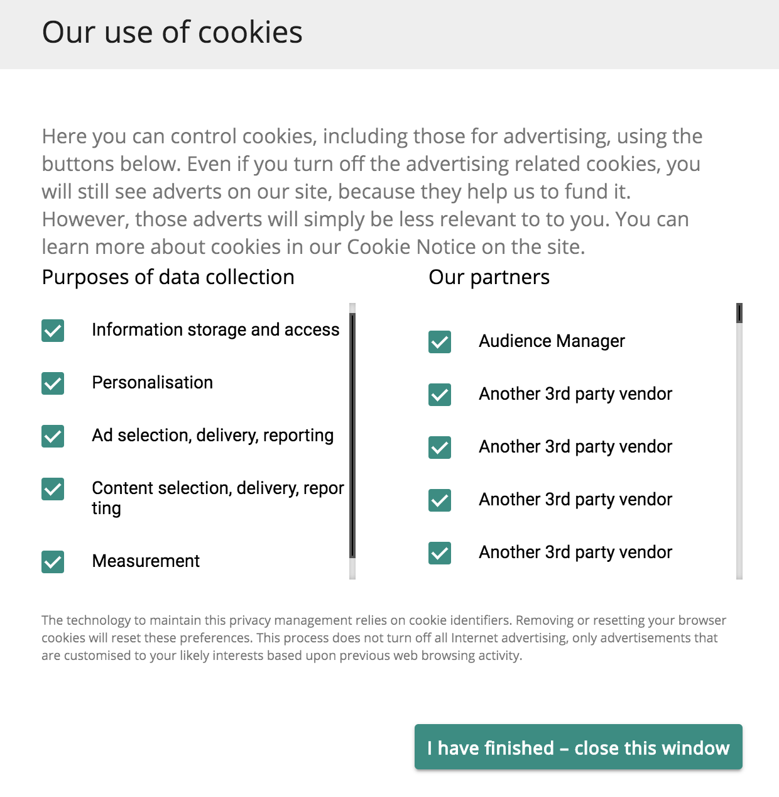

# Audience Manager Plug-in for IAB TCF 

## Overview

An important aspect in the privacy obligations you have towards your users is the acquisition and conveyance of user choices over how their personal data may be used (i.e., “purposes”) and by whom (i.e., “companies”).

Adobe provides you with the means to manage and communicate your users' privacy choices through the [Opt-in functionality](https://marketing.adobe.com/resources/help/en_US/mcvid/overview.html) and through [IAB Transparency and Consent Framework (TCF)](https://iabtechlab.com/standards/gdpr-transparency-and-consent-framework/) support.

This article describes the Audience Manager use cases that support the IAB TCF and how to implement IAB TCF support in Audience Manager. Audience Manager is registered in the IAB TCF with the vendor ID 565.

The Audience Manager Plug-in for IAB TCF utilizes the [Opt-in functionality](https://marketing.adobe.com/resources/help/en_US/mcvid/iab.html), which is, in turn, part of the Adobe [Experience Cloud ID Service (ECID)](https://marketing.adobe.com/resources/help/en_US/mcvid/) library.

## Scope and Limitations

As a Publisher or Advertiser working with Audience Manager, you are able to convey user choices to Audience Manager as per IAB TCF. This provides you with an easy and consistent way of communicating user choices to all partners you work with and Audience Manager can help you respect your users' privacy choices.

The IAB TCF support described in this article represents the first phase in Audience Manager's planned support for the IAB framework. Currently, Audience Manager does not support:

* Mobile device workflows;
* Cross-device consent management;
* Appending consent to URLs sent to [URL destinations](/help/using/features/destinations/manage-destinations.md#configure-url-destination);
* Appending consent to segments.

## Prerequisites

You must meet the following prerequisites to use the IAB TCF with Audience Manager:

1. You must be using Experience Cloud ID Service (ECID) version 4.1 or newer. [Download](https://github.com/Adobe-Marketing-Cloud/id-service/releases) our latest ECID release.
2. 
   1. You must be using Audience Manager Data Integration Library (DIL) version 9.0 or newer, downloadable from [here](https://github.com/Adobe-Marketing-Cloud/dil/releases). Read about [DIL in the Audience Manager documentation](/help/using/dil/dil-overview.md).
   2. Alternatively, if you use Server-Side Forwarding (SSF) to import data into Audience Manager, you must upgrade to the latest version of AppMeasurement. Download AppMeasurement using the [Analytics Code Manager](https://marketing.adobe.com/resources/help/en_US/reference/code_manager_admin.html).
3. You must be using a Consent Management Platform (CMP), either commercial or your own, that supports IAB, and is registered with the IAB TCF. See the list of [CMPs registered within the IAB framework](https://advertisingconsent.eu/cmp-list/).

## Recommendations and how to implement

To enable the IAB TCF support in Audience Manager, read our documentation on [how to set up IAB with Opt-in](https://marketing.adobe.com/resources/help/en_US/mcvid/iab.html).

This is easiest done by using [Adobe Launch](https://docs.adobelaunch.com/) to instrument ECID Opt-in on your properties. Read the documentation for the [ECID Opt-in extension](https://docs.adobelaunch.com/extension-reference/web/experience-cloud-id-service-extension#opt-in) to learn how to set up the Launch extension.

## User choice workflow when using the IAB framework

When visiting a web property, your users can provide their choices regarding how their data is to be used by the publisher and by the third-party vendors that the publisher works with. Users provide their choices in the form of *standard purposes* and permissions to *third-party vendors* registered in the global vendor list. The image below represents an example of a CMP dialogue, displayed to a first-time visitor of a website. Keep in mind that this dialogue can look very different, based on customer implementation.

The standard purposes in the IAB framework are:

* Information storage and access
* Personalization
* Ad selection, delivery, and reporting
* Content selection, delivery, and reporting
* Measurement

Refer to the [IAB framework specification page](https://github.com/InteractiveAdvertisingBureau/GDPR-Transparency-and-Consent-Framework/blob/master/Consent%20string%20and%20vendor%20list%20formats%20v1.1%20Final.md#purposes-features) for a description of the five standard purposes.

Users may grant their consent for a combination of standard purposes and vendors. For example, users could grant their consent for storage, personalization, and measurement and grant their consent to all third-party vendors displayed by the CMP. Or, in another example, they could grant their consent for all five standard purposes but only grant consent to a few of the vendors displayed by the CMP.

Once the user selects their privacy choices, the user choice(s) are recorded in the IAB TCF consent string. The IAB TCF consent string stores the combination of approved purposes and vendors, along with other metadata information (see the [IAB page](https://github.com/InteractiveAdvertisingBureau/GDPR-Transparency-and-Consent-Framework/blob/master/Consent%20string%20and%20vendor%20list%20formats%20v1.1%20Final.md#Consent-string-and-vendor-list-format) for more information). Every vendor registered in the IAB TCF evaluates the IAB TCF consent string and makes decisions based on the users' privacy choices. Keep in mind that the users' privacy choices are valid across all approved vendors.

## Standard purposes needed by Audience Manager

Audience Manager evaluates the users' choices stored in the IAB TFC consent string for:

* Information storage and access (purpose ID 1 in the [global vendor list](https://vendorlist.consensu.org/vendorlist.json))
* Personalization (purpose ID 2)
* Measurement (purpose ID 5)
* Audience Manager vendor consent to store, process, or activate on data for a publisher.

>[!IMPORTANT]
>
>Audience Manager needs consent for *all three purposes, plus vendor consent* in order to deploy cookies and initiate or honor ID syncs.

## Audience Manager behavior depends on whether the user grants consent

Audience Manager works differently depending on whether Audience Manager detects in the IAB TCF consent string that the user has provided consent for the three purposes (storage, personalization, measurement) or not.

When your user *provides consent*, Audience Manager: | When your user *declines* consent, Audience Manager: |
---------|----------|
 Carries out all the Audience Manager use cases you have requested. | Does not store any new user data in your instance. This includes partner IDs, signals, traits, or pixel data.|
 Conveys consent to third parties in ID syncs (by passing gdpr = 1 and the consent string as gdpr_consent on ID sync calls). | Does not initiate 3rd party ID syncs. |
 Evaluates and honors consent passed from ad server pixels. | Does not honor partner-initiated ID syncs. |
 Honors partner-initiated ID syncs. | |

