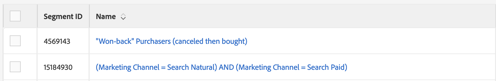
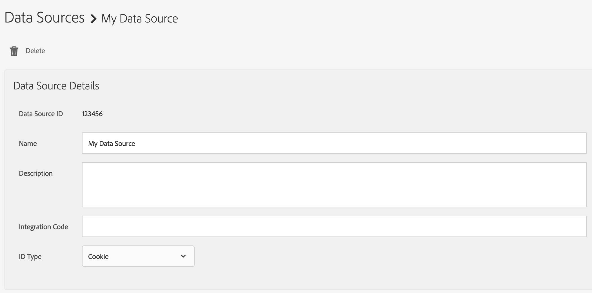
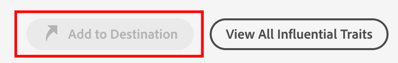
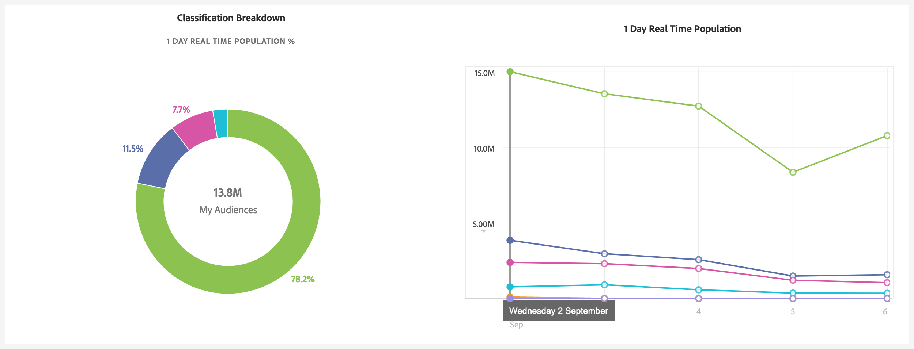

# Accessibility in Audience Manager {#accessibility}

## Overview {#overview}

Accesibility refers to a series of features that make a software product usable, with as little effort as possible from users with various disabilities, such as visual, auditory, cognitive, motor, or other kind.

Adobe is an industry leader in accessibility and supports the creation of outstanding web experiences by encouraging developers to produce rich, engaging content that is accessible to all users. For more details about Adobe's committment to accesibility, see [Adobe Accessibility](https://www.adobe.com/accessibility.html).

The most common accessibility features used in software products are keyboard navigation, keyboard shortcuts, support for high contrast in the user interface, screen reader support, clear labels for graphical elements, and so on.

To make [!DNL Audience Manager] easily accessible, we've developed support for multiple accessibility features.

## Keyboard Navigation {#keyboard-navigation}

Audience Manager supports full keyboard navigation, using a few dedicated keys:

* The `Tab` key and the arrows move between individual elements of the user interface. Selected elements are highlighted with a blue border.

* The `Return` and `Space` keys activate the selected item.

## Accessible Table Sorting {#table-sorting}

Table headers are selectable when navigating via the `Tab` key, and you can change the sorting order by pressing `Space`.

## Screen Readers and Support for Assistive Technologies {#screen-readers-support}

Screen readers are accesibility tools that read text that appears on the computer screen. They can also read non-textual information, such as graphical element labels or image descriptions, which have to be included by the developers in accessibility tags or attributes.

All interactive elements within the Audience Manager user interface include corresponding labels. This ensures that assistive technologies, such as screen readers, can read out the labels to users.

## Colors and Contrast {#colors-contrast}

The [!DNL Audience Manager] user interface was developed with optimal contrast requirements in mind, ensuring an accessible viewing experience for users with low vision or color deficiencies.

* Labels and additional text are displayed in dark fonts on light backgrounds; 
  
* Inactive elements are greyed out;
  
* Graphical elements are displayed in high contrast colors, for optimal readability.
  

