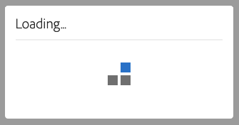

# Accessibility in Audience Manager {#accessibility}

## Overview {#overview}

Accessibility refers to a series of features that make a software product usable, with as little effort as possible from users with various disabilities, such as visual, auditory, cognitive, motor, or other kind.

Adobe is an industry leader in accessibility and supports the creation of outstanding web experiences by encouraging developers to produce rich, engaging content that is accessible to all users. For more details about Adobe's commitment to accessibility, see [Adobe Accessibility](https://www.adobe.com/accessibility.html).

The most common accessibility features found in software products are: keyboard navigation, semantic structure, sufficient contrast between foreground elements and background elements, assistive technology support, clear element labels, and so on.

To make [!DNL Audience Manager] easier to use for everyone, we've developed support for multiple accessibility features.

## Keyboard Navigation {#keyboard-navigation}

[!DNL Audience Manager] supports full keyboard accessibility:

* The `Tab` key and the arrows move between individual elements of the user interface.

  

* The `Return` (`Enter`) and `Space` keys activate the selected item.

## Accessible Table Sorting {#table-sorting}

Table headers are selectable when navigating via the `Tab` key, and you can change the sorting order by pressing `Space`.

  

## Support for Assistive Technologies {#assistive-technologies}

Through the use of semantic code and [ARIA](https://www.w3.org/WAI/standards-guidelines/aria/), interactive elements within the [!DNL Audience Manager] user interface include corresponding labels, accessible names, and roles that identify both their purpose and their current state.

This ensures that assistive technologies, such as screen readers, can read out the labels and other information to users so that they can easily interact with the application controls.

All interactive elements within the Audience Manager user interface include corresponding labels. This ensures that assistive technologies, such as screen readers, can read out the labels to users.

## Colors and Contrast {#colors-contrast}

The [!DNL Audience Manager] user interface strives to provide enough contrast in the application to ensure an accessible viewing experience for users with low vision or color deficiencies.

For example, loading screens include a loading spinner inside a white modal box, all on top of a dark grey overlay.

## Further Reading {#further-reading}

[!DNL Audience Manager] strives to provide an ever increasing degree of accessibility, making the product easy to use for everyone.

We encourage you to use the [Adobe Accessibility Feedback Form](https://www.adobe.com/accessibility/feedback.html) to send us improvement suggestions and accessibility issues that you run into. We'll be more than glad to take your feedback into account and improve [!DNL Audience Manager].