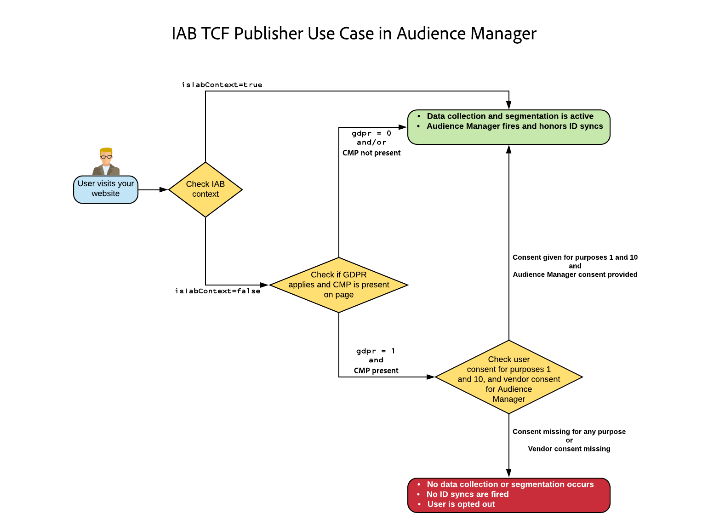
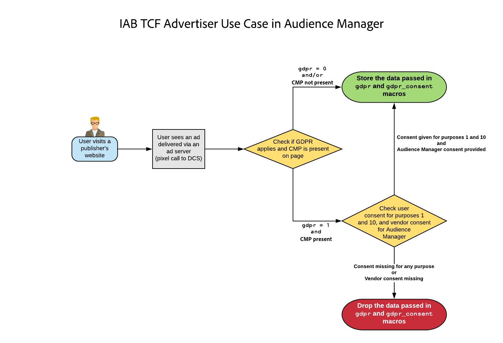

# Audience Manager Plug-in for IAB TCF {#aam-iab-plugin}

## Overview

An important aspect in the privacy obligations you have towards your users is the acquisition and conveyance of user choices over how their personal data may be used (i.e., “purposes”) and by whom (i.e., “companies”).

Adobe provides you with the means to manage and communicate your users' privacy choices through the [Opt-in functionality](https://docs.adobe.com/content/help/en/id-service/using/implementation/opt-in-service/optin-overview.html) and through [IAB Transparency and Consent Framework (TCF)](https://iabtechlab.com/standards/gdpr-transparency-and-consent-framework/) support.

This article describes the Audience Manager use cases that support the IAB TCF and how to implement IAB TCF support in Audience Manager. Audience Manager is registered in the IAB TCF with the vendor ID 565.

The Audience Manager Plug-in for IAB TCF utilizes the [Opt-in functionality](https://docs.adobe.com/content/help/en/id-service/using/implementation/opt-in-service/iab.html), which is, in turn, part of the Adobe [Adobe Experience Platform Identity Service (ECID)](https://docs.adobe.com/content/help/en/id-service/using/home.html) library.

## Scope and Limitations {#scope-and-limitations}

As a Publisher or Advertiser working with Audience Manager, you are able to convey user choices to Audience Manager as per IAB TCF. This provides you with an easy and consistent way of communicating user choices to all partners you work with and Audience Manager can help you respect your users' privacy choices.

The IAB TCF support described in this article represents the first phase in Audience Manager's planned support for the IAB framework. Currently, Audience Manager does not support:

* Mobile device workflows;
* Cross-device consent management;
* Appending consent to URLs sent to [URL destinations](../../features/destinations/create-url-destination.md);
* Appending consent to segments.

## Prerequisites {#prerequisites}

You must meet the following prerequisites to use the IAB TCF with Audience Manager:

1. You must be using Adobe Experience Platform Identity Service (ECID) version 4.1 or newer. [Download](https://github.com/Adobe-Marketing-Cloud/id-service/releases) our latest ECID release.
1. You must be using Audience Manager Data Integration Library (DIL) version 9.0 or newer, downloadable from [here](https://github.com/Adobe-Marketing-Cloud/dil/releases). Read about [DIL in the Audience Manager documentation](../..//dil/dil-overview.md).
1. Alternatively, if you use Server-Side Forwarding (SSF) to import data into Audience Manager, you must upgrade to the latest version of AppMeasurement. Download AppMeasurement using the [Analytics Code Manager](https://docs.adobe.com/content/help/en/analytics/admin/admin-tools/code-manager-admin.html).
2. You must be using a Consent Management Platform (CMP), either commercial or your own, that supports the IAB TCF, and is registered with the IAB TCF. See the list of [CMPs registered within the IAB framework](https://iabeurope.eu/cmp-list/).

## Recommendations and how to implement {#recommendations}

To enable the IAB TCF support in Audience Manager, read our documentation on [how to set up IAB with Opt-in](https://docs.adobe.com/content/help/en/id-service/using/implementation/opt-in-service/iab.html).

This is easiest done by using [Adobe Experience Platform Launch](https://docs.adobelaunch.com/) to instrument ECID Opt-in on your properties. Read the documentation for the [ECID Opt-in extension](https://docs.adobelaunch.com/extension-reference/web/experience-cloud-id-service-extension#opt-in) to learn how to set up the Launch extension.

## User choice workflow when using the IAB framework {#user-choice-workflow}

When visiting a web property, your users can provide their choices regarding how their data is to be used by the publisher and by the third-party vendors that the publisher works with. Users provide their choices in the form of *standard purposes* and permissions to *third-party vendors* registered in the global vendor list. The image below represents an example of a CMP dialogue, displayed to a first-time visitor of a website. Keep in mind that this dialogue can look very different, based on customer implementation.


The standard purposes in the IAB framework are:

* Information storage and access
* Personalization
* Ad selection, delivery, and reporting
* Content selection, delivery, and reporting
* Measurement

Refer to the [IAB framework specification page](https://github.com/InteractiveAdvertisingBureau/GDPR-Transparency-and-Consent-Framework/blob/master/Consent%20string%20and%20vendor%20list%20formats%20v1.1%20Final.md#purposes-features) for a description of the five standard purposes.

Users may grant their consent for a combination of standard purposes and vendors. For example, users could grant their consent for storage, personalization, and measurement and grant their consent to all third-party vendors displayed by the CMP. Or, in another example, they could grant their consent for all five standard purposes but only grant consent to a few of the vendors displayed by the CMP.

Once the user selects their privacy choices, the user choice(s) are recorded in the IAB TCF consent string. The IAB TCF consent string stores the combination of approved purposes and vendors, along with other metadata information (see the [IAB page](https://github.com/InteractiveAdvertisingBureau/GDPR-Transparency-and-Consent-Framework/blob/master/Consent%20string%20and%20vendor%20list%20formats%20v1.1%20Final.md#Consent-string-and-vendor-list-format) for more information). Every vendor registered in the IAB TCF evaluates the IAB TCF consent string and makes decisions based on the users' privacy choices. Keep in mind that the users' privacy choices are valid across all approved vendors.

## Standard purposes needed by Audience Manager {#aam-standard-purposes}

Audience Manager evaluates the users' choices stored in the IAB TFC consent string for:

* Information storage and access (purpose ID 1 in the [global vendor list](https://vendorlist.consensu.org/vendorlist.json))
* Personalization (purpose ID 2)
* Measurement (purpose ID 5)
* Audience Manager vendor consent to store, process, or activate on data for a publisher.

>[!IMPORTANT]
>
>Audience Manager needs consent for *all three purposes, plus vendor consent* in order to deploy cookies and initiate or honor ID syncs.

## Audience Manager behavior depends on whether the user grants consent {#aam-behavior-consent}

Audience Manager works differently depending on whether Audience Manager detects in the IAB TCF consent string that the user has provided consent for the three purposes (storage, personalization, measurement) or not.

| When your user *provides consent*, Audience Manager:  | When your user *declines* consent, Audience Manager: |
|---|---|
| <ul><li>Carries out all the Audience Manager use cases you have requested.</li><li>Conveys consent to third parties in ID syncs (by passing gdpr = 1 and the consent string as gdpr_consent on ID sync calls).</li><li>Evaluates and honors consent passed from ad server pixels.</li><li>Honors partner-initiated ID syncs.</li></ul>  | <ul><li>Does not store any new user data in your instance. This includes partner IDs, signals, traits, or pixel data.</li><li>Does not initiate 3rd party ID syncs.</li><li>Does not honor partner-initiated ID syncs.</li></ul> |

## Publisher Use Case {#publisher-use-case}

By implementing the IAB TCF, you are not required to maintain custom code for consent management on your web properties via a different mechanism with Adobe or other third-party vendors. The use case is described in the image and in the steps below. Start from the left of the image:

1. A user visits one of your web properties. As long as you are using the latest versions of the ECID and DIL libraries (see [Prerequisites](/help/using/overview/data-security-and-privacy/aam-iab-plugin.md#prerequisites)), the opt-in flow is triggered.
2. Audience Manager checks whether the IAB flow applies (`isIabContext=true`). See [Recommendations and how to implement](aam-iab-plugin.md#recommendations).
3. Audience Manager checks whether GDPR applies (`gdpr = 1`) and whether there is a CMP, registered with IAB, on your web property. For example, this would apply to users visiting from the European Union area. Note that it is your responsibility as publisher to set the GDPR flag.
4. If GDPR applies, Audience Manager checks the IAB TCF consent string, passed in the parameter `gdpr_consent`, for the needed permissions. Audience Manager needs permissions for storage, personalization, measurement, plus Audience Manager vendor consent, to store, process or activate data.
5. If the IAB TCF consent string is present and it contains the required permissions, Audience Manager passes the IAB TCF consent string on to our [data collection servers](../../reference/system-components/components-data-collection.md) (DCS).
6. Audience Manager responds by setting a [demdex cookie](https://docs.adobe.com/content/help/en/core-services/interface/ec-cookies/cookies-am.html) on the browser. Audience Manager also initiates and honors 3rd party ID syncs.
7. Alternatively, if the IAB TCF consent string passed in step 5 does not contain all the needed permissions, Audience Manager does not collect, process, or activate data and does not honor or initiate ID syncs.



## Advertiser Use Case {#advertiser-use-case}

Audience Manager evaluates and honors consent passed in [pixel calls](../../integration/sending-audience-data/real-time-data-integration/pixel-based-data-transfer.md), in accordance with the IAB TCF.

Pixels are generally placed by Audience Manager customers on their partner pages or they are placed in ad servers to include in the ad response. In the first case, your partner must programmatically retrieve the consent parameter and add it to the pixel before firing. In the second case, which is more common and is described in detail below, ad servers append the consent parameters they receive from the Supply-Side Platform (SSP) or publisher ad servers to all pixels.

Audience Manager uses two parameters to pass user consent in pixel calls:

* `gdpr` can be 0 (GDPR does not apply) or 1 (GDPR applies);
* `gdpr_consent` is the URL-safe base64-encoded GDPR consent string (see [specification](https://github.com/InteractiveAdvertisingBureau/GDPR-Transparency-and-Consent-Framework/blob/master/URL-based%20Consent%20Passing_%20Framework%20Guidance.md#specifications)). A sample call for an impression pixel, with the two parameters could look like below:

```
http://yourcompany.demdex.net/event?d_event=imp&gdpr=1&gdpr_consent=consentstring&d_src=datasource_id&d_site=siteID&d_creative=creative_id&d_adgroup=adgroup_id&d_placement=placement_id
```

The use case is described in the image and in the steps below. Start from the left of the image:

1. Your user is served an impression via an ad server. This translates into a pixel call to our Data Collection Servers (DCS).
2. Audience Manager checks whether the GDPR flag applies. If it doesn't, Audience Manager stores the data passed in macro variables in pixel calls.
3. If the consent string is present and it contains the required permissions, Audience Manager stores the data passed in macro variables in pixel calls.
4. If the consent string is missing or lacks the required permissions, Audience Manager drops the data passed in macro variables in pixel calls.



## Activation partners that support IAB TCF {#aam-activation-partners}

The Audience Manager Plug-in for IAB TCF enables you to forward the IAB TCF consent string to activation partners while respecting users’ privacy choices. For information on which activation partners support IAB TCF, refer to our [list of device-based destinations](/help/using/features/destinations/device-based-destinations-list.md).

## Test your IAB implementation {#test-iab-implementation}

To test that you have correctly implemented the Audience Manager Plug-in for IAB TCF, read [Use Case 4 in Validation Methods for Opt-in and IAB implementation](https://docs.adobe.com/content/help/en/id-service/using/implementation/opt-in-service/testing-optin-and-iab-plugin.html#section-64331998954d4892960dcecd744a6d88).

## IAB and Opt-out in Audience Manager. Order of precedence. {#iab-and-optout}

Another privacy option at your users' disposal is the ability to opt out of all data collection. Adobe provides users with the means to do so within the [Your Privacy Choices](https://www.adobe.com/privacy/opt-out.html#customeruse) page.

Audience Manager addresses opt-out requests in a [separate article in our documentation](data-privacy-requests.md).

>[!NOTE]
>
>**Order of Precedence** - If your user opts out of data collection using a global opt-out tool, as described in the link above, this takes precedence over the opt-in and IAB verifications.

## Additional resources {#additional-resources}

* [Adobe Experience Platform Identity Service Opt-in](https://docs.adobe.com/content/help/en/id-service/using/implementation/opt-in-service/optin-overview.html)
* [IAB Europe GDPR Transparency and Consent Framework](https://iabtechlab.com/standards/gdpr-transparency-and-consent-framework/)
* [IAB Europe GDPR Transparency and Consent Framework Technical Specifications](https://github.com/InteractiveAdvertisingBureau/GDPR-Transparency-and-Consent-Framework/blob/master/Consent%20string%20and%20vendor%20list%20formats%20v1.1%20Final.md)
* [IAB TCF plugin - video demonstration](https://helpx.adobe.com/audience-manager/kt/using/iab-tcf-support-audience-manager-technical-video-implement.html)