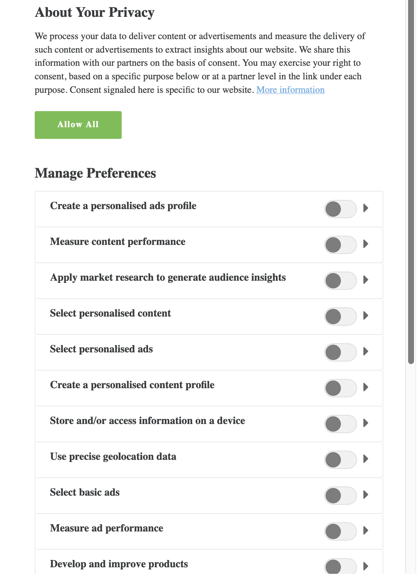

# [!DNL Audience Manager Plug-in for IAB TCF] {#aam-iab-plugin}

## Overview

An important aspect in the privacy obligations you may have towards your users is the acquisition and conveyance of user choices over how their personal data may be used (i.e., "purposes") and by whom (i.e., "companies").

Adobe provides you with the means to manage and communicate your users' privacy choices through the [Opt-in functionality](https://experienceleague.adobe.com/docs/id-service/using/implementation/opt-in-service/optin-overview.html) and through [IAB Transparency and Consent Framework (TCF)](https://iabtechlab.com/standards/gdpr-transparency-and-consent-framework/) support.

This article describes the Audience Manager use cases that support the IAB TCF and how to implement IAB TCF support in Audience Manager.

>[!IMPORTANT]
>
>Audience Manager is registered in the [IAB TCF](https://iabeurope.eu/tcf-for-vendors/) with the vendor ID 565.

The Audience Manager Plug-in for IAB TCF utilizes the [Opt-in functionality](https://experienceleague.adobe.com/docs/id-service/using/implementation/opt-in-service/iab.html), which is, in turn, part of the [Adobe Experience Platform Identity Service (ECID)](https://experienceleague.adobe.com/docs/id-service/using/home.html) library.

## Scope and Limitations {#scope-and-limitations}

As a Publisher or Advertiser working with Audience Manager, you are able to convey user choices to Audience Manager as per IAB TCF.

>[!IMPORTANT]
>
>IAB TCF regulations apply only to visitors located in the European Economic Area.

Audience Manager helps you respect your users' privacy choices and also provides you with an easy way to communicate these choices to all the partners you work with.

Currently, Audience Manager does not support:

* Mobile device workflows;
* Appending consent to segment exports.

## Upgrading to [!DNL IAB TCF v2.2] {#upgrading}

Customers who are upgrading their [!DNL Audience Manager Plug-in for IAB TCF] implementation from [!DNL IAB TCF] v1.1 to [!DNL IAB TCF] v2.2, or enabling [!DNL IAB TCF] v2.2 for the first time, should all follow the same guidelines on prerequisites and implementation as described below.

## Prerequisites {#prerequisites}

>[!IMPORTANT]
>
>Audience Manager supports IAB TCF v2.2.
>
>IAB TCF v1.1 support will end on August 15th, 2020.
>
> Customers who wish to continue using the Audience Manager Plug-in for IAB TCF for consent management should upgrade to latest version of [ECID](https://github.com/Adobe-Marketing-Cloud/id-service/releases) for continued support.
>
> After upgrading to the latest [ECID](https://github.com/Adobe-Marketing-Cloud/id-service/releases) version, IAB TCF v1.1 consent strings will no longer be supported, so make sure to update your CMP before upgrading to the latest ECID version.

You must meet the following prerequisites to use the Audience Manager Plug-in for IAB TCF with Audience Manager:

1. You must be using Adobe Experience Platform Identity Service (ECID) version 5 or newer. [Download](https://github.com/Adobe-Marketing-Cloud/id-service/releases) our latest ECID release.
2. You must be using Audience Manager [!DNL Data Integration Library] (DIL) version 9.0 or newer, downloadable from [here](https://github.com/Adobe-Marketing-Cloud/dil/releases). Read about [DIL in the Audience Manager documentation](../../dil/dil-overview.md). We recommend using the [Adobe Audience Manager tag extension](https://experienceleague.adobe.com/docs/experience-platform/tags/extensions/adobe/audience-manager/overview.html) for the easiest DIL implementation of Audience Manager.
3. Alternatively, if you use [!DNL Server-Side Forwarding] (SSF) to import data into Audience Manager, you must upgrade to the latest version of AppMeasurement. Download AppMeasurement using the [Analytics Code Manager](https://experienceleague.adobe.com/docs/analytics/admin/admin-tools/code-manager-admin.html).
4. You must be using a Consent Management Platform (CMP), either commercial or your own, that is integrated with IAB TCF v2.2, and is registered with the IAB TCF. See the list of [CMPs registered within the IAB framework](https://iabeurope.eu/cmp-list/).

>[!WARNING]
>
>If you are using a Consent Management Platform (CMP) that does not support IAB TCF v.2.0, Audience Manager will automatically send the `gdpr=0` parameter in ID syncs, even if your visitors are in the European Union. To determine if your GDPR validation is active, we recommend that you confirm with your Consent Management Platform (CMP) that they support IAB TCF v2.2.

## Recommendations and how to implement {#recommendations}

To enable the IAB TCF support in Audience Manager, read our documentation on [how to set up IAB with Opt-in](https://experienceleague.adobe.com/docs/id-service/using/implementation/opt-in-service/iab.html).

The easiest way you can do this is by using [Adobe Experience Platform Tags](https://experienceleague.adobe.com/docs/experience-platform/tags/home.html?lang=en) to add [!DNL ECID Opt-in] on your properties. Read the documentation for the [ECID Opt-in extension](https://experienceleague.adobe.com/docs/experience-platform/tags/extensions/adobe/id-service/overview.html) to learn how to set up the Tags extension.

## User choice workflow when using the IAB framework {#user-choice-workflow}

When visiting a web property, your users can provide their choices regarding how their data is to be used by the publisher and by the third-party vendors that the publisher works with.

Users provide their choices in the form of *consent* for the IAB purposes to *third-party vendors* registered in the global vendor list. 

The image below represents an example of a CMP dialogue, displayed to a first-time visitor of a website. Keep in mind that this dialogue can look very different, based on customer implementation.



Details on the various purposes and permissions included in IAB TCF v2.2 are covered in the [IAB Europe Transparency & Consent Framework Policies](https://iabeurope.eu/iab-europe-transparency-consent-framework-policies/#A_Purposes).

Users may grant their consent for a combination of purposes and vendors. For example, users could grant their consent for storing information on a device, developing and improving products, and grant their consent to all third-party vendors displayed by the CMP.

Or, in another example, they could grant their consent for all purposes but only grant consent to a few of the vendors displayed by the CMP.

Once the user selects their privacy choices, the user choice(s) are recorded in the IAB TC string. The IAB TC string stores the combination of approved purposes and vendors, along with other metadata information (see the [IAB page](https://github.com/InteractiveAdvertisingBureau/GDPR-Transparency-and-Consent-Framework/blob/master/TCFv2/IAB%20Tech%20Lab%20-%20Consent%20string%20and%20vendor%20list%20formats%20v2.md#about-the-transparency--consent-string-tc-string) for more information).

Every vendor registered in the IAB TCF evaluates the IAB TC string and makes decisions based on the users' privacy choices. Keep in mind that the users' privacy choices are valid across all vendors registered with IAB TCF.

## Purposes Required by Audience Manager {#aam-standard-purposes}

Audience Manager evaluates the users' choices stored in the IAB TC string for the following purposes, defined in the [IAB Europe Transparency & Consent Framework Policies](https://iabeurope.eu/iab-europe-transparency-consent-framework-policies/#Appendix_A_Purposes_and_Features_Definitions). 

* **Purpose 1**: Store and/or access information on a device;
* **Purpose 10**: Develop and improve products;
* **Special Purpose 1**: Ensure security, prevent fraud, and debug.

>[!IMPORTANT]
>
>Audience Manager needs consent for Purpose 1 and Purpose 10, plus vendor consent, in order to deploy cookies and initiate or honor ID syncs.
>
>Per [IAB regulations](https://iabeurope.eu/iab-europe-transparency-consent-framework-policies/#Special_Purpose_1__Ensure_security_prevent_fraud_and_debug_), Special Purpose 1 (Ensure security, prevent fraud, and debug) is always consented to, and users cannot object to it.

## Audience Manager behavior depends on whether the user grants consent {#aam-behavior-consent}

Audience Manager works differently depending on whether the IAB TC string includes user consent for the two purposes (store and/or access information on a device, and develop and improve products) or not.

We also check for user consent for all the destinations that you work with in Audience Manager, as long as those destinations are registered with IAB TCF.

| When your user *provides consent*, Audience Manager:  | When your user *declines* consent, Audience Manager: |
|---|---|
| <ul><li>Carries out all the Audience Manager use cases you have requested.</li><li>Conveys consent to third parties in ID syncs (by passing `gdpr = 1` and the consent string as `gdpr_consent` on ID sync calls).</li><li>Evaluates and honors consent passed from ad server pixels.</li><li>Honors partner-initiated ID syncs.</li></ul>  | <ul><li>Does not store any new user data in your instance. This includes partner IDs, signals, traits, or pixel data.</li><li>Does not initiate 3rd party ID syncs.</li><li>Does not honor partner-initiated ID syncs.</li><li>Opts out the user from further data collection.</li></ul> |

## Publisher Use Case {#publisher-use-case}

By implementing the Audience Manager Plug-in for IAB TCF, you are not required to maintain custom code for consent management on your web properties via a different mechanism with Adobe or other third-party vendors. The use case is described in the image and in the steps below. Start from the left of the image:

1. A user visits one of your web properties. As long as you are using the latest versions of the ECID and DIL libraries (see [Prerequisites](/help/using/overview/data-security-and-privacy/aam-iab-plugin.md#prerequisites)), the opt-in flow is triggered.
2. Audience Manager checks whether the IAB flow applies (`isIabContext=true`). See [Recommendations and how to implement](aam-iab-plugin.md#recommendations).
3. Audience Manager checks whether GDPR applies (`gdpr = 1`) and whether there is a CMP, registered with IAB TCF, on your web property. For example, this would apply to users visiting from the European Union. Note that it is your responsibility as a publisher to set the GDPR flag.
4. If GDPR applies, Audience Manager checks the IAB TC string, passed in the `gdpr_consent` parameter, for the required consent. Audience Manager needs consent for storing and/or accessing information on a device ([IAB TCF purpose 1](https://iabeurope.eu/iab-europe-transparency-consent-framework-policies/#A_Purposes)), developing and improving products ([IAB TCF purpose 10](https://iabeurope.eu/iab-europe-transparency-consent-framework-policies/#A_Purposes)), plus Audience Manager vendor consent to store, process, or activate data.
5. If the IAB TC string is present and it contains the required consent, Audience Manager passes the IAB TC string on to our [data collection servers](../../reference/system-components/components-data-collection.md) (DCS).
6. Audience Manager responds by setting a [demdex cookie](https://experienceleague.adobe.com/docs/core-services/interface/ec-cookies/cookies-am.html) on the browser, and initiates and honors third party ID syncs.
7. Alternatively, if the IAB TC string passed in step 4 does not contain all the needed permissions, Audience Manager does not collect, process, or activate any user data, and does not honor or initiate ID syncs. Additionally, it opts out the user from the destinations that you work with.

>[!IMPORTANT]
>
>If you are working with Audience Manager destination partners who require IAB TCF parameters, but you do not have a CMP that supports IAB TCF on your website, then Audience Manager sends `gdpr=0` in ID syncs. This means that GDPR does not apply to those users.
>
> If that is not desired, you should enable the IAB TCF functionality in Audience Manager to send the appropriate IAB TC strings to the destination partners.


## Advertiser Use Case {#advertiser-use-case}

Audience Manager evaluates and honors consent passed in [pixel calls](../../integration/sending-audience-data/real-time-data-integration/pixel-based-data-transfer.md), in accordance with the IAB TCF.

Pixels may be placed by Audience Manager customers on their partner pages or they are placed in ad servers to include in the ad response. In the first case, your partner must programmatically retrieve the consent parameter and add it to the pixel before firing. In the second case, which is more common and is described in detail below, ad servers append the consent parameters they receive from the Supply-Side Platform (SSP) or publisher ad servers to all pixels.

Audience Manager uses two parameters to pass user consent in pixel calls:

* `gdpr` can be 0 (GDPR does not apply) or 1 (GDPR applies);
* `gdpr_consent` is the URL-safe base64-encoded GDPR consent string (see [specification](https://github.com/InteractiveAdvertisingBureau/GDPR-Transparency-and-Consent-Framework/blob/master/TCFv2/IAB%20Tech%20Lab%20-%20Consent%20string%20and%20vendor%20list%20formats%20v2.md#about-the-transparency--consent-string-tc-string)). A sample call for an impression pixel, with the two parameters could look like below:

```
https://yourcompany.demdex.net/event?d_event=imp&gdpr=1&gdpr_consent=consentstring&d_src=datasource_id&d_site=siteID&d_creative=creative_id&d_adgroup=adgroup_id&d_placement=placement_id
```

The use case is described in the image and in the steps below. Start from the left of the image:

1. Your user is served an impression via an ad server. This translates into a [pixel call](../../integration/media-data-integration/impression-data-pixels.md) to our Data Collection Servers (DCS).
2. Audience Manager checks whether the GDPR flag applies. If it doesn't, Audience Manager stores the data passed in the `gdpr` and `gdpr_consent` variables in pixel calls.
3. If the IAB TC string is present and it contains the required permissions, Audience Manager stores the data passed in the `gdpr` and `gdpr_consent` variables in pixel calls.
4. If the IAB TC string is missing or lacks the required permissions, Audience Manager drops the data passed in the `gdpr` and `gdpr_consent` variables in pixel calls.


## Activation partners that support IAB TCF {#aam-activation-partners}

The Audience Manager Plug-in for IAB TCF enables you to forward the IAB TC string to activation partners while respecting users' privacy choices. For information on which activation partners support IAB TCF, refer to our [list of device-based destinations](/help/using/features/destinations/device-based-destinations-list.md).

## Appending Consent to URLs sent to URL Destinations

The Audience Manager integration with IAB TCF v2.2 supports the appending of consent to information sent to [URL destinations](../../features/destinations/create-url-destination.md) that are integrated with IAB TCF v2.2. However, this process is not done automatically by Audience Manager, to avoid breaking specific URL formats.

Customers who wish to append consent to data sent to [!DNL URL destinations] must manually add the `${GDPR}` and `${GDPR_CONSENT_XXXX}` macros to their URL format, replacing `XXXX` with the destination partner ID.

Example: `https://yourdomain.com?gdpr=${GDPR}&gdpr_consent=${GDPR_CONSENT_1234}`.

See [Destination Macros Defined](../../features/destinations/destination-macros.md) for more details about the supported destination macros.

## Cross-Device Consent Management

The Audience Manager Plug-in for IAB TCF automatically opts out the IDs present on a request, when your site visitors do not provide the appropriate permissions. If the request contains a [cross-device ID (CRM ID)](../../reference/ids-in-aam.md), Audience Manager opts out the ID, together with the last device linked to that [cross-device ID (CRM ID)](../../reference/ids-in-aam.md).

## Test your IAB implementation {#test-iab-implementation}

To test that you have correctly implemented the Audience Manager Plug-in for IAB TCF, read [Use Case 4 in Validating Opt-in Service](https://experienceleague.adobe.com/docs/id-service/using/implementation/opt-in-service/testing-optin-and-iab-plugin.html#section-64331998954d4892960dcecd744a6d88).

## IAB and Opt-out in Audience Manager. Order of precedence. {#iab-and-optout}

Another privacy option at your users' disposal is the ability to opt out of all data collection. Adobe provides users with the means to do so within the [Your Privacy Choices](https://www.adobe.com/privacy/opt-out.html#customeruse) page.

Audience Manager addresses opt-out requests in a [separate article in our documentation](data-privacy-requests.md#opt-out-requests).

>[!IMPORTANT]
>
>Users who are opted out of all data collection after they decline consent, cannot be opted back in.

>[!NOTE]
>
>**Order of Precedence** - If your user opts out of data collection using a global opt-out tool, as described in the link above, this takes precedence over the opt-in and IAB verifications.

## Additional resources {#additional-resources}

* [Adobe Experience Platform Identity Service Opt-in](https://experienceleague.adobe.com/docs/id-service/using/implementation/opt-in-service/optin-overview.html)
* [IAB Europe GDPR Transparency and Consent Framework](https://iabtechlab.com/standards/gdpr-transparency-and-consent-framework/)
* [IAB Europe GDPR Transparency and Consent Framework Technical Specifications](https://github.com/InteractiveAdvertisingBureau/GDPR-Transparency-and-Consent-Framework/blob/master/Consent%20string%20and%20vendor%20list%20formats%20v1.1%20Final.md)
* [IAB TCF plugin - video demonstration](https://helpx.adobe.com/audience-manager/kt/using/iab-tcf-support-audience-manager-technical-video-implement.html)
