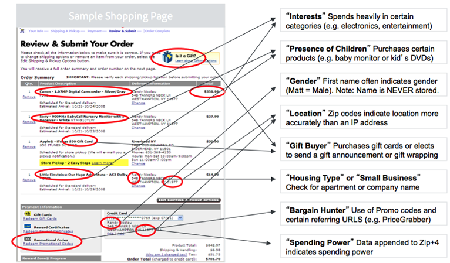
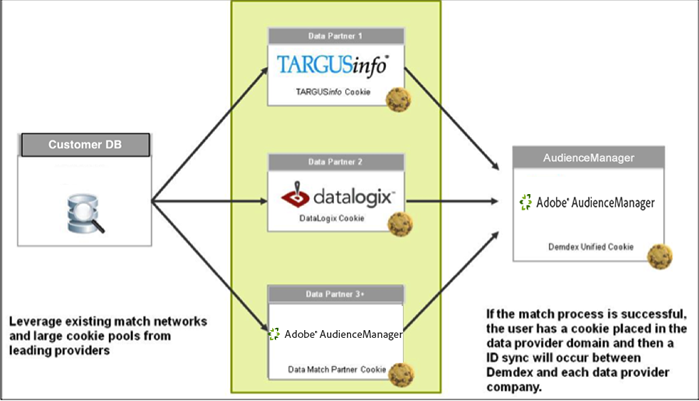

# Types of Data Collected{#types-of-data-collected}

Audience Manager helps you collect and manage first-party, second-party, and third-party data.

Unlocking customer information assets stored in multiple silos is one of the biggest data challenges faced by companies today. From CRM databases, to registration systems, to ad servers, and so forth, companies require tools that help centralize valuable data and manage customer/audience information as a single strategic data asset. Audience Manager helps you unlock isolated customer information and manage data collection from multiple sources. Collected data can be managed based on data element time-to-live (TTL) values, which helps the publisher control data expiration across all sources. Audience Manager is designed to help you manage the following types of data:  

|  Data Type  | Where Data Comes From  |
|---|---|
| **First-party** | Customers. Data is collected online (from consumer interactions on your websites) or offline.  |
| **Second-party** | Strategic partners and advertisers.  |
| **Third-party** | Data providers and/or exchanges. Data can include information such as intent, demography, social/lifestyle, psychographic, and more.  |

## First-Party Data Collection {#first-party-data}

First-party data collection is a main Audience Manager feature. This core competency addresses the needs of our customers (publishers or advertisers) who want to use proprietary data as the cornerstone of their marketing programs or for targeting and modeling against other data sources.

<!-- 

c_1st_party_data.xml

 -->

Audience Manager works with clients to understand their data strategy and then maps that strategy back to a custom data-collection plan. Our Partner Solutions team works with you to evaluate sites, raw data signals, and other user interactions on your websites. With this information, we’ll help you create a tailored data-collection strategy that captures user-level data signals from various pages in your inventory. Captured data is stored and mapped back to a predefined taxonomy, which can be updated at any time, as your business needs change.

The following example illustrates how potential data elements can be captured from a sample shopping page.

After the raw data is collected, it gets mapped back to customer-defined traits within the Audience Manager platform. Both the taxonomy and data mappings can be adjusted at any time without making changes to the data collection code. 

## Second-Party Data Collection {#second-party-data}

Second-party data comes from a strategic business partner (it's not publisher data). This information is collected and managed just like first-party data.

<!-- 

c_2nd_party_data.xml

 -->

In a second-party-data scenario, advertisers send their own data assets to publishers so they can combine that information with the publisher’s data and then execute a more targeted advertising program. Furthermore, publishers can extend their audience pool by partnering with their advertisers. In most cases, these arrangements involve contractual relationships limited to putting the Audience Manager container tag on the partner site to facilitate data collection and sharing.

An example of second-party-data collection and remarketing could involve an automobile manufacturer collecting data on its car configuration pages and then sharing this information with key partners. In this case, the car manufacturer could serve different ads across an Audience Manager partner site for consumers who configured different types of vehicle options (e.g., color, model, etc.).

## Third-Party Data Collection {#third-party-data}

Third-party data is information collected and shared by vendors outside of Audience Manager.

<!-- 

c_3rd_party_data.xml

 -->

Third-party data can be used to qualify existing data segments (for example, age, household income, and so forth), provide data that is in demand but not otherwise available, or be used in lookalike modeling against a known user base from first-party and second-party data. Audience Manager works with many third-party data providers and will help you understand the type of data these data providers collect so you can make the right strategic deals with each provider.

>[!NOTE]
>
>For a full list of third-party data providers supported by [!DNL Audience Manager], see the [Adobe Audience Finder](https://www.adobe-audience-finder.com/).

Audience Manager integrates with other data providers based on their available APIs and data sets. Data collection works in real-time, as a user browses your site, or via out-of-band methodologies where IDs are synchronized between partners and data is transferred between servers after a user has left your site. In either case, Audience Manager clients get the benefit of having third-party data synchronized on our platform, which means each client, or domain, does not have to perform its own synchronization. This helps increase reach and reduces server calls from the page.

## Match Partners {#match-partners}

Many clients choose to work with third-party data-match partners. These entities have relationships with sites that have registration requirements and can process customer data files by matching them (in real-time) based on their registration network.

