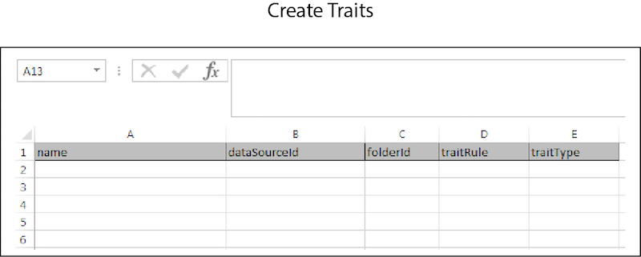

# Bulk Create{#bulk-create}

Bulk create lets you construct multiple data sources, derived signals, segments, traits, and other items with a single operation. Follow these instructions to make a bulk creation request.

<!-- 

t_bulk_create.xml

 -->

>[!NOTE]
>
>[RBAC group permissions](../../features/administration/administration-overview.md) assigned in the [!DNL Audience Manager] UI are honored in the [!UICONTROL Bulk Management Tools].

>[!CAUTION]
>
>Do not mix object types in a bulk creation request. The headers for each object are unique and cannot be combined. Clear the worksheet and make a separate request for different items.

To create objects in bulk, open the [!UICONTROL Bulk Management Tools] worksheet and: 

1. Click the **[!UICONTROL Headers]** tab and copy the create headers for the item you want to add.
2. Click the **[!UICONTROL Create]** tab.
3. Paste the create headers into the first row of the update worksheet.
4. Paste or type the data you want to change into a corresponding column based on the header label.
5. In the worksheet toolbar, click the create button that matches the item you're updating.
This action opens the [!UICONTROL Account Information] dialog box.  
6. Provide the required [log on information](../../reference/bulk-management-tools/bulk-management-intro.md#auth-reqs) and click **[!UICONTROL Submit]**.

The worksheet creates a [!UICONTROL Results] column. The [!UICONTROL Results] column returns the JSON response for a successful operation. See the [REST APIs](../../api/rest-api-main/rest-api-main.md) for examples. Before entering data, your bulk create worksheet should look similar to the following example. Note, all the different create options are not shown here. This is included to help you understand what a completed worksheet could look like. 

If your bulk update returns an error or fails, see [Troubleshooting for Bulk Management Tools](../../reference/bulk-management-tools/bulk-troubleshooting.md).
