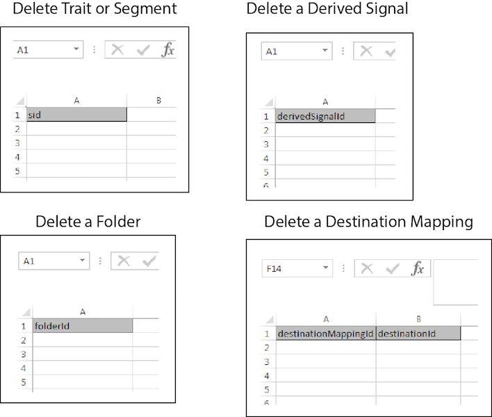

# Bulk Delete{#bulk-delete}

Bulk delete lets you remove multiple segments, traits, folders, derived signals, data sources, models, and destinations with a single operation. Follow these instructions to make a bulk delete request.

>[!IMPORTANT]
>
>The Bulk Management Tools are not an officially supported Adobe offering. Troubleshooting and support through Customer Care will be handled on a case by case basis.

<!-- 

t_bulk_delete.xml 

 -->

>[!NOTE]
>
>[RBAC group permissions](../../features/administration/administration-overview.md) assigned in the [!DNL Audience Manager] UI are honored in the [!UICONTROL Bulk Management Tools].

>[!NOTE]
>
>A bulk delete for destination mappings will fail if you have segments mapped to the destination. Remove your segments from that destination in the user interface before attempting to bulk delete destinations. Also, trait and segment folders must be empty before you can delete them.

To delete multiple items, open the [!UICONTROL Bulk Management Tools] worksheet and:

1. Click the **[!UICONTROL Headers]** tab and copy the create headers for the item you want to add.
2. Click the **[!UICONTROL Delete]** tab.
3. Paste the delete headers into the first row of the update worksheet.
4. Paste or type the IDs for the objects you want to delete in the column below the header.
5. Provide the required [log on information](../../reference/bulk-management-tools/bulk-management-intro.md#auth-reqs) and click **[!UICONTROL Submit]**.

   The worksheet creates a [!UICONTROL Results] column. The [!UICONTROL Results] column returns a message that indicates if the item has been deleted or an error message. 
   Before entering data, your bulk update worksheet should look similar to the following:

If your bulk update returns an error or fails, see [Troubleshooting for Bulk Management Tools](../../reference/bulk-management-tools/bulk-troubleshooting.md).
