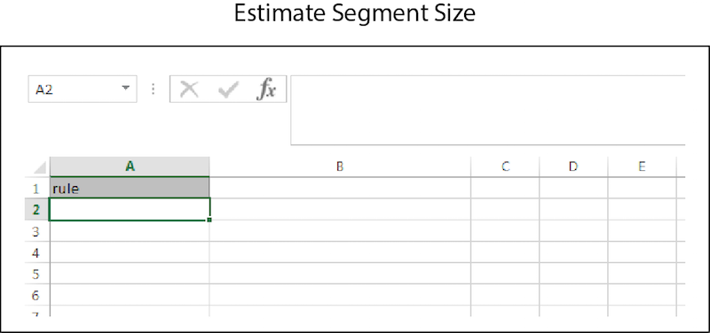

# Bulk Estimates{#bulk-estimates}

A bulk estimate returns segment size data based on segment rules. Follow these instructions to make a bulk estimate request.

<!-- 

t_bulk_estimates.xml

 -->

>[!NOTE]
>
>[RBAC group permissions](../../features/administration/administration-overview.md) assigned in the [!DNL Audience Manager] UI are honored in the [!UICONTROL Bulk Management Tools].

To make bulk updates, open the [!UICONTROL Bulk Management Tools] worksheet and: 

1. Click the **[!UICONTROL Headers]** tab and copy the [!UICONTROL Estimate Segment Size] header.
2. Click the **[!UICONTROL Estimate]** tab.
3. Paste the estimate header into the first row of the estimate worksheet.
4. Paste or type the data you want to change into a corresponding column based on the header label.
5. In the worksheet toolbar, click the create button that matches the item you're updating.
This action opens the [!UICONTROL Account Information] dialog box. 
6. Provide the required [log on information](../../reference/bulk-management-tools/bulk-management-intro.md#auth-reqs) and click **[!UICONTROL Submit]**.

This action creates a [!UICONTROL Response] column in the worksheet that contains estimated segment size data. Before entering data, your bulk estimate worksheet should look similar to the following: 

If your bulk update returns an error or fails, see [Troubleshooting for Bulk Management Tools](../../reference/bulk-management-tools/bulk-troubleshooting.md).
