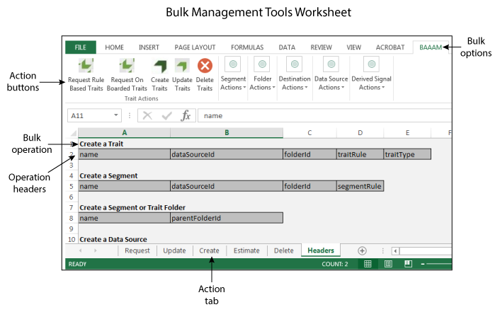
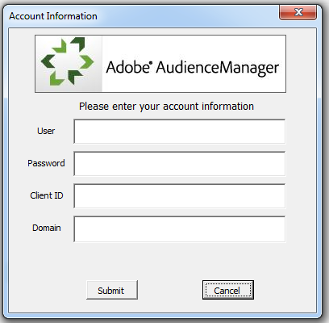

# Getting Started With Bulk Management{#getting-started-with-bulk-management}

The Bulk Management Tools let you create and manage multiple objects at once with single operation. You can use Bulk Management Tools to work with data sources, derived signals, destinations, folders, segments, and traits.

<!-- 

c_bulk_start.xml

 -->

>[!NOTE]
>
>The [!UICONTROL Bulk Management Tools] *are not* supported by [!DNL Audience Manager]. This tool is provided for convenience and as a courtesy only. For bulk changes, we recommend that you work with the [Audience Manager APIs](../../api/rest-api-main/aam-api-getting-started.md) instead. [RBAC group permissions](../../features/administration/administration-overview.md) assigned in the [!DNL Audience Manager] UI are honored in the [!UICONTROL Bulk Management Tools].

## Overview {#overview}

This feature uses a Microsoft Excel spreadsheet with macros that make secure, authenticated calls to the [!DNL Audience Manager] APIs. The API provides the methods and services that let you make changes in bulk. You don't have to know how to code or work with our APIs to use it. The worksheet contains column headers and tabs that perform specific bulk change functions. To make bulk changes, all you do is add the pre-defined headers to specific worksheets, provide the information you want to change in bulk, and click an action button. The worksheet and the APIs do the rest of the work for you.

## Download {#download}

Download the latest worksheet **[here](assets/BAAAM_August_2018.xlsm)**. 

## Prerequisites {#prereqs}

To use the [!DNL Bulk Management Tools], you need the following:

* Your [!DNL Audience Manager] user name and password. As a customer, you should already have these credentials. 
* An API client ID and secret key. Your account manager can provide you with these. 
* The [!UICONTROL Bulk Management Tools] worksheet. [Download the worksheet](/help/using/reference/bulk-management-tools/bulk-management-intro.md#download) to get the latest version.

* Microsoft Excel running on [!DNL Windows] or in a [!DNL Microsoft Windows] virtual machine running on [!DNL macOS X]. You must use 32-bit Excel for the [!UICONTROL Bulk Management Tools] to work.

## Actions and operations {#actions-ops}

The [!UICONTROL Bulk Management Tools] worksheet consists of action tabs, action buttons, and a **[!UICONTROL Headers]** tab. The **[!UICONTROL Headers]** tab contains the pre-formatted column headers used by the action tabs. The action tabs contain macros that perform your selected bulk operation. To perform a bulk operation, you copy a set of headers into the appropriate action tab, enter header data, and click an action button.

Open the spreadsheet and click an action button to get started.

The table below lists the operations you can perform and items you can manipulate with the [!UICONTROL Bulk Management Tools] worksheets.

<table id="table_B9B3E09B692E42BAA52FB32C18B00709"> 
 <thead> 
  <tr> 
   <th colname="col1" class="entry"> Actions </th> 
   <th colname="col2" class="entry"> Objects </th> 
  </tr> 
 </thead>
 <tbody> 
  <tr> 
   <td colname="col1"> 
Bulk actions appear in tabs at the bottom of the worksheet and include: 
 
 
     <ul id="ul_49F46B9E00C045D29E40258EB7BDCFBB"> 
      <li id="li_193C41EA19EF4D738FBA037D2BF9B05C">Requests </li> 
      <li id="li_5BE2E13D839F4958AAA5C01B7EFC5096">Update </li> 
      <li id="li_4CCCC739795945DF8C89787F9A67EB88">Create </li> 
      <li id="li_C7D36D2BDF0448CEAF3A5EABE41038E8">Estimate </li> 
      <li id="li_07A3E94326124A3092362D9896EB7732">Delete </li> 
     </ul> 
 </td> 
   <td colname="col2"> 
The objects you can change in bulk are located under the <b> Headers</b> tab and include: 
 
 
     <ul id="ul_A7A96F2B1B63430B9A1E1184AC5FA8F2"> 
      <li id="li_E3D9E2E190B04BE685337AC6140C371C"> <a href="../../features/datasources-list-and-settings.md#data-sources-list-and-settings"> Data sources</a> </li> 
      <li id="li_B645385E40684FA28770913EAF18CB2C"> <a href="../../features/derived-signals.md"> Derived signals</a> </li> 
      <li id="li_9059F8C4A41A410899BDEFC76D3F5949"> <a href="../../features/destinations/destinations.md"> Destinations</a> </li> 
      <li id="li_BB5A445150754E53AA38C78461326932"> <a href="../../features/traits/trait-storage.md#trait-storage"> Trait folders</a> and segment folders </li> 
      <li id="li_7A27DBF64E0945CF8AE8C96E8C6EDA09"> <a href="../../features/segments/segments-purpose.md"> Segments</a> </li> 
      <li id="li_A4640A34930040DEA8555EAF0AE2A702"> <a href="../../features/traits/trait-details-page.md"> Traits</a> </li> 
     </ul> 
 </td> 
  </tr> 
 </tbody> 
</table>

**Bulk operation example**

As an example, let's take a look at how to create multiple traits at one time. To create multiple traits in a bulk operation you would:

1. Click the **[!UICONTROL Headers]** tab and copy all the labels under the [!UICONTROL Create a Trait] option. 

2. Click the **[!UICONTROL Create]** tab and paste the labels starting in row 1, column A. 
3. Provide information related to each column header and click **[!UICONTROL Create Traits]**. This action prompts you to log on. Your bulk job runs after you successfully authenticate (see the [authentication requirements](../../reference/bulk-management-tools/bulk-management-intro.md#auth-reqs) below). Check the lower left corner of the worksheet for a job status notification.

>[!NOTE]
>
>When working with large requests, the worksheet might become unresponsive and appear to be inactive. In these cases, just leave it alone. The worksheet will become responsive when the bulk request is complete. If the worksheet does not respond for a long period of time, see the [troubleshooting section](../../reference/bulk-management-tools/bulk-troubleshooting.md).

## Authentication requirements and options {#auth-reqs}

Bulk changes require authentication. When you select an action, the worksheet prompts you to log in. Because the worksheet makes API calls, you need to configure it to read your secret key. And, the **[!UICONTROL Domain]** field lets you make bulk changes in a staging/test environment or against your live, production account.

**API authentication requirements**

To set up API authentication, you must:

* Copy and save the secret key to a text (.txt) file. 
* Name the text file with your API client ID. For example, if your client ID is "Bulk-User," save the key in a file titled "Bulk-User.txt." 
* Save the secret key and worksheet together in the same folder.

When making bulk changes, you'll still have to enter a user name, password, client ID, and domain, but API authentication is automatic.

**Domain authentication options**

Domain authentication gives you the option to test bulk requests or apply them directly to your production account. Making bulk changes to the test environment won't affect your production account. Production changes are effective immediately. The **[!UICONTROL Domain]** field accepts the following addresses, depending on the environment you want to work in:

* Testing: `api-beta.demdex.com` 
* Production: `api.demdex.com`

>[!MORE_LIKE_THIS]
>
>* [Download the Bulk Management Worksheet](assets/BAAAM_August_2018.xlsm)
