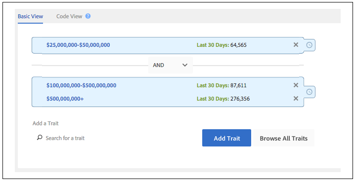
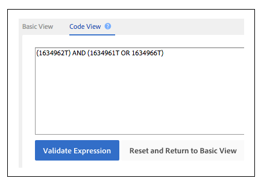
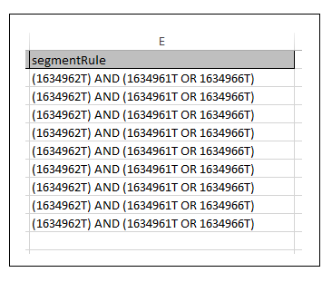

# Create or Update Trait Rules and Segment Rules{#create-or-update-trait-rules-and-segment-rules}

The create and update worksheets accept a traitRule header that lets you apply multiple rules in a single operation. Follow these instructions to make bulk rule requests.

<!-- 

c_bulk_rules.xml 

 -->

>[!NOTE]
>
>[RBAC group permissions](../../features/administration/administration-overview.md) assigned in the [!DNL Audience Manager] UI are honored in the [!UICONTROL Bulk Management Tools].

## Working with trait rules {#trait-rules}

In your worksheet, the trait rule column returns and accepts rules that consist of Boolean expressions, comparison operators, and regular expressions. You can create rules with trait or segment builder in [!DNL Audience Manager] and copy them to your worksheet. Or, if you're familiar with rule syntax, you can write expressions directly in the worksheets.

## Rule builder example {#rule-builder-example}

Let's take a look at an example that demonstrates how to use [!UICONTROL Segment Builder] to create a rule you can to the bulk worksheet. However, this isn't a set of step-by-step instructions for those tools. Instead we're going to start with a simple rule that's already been created. For instructions about how to use the rule builders see [Segment Builder](../../features/segments/segment-builder.md) and [Trait Builder](../../features/traits/about-trait-builder.md).

With the visual rule builder, we've created a segment rule with 3 traits and a Boolean [!UICONTROL AND] operator.

Click **[!UICONTROL Code View]** to get the text version of this rule. 

>[!TIP]
>
>Click **[!UICONTROL Validate Expression]** to check your rule logic. This will help prevent you from uploading an invalid rule.

Paste the rule into the [!UICONTROL Bulk Management Tools] worksheet and commit your changes to update segment rules in bulk.

## Creating your own rules {#create-rules}

You can write your own rules outside of [!UICONTROL Rule Builder]. Before you start, be sure to read the documentation that covers things like operators, expression, and required variables. We recommend you review the following:

* [Working With Comparison Operators In Trait Builder](../../features/traits/trait-comparison-operators.md) 
* [Order of Operations](../../features/traits/trait-operator-precedence.md) 
* [Prefix Requirements for Key Variables](../../features/traits/trait-variable-prefixes.md) 
* [Sample Expressions With Boolean and Comparison Operators](../../features/traits/trait-expression-samples.md)

