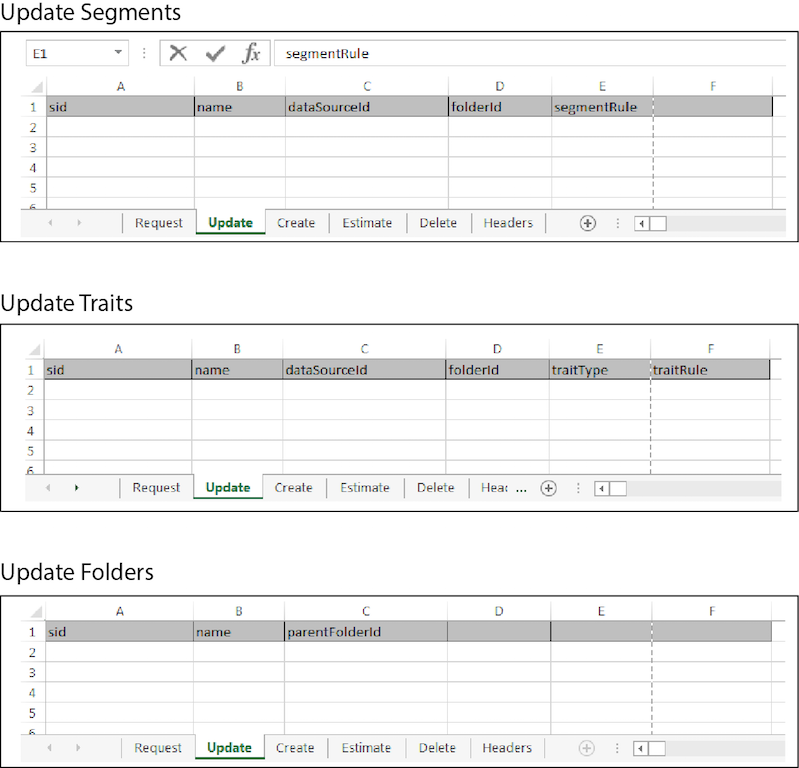

# Bulk Updates{#bulk-updates}

A bulk update lets you edit multiple segments, traits, models, data sources, and segment or trait folder elements in a single operation. Follow these instructions to make bulk updates.

>[!IMPORTANT]
>
>The Bulk Management Tools are not an officially supported Adobe offering. Troubleshooting and support through Customer Care will be handled on a case by case basis.

<!-- 

t_bulk_updates.xml

 -->

>[!NOTE]
>
>[RBAC group permissions](../../features/administration/administration-overview.md) assigned in the [!DNL Audience Manager] UI are honored in the [!UICONTROL Bulk Management Tools].

To make bulk updates, open the [!UICONTROL Bulk Management Tools] worksheet and: 

1. Click the **[!UICONTROL Headers]** tab and copy the update headers for the item you want to edit.
2. Click the **[!UICONTROL Update]** tab.
3. Paste the update headers into the first row of the update worksheet. Note the following:

    * When updating a folder, all headers are required. 
    * When updating segments or traits, you only need the segment ID (SID) and the header element that needs to be changed. Delete unused headers.

4. Paste or type the data you want to change into a corresponding column based on the header label.
5. In the worksheet toolbar, click an update button that matches the        item you're updating.
   This action opens the [!UICONTROL Account Information] dialog box. 

6. Provide the required [log on information](../../reference/bulk-management-tools/bulk-management-intro.md#auth-reqs) and click **[!UICONTROL Submit]**.

   The worksheet creates a [!UICONTROL Results] column. The [!UICONTROL Results] column returns the JSON response for a successful operation. See the [REST APIs](../../api/rest-api-main/rest-api-main.md) for examples. Before entering data, your bulk update worksheet should look similar to the following: 

If your bulk update returns an error or fails, see [Troubleshooting for Bulk Management Tools](../../reference/bulk-management-tools/bulk-troubleshooting.md).
