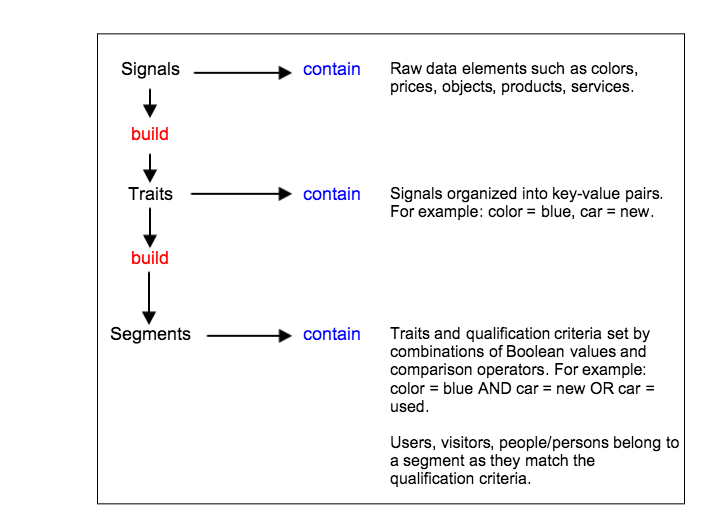

# [!UICONTROL Signals], [!UICONTROL Traits], and [!UICONTROL Segments] {#signals-traits-and-segments}

Describes the components of an [!DNL Audience Manager] [!UICONTROL segment], the expressions used to set audience qualification criteria, and how data is transmitted in an event call.

## Composition and Purpose

[!DNL Audience Manager] data consists of [!UICONTROL signals], [!UICONTROL traits], [!UICONTROL segments], and related qualification rules. The data elements and rules combine to create [!UICONTROL segments]. [!UICONTROL Segments] organize site visitors into related groups. The following table defines the three principal components in an [!DNL Audience Manager] [!UICONTROL segment].  

|Element|Consists of|Example|
|---|---|---|
|[!UICONTROL Signal]|[!UICONTROL Signals] are the smallest data units in [!DNL Audience Manager] and are expressed as [key-value pairs](../reference/key-value-pairs-explained.md).  <ul><li>The key is a constant that defines a data set (e.g., gender, color, price).</li><li>The value is a variable related to the constant (e.g., male/female, green, 100).</li></ul>Comparison operators join the key-value pair and set the relationship between them.|<ul><li>`product=camera`</li><li>`price>1000`</li><li>`type=digital SLR`</li></ul>|
|[!UICONTROL Trait]|Combinations of one or more [!UICONTROL signals].   [!DNL Boolean] expressions and comparison operators let you create [!UICONTROL trait] qualification rules.   Create precise qualification requirements with combinations of [!UICONTROL traits] and [!UICONTROL trait] groups.|From the available [!UICONTROL signals], you could create a `High End Camera Browser` rule expressed as: `product=camera AND price>1000`|
|[!UICONTROL Segment]|Users who share a set of common attributes and qualify for related [!UICONTROL traits]. [!DNL Boolean] expressions, along with recency/frequency requirements, let you create [!UICONTROL segment] qualification rules.   Create precise qualification requirements with combinations of [!UICONTROL trait] and [!UICONTROL segment] rules.|From the available [!UICONTROL traits] and [!UICONTROL signals], you could create a [!UICONTROL segment] rule expressed as:`(product=camera AND type=digital SLR) OR (price>1000)`|

Use the diagram below to keep a mental note of the relationship between [!UICONTROL signals], [!UICONTROL traits], and [!UICONTROL segments].

**Build [!UICONTROL Traits] and [!UICONTROL Segment] Rules With Visual Tools and Code Editors**

Clients manage [!UICONTROL traits] and [!UICONTROL segments] with visual tools and code editors in the [!DNL Audience Manager] user interface. The visual tools let you create rules using search features, pop-up options, drop-down menus, and drag and drop functionality. The code editors provide advanced users with a way to programmatically develop audience segmentation criteria.

**Event Calls Send Data to [!DNL Audience Manager]**

An event call sends data from your website to [!DNL Audience Manager]. The call contains [!UICONTROL signal], [!UICONTROL trait], and [!UICONTROL segment] data in an [!DNL HTTP] request. The event itself is everything after the `/event` part of a [!DNL URL] string. As shown in the example below, this process requires only a single event call to pass in multiple variables to [!DNL Audience Manager].

`https://<domain>/event?product=camera&price>100`

>[!MORELIKETHIS]
>
>* [Segments: Purpose, Composition, and Rules](../features/segments/segments-purpose.md)
