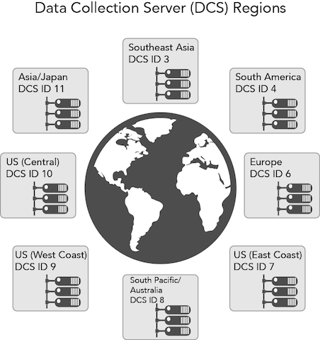

# Data Collection Components{#data-collection-components}

Data collection components include the Data Collection Servers, the DIL API, inbound server-to-server data transfers, and log files.

<!-- 

c_compcollect.xml

 -->

Audience Manager contains the following data-collection components:

* [Data Collection Servers (DCS) and Profile Cache Servers (PCS)](../../reference/system-components/components-data-collection.md#section_DEB68BEDDB4D4BCDAF50653D3F4568E2) 
* [Data Integration Library (DIL)](../../reference/system-components/components-data-collection.md#section_71E528B4528742BA9F6CA69D1AF26C1D) 
* [Inbound Server-to-Server](../../reference/system-components/components-data-collection.md#section_0CC5BA6F15CE4379AA3144D201B11F87) 
* [Log Files](../../reference/system-components/components-data-collection.md#section_7900899D0DAB4F278A964F129E7E7A19)

## Data Collection Servers (DCS) and Profile Cache Servers (PCS) {#section_DEB68BEDDB4D4BCDAF50653D3F4568E2}

The DCS and PCS work together and separately provide services related to trait realization, audience segmentation, and data storage.

**[!UICONTROL Data Collection Servers (DCS)] Function**

In [!DNL Audience Manager], the DCS:

* Receives and evaluates trait data from an event call. This includes information used for real-time segmentation and data passed in at scheduled intervals by server-to-server transfers. 
* Segments users based on their realized traits and the qualification rules you create with [Segment Builder](../../c-features/c-segments/segment-builder.md#topic_E166819D26B94A868376BA54E10E4B74). 
* Creates and manages device IDs and authenticated profile IDs. This includes identifiers such as data provider IDs, user IDs, declared IDs, integration codes, etc. 
* Checks the PCS for additional traits a user has already realized prior to a real-time event call. This lets the DCS qualify users based on real-time data and historical data. 
* Writes log files and sends those to analytics systems for storage and processing.

**[!UICONTROL DCS] Manages Demand Through [!UICONTROL Global Server Load Balancing (GSLB)]**

The [!UICONTROL DCS] is a geographically distributed and load-balanced system. This means [!DNL Audience Manager] can direct requests to and from a regional data center based on the geographic location of a site visitor. This strategy helps improve response times because a [!UICONTROL DCS] response goes directly to a data center that contains information about that visitor. [!UICONTROL GSLB] makes our system efficient because relevant data is cached in servers closest to the user. 

>[!IMPORTANT]
>
>The [!UICONTROL DCS] only detects web traffic originating from devices that use IPv4.

In an event call, geographic location is captured in a key-value pair returned in a larger body of JSON data. This key-value pair is the `"dcs_region": region ID` parameter.

As a customer, you engage with the [!UICONTROL DCS] indirectly through our data collection code. You can also work directly with the [!UICONTROL DCS] through a set of APIs. See [Data Collection Server (DCS) API Methods and Code](../../c-api/dcs-intro/dcs-event-calls/dcs-event-calls.md).

**[!UICONTROL Profile Cache Servers (PCS)]**

The [!UICONTROL PCS] is a large database (basically, a huge server-side cookie). It stores data received for active users from server-to-server transfers and the [!UICONTROL DCS]. [!UICONTROL PCS] data consists of device IDs, authenticated profile IDs, and their associated traits. When the [!UICONTROL DCS] receives a real time call, it checks the [!UICONTROL PCS] for other traits a user may belong to or qualify for. And, if a trait is added to a segment at a later time, those trait IDs are added to the [!UICONTROL PCS] and users can qualify for that segment automatically, without a visit to a particular site or app. The [!UICONTROL PCS] helps deepen [!DNL Audience Manager]'s understanding of your users because it can match and segment users in real time or behind the scenes with new and historic trait data. This behavior gives you a more complete and accurate picture of your users than from real-time qualifications alone.

There are no UI controls that lets our customers work directly with the [!UICONTROL PCS]. Customer access to the [!UICONTROL PCS] is indirect, through its role as a data store and data transfers. The [!UICONTROL PCS] runs on Apache Cassandra.

**Purging inactive IDs from the [!UICONTROL PCS]**

As indicated previously, the [!UICONTROL PCS] stores trait IDs for active users. An active user is any user who has been seen by the [edge data servers](../../reference/system-components/components-edge.md#concept_DD36E2B5A23D4CC5A91CA9808B908B8E) from any domain during the last 14-days. These calls to the [!UICONTROL PCS] keep a user in an active state:

* [!DNL /event] calls 
* [!DNL /ibs] calls (ID syncs)

<!-- 

Removed /dpm calls from the bulleted list. /dpm calls have been deprecated.

 -->

The [!UICONTROL PCS] flushes traits if they're inactive for 17-days. These traits aren't lost however. They're stored in Hadoop. If the user is seen again at another time, then Hadoop pushes all of their traits back to the [!UICONTROL PCS], typically within a 24-hour period.

**Other [!UICONTROL DCS/PCS] Processes: Privacy Opt-out**

These server systems handle privacy and user opt-out requests. User cookie information is not collected in the log file if a user has opted out of data collection. For more information about our privacy policies see the [Adobe Privacy Center](https://www.adobe.com/privacy/advertising-services.html).

## Data Integration Library (DIL) {#section_71E528B4528742BA9F6CA69D1AF26C1D}

[!UICONTROL DIL] is code you place on the page for data collection. See the [DIL API](../../c-dil/dil-overview.md) for more information about available services and methods.

## Inbound Server-to-Server {#section_0CC5BA6F15CE4379AA3144D201B11F87}

These are systems that receive data sent in by various server-to-server integrations with our clients. See the documentation on [sending audience data](../../c-integration/sending-audience-data/real-time-data-integration/real-time-data-integration.md) for more information.

## Log Files {#section_7900899D0DAB4F278A964F129E7E7A19}

The [!UICONTROL PCS] creates and writes data to the log files. These are sent to other database systems for processing, reporting, and storage. 

>[!MORE_LIKE_THIS]
>
>* [Adobe Privacy Center](https://www.adobe.com/privacy.html)
