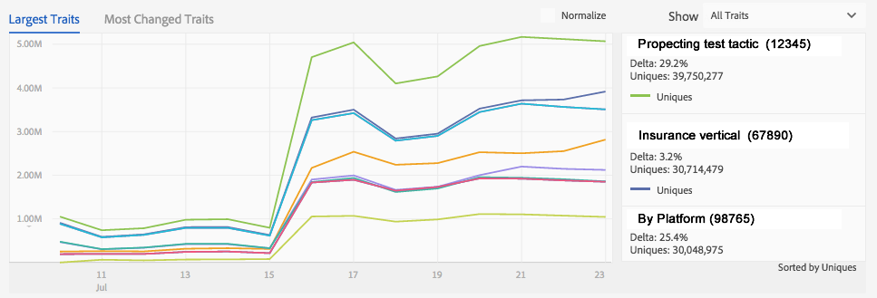
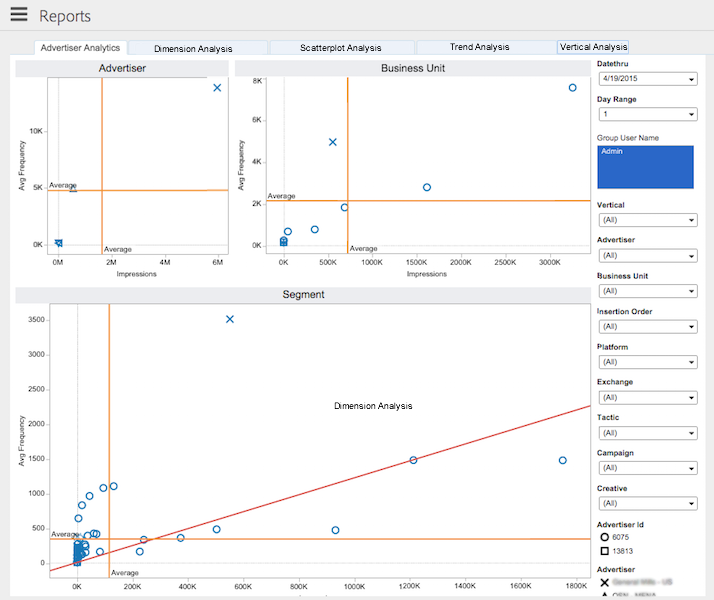

# Data Processing Components{#data-processing-components}

Data processing components include Hadoop, Snowflake, SOLR, and Tableau.

<!-- 

c_comproc.xml

 -->

Audience Manager uses the following components to process data:

## Hadoop {#section_9C142B1598FD442DB8A6AC22B71B8794}

In [!DNL Audience Manager], [Hadoop](https://hadoop.apache.org/) is the master database that contains everything [!DNL Audience Manager] knows about a user. For example, when the [Profile Cache Servers](../../reference/system-components/components-data-collection.md#concept_66CFFEBF5E8B41ED94082D562A93506E) create log files that contain data about your users, it sends that data to Hadoop for storage. Other important Hadoop elements include:

* **Hive:** A data warehouse for Hadoop. [Hive](https://hive.apache.org/) manages ad hoc queries to the data stored in Hadoop. 

* **HBase:** A very large Hadoop database. It processes and manages inbound and outbound data, trait rules, algorithmic modeling information, and performs many other functions related to storing and moving data to different systems.

Customers do not have direct access to these systems. However, customers do work with them indirectly as these components store important data about their site visitors.

## Snowflake {#section_968E9CB7AEFA4A55867BD2582A7E91A6}

[Snowflake](https://www.snowflake.net/) is a massive cloud database. It provides data to many of the dashboard graphs and their related text boxes that display the % change for each item in the graph. If you use [!DNL Audience Manager] and look at the dashboard reports, you're interacting with data provided by [!UICONTROL Snowflake].

This is by no means a comprehensive list, but some common dashboard reports that [!UICONTROL Snowflake] is responsible for include:

* [Daily Trait Variation Report](https://marketing.adobe.com/resources/help/en_US/aam/?f=c_daily_trait_variation.html) 
* [Delivery and Performance Report](https://marketing.adobe.com/resources/help/en_US/aam/?f=c_delivery_reports.html) 
* All the overlap reports (see the [Interactive Reports](https://marketing.adobe.com/resources/help/en_US/aam/?f=c_dynamic_reports.html) section for information about each overlap report). 
* [Unused Signals Report](https://marketing.adobe.com/resources/help/en_US/aam/?f=c_unused_signals.html)

## SOLR {#section_ED495D6C57D2498DAB1F3C99F9EACD39}

[SOLR](https://lucene.apache.org/solr/) is an open-source database and server system from Apache. It provides robust and fast search capabilities over our large data sets. As an [!DNL Audience Manager] customer, you can see SOLR in action when you build segments. It provides data to the [!UICONTROL Estimated Historic Segment Size] report. SOLR is ideal for this role because of its speed. For example, SOLR is able to update the historic size data as you build rules and add new traits to a segment.

## Tableau {#section_48E06839551D4D158CC8F484ACE1671F}

[!DNL Audience Manager] uses [Tableau](https://www.tableausoftware.com/) to display data in the [Interactive Reports](../../reporting/dynamic-reports/dynamic-reports.md#concept_88ADC775F1E9458582A3285B29B76A46) and the [Audience Optimization Reports](../../reporting/audience-optimization-reports/audience-optimization-reports.md#concept_D66D2C58493E48BDAFF2F95BBB508946). The interactive reports display performance and overlap data for traits and segments. Instead of using numbers arranged in columns and rows, they return data using different shapes, colors, and sizes. Additionally, you can choose individual or groups of data points and drill down into the report results for more details. These visualization techniques and report interactivity help make large amounts of numeric data easier to understand.

