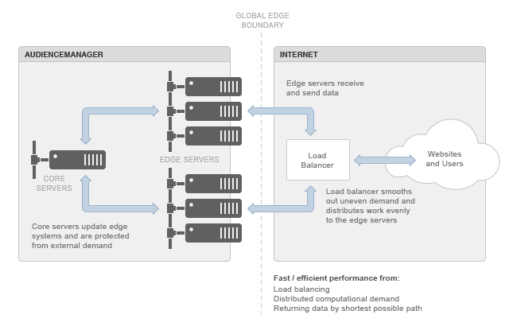

# Understanding the Edge Data Center

Audience Manager uses distributed, edge-computing topologies to meet the demands placed on our systems by external sources.

## Edge Data Center Basics {#section_9813253A088D46C186BAE6C5E54ECBB4}

<!-- c_compedge.xml -->

Edge computing provides improved performance in response to diffuse, Internet-wide demand because the “edge” itself is a global boundary. This means [!DNL Audience Manager] dynamically places processing closest to the sources of demand and returns data by the shortest possible path. Edge computing helps maintain site performance, which, in turn, preserves the user experience on your website. The edge data center is a key gateway for moving data in and out of [!DNL Audience Manager].

The [!DNL Audience Manager] edge data center includes:

* **Core Servers:** These are the main [!DNL Audience Manager] systems. They update and provide data to the edge servers. 

* **Edge Servers:** Typically, these are application and/or web servers. They sit at the boundary between [!DNL Audience Manager] and the Internet. Edge servers, such as the [!UICONTROL DCS] or Akamai systems, typically handle data and requests flowing into and out of [!DNL Audience Manager]. 

* **Load Balancers:** Manage uneven computing/processing demands inherent in Internet applications. These balancers prevent clusters of servers from being overloaded while others remain idle.

The following diagram illustrates the Audience Manager edge data center environment.

## Geographic Distribution and Load Balancing {#section_CBBD2FC7971545DA94332E7E32CF2915}

See the [!UICONTROL DCS] section in [Data Collection Components](../../reference/system-components/components-data-collection.md#concept_66CFFEBF5E8B41ED94082D562A93506E). 
