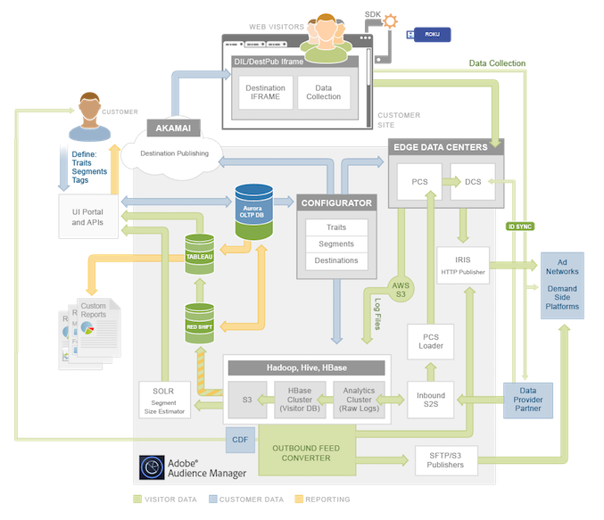

# Platform Architecture: Data Flow Map

This map contains the major Audience Manager systems. It visually represents how data flows into, out of, and among Audience Manager components.

## How to read this map {#section_EF516077AB4E433DB63776BAA2A56DF5}

In the map, the gray box contains [!DNL Audience Manager] systems. Some components are completely internal and others sit on the boundary between [!DNL Audience Manager] and the outside world. As an [!DNL Audience Manager] customer, internal components are often transparent or inaccessible. However, sometimes you may engage with these systems through the user interface or data integrations. Systems on the edge of the box collect and send data between [!DNL Audience Manager] and the outside world. 

Colors define the type of data that flows in and out of [!DNL Audience Manager]. Green is client data, blue is customer data (people visiting your site), and orange is data used for reporting. 

For system descriptions and summaries see the data [action](../../reference/system-components/components-data-action.md#concept_7A6F1335AA634CC4887A2F39E903E507), [collection](../../reference/system-components/components-data-collection.md#concept_66CFFEBF5E8B41ED94082D562A93506E), [processing](../../reference/system-components/components-data-processing.md#concept_C17B304DDBB8425C9D9F4E94672BCC8F), and [tag management](../../reference/system-components/components-tag-management.md#concept_C48BDB96376D4410B0565FC5F01F8F66) sections. 

 
