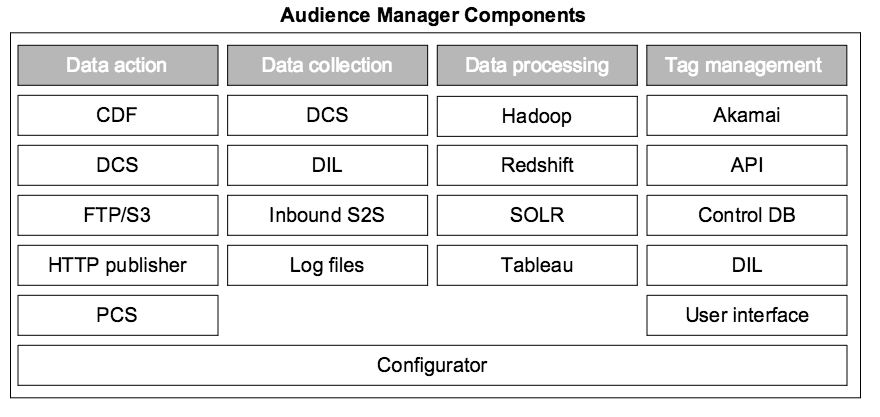

# Key Components in the Audience Manager System{#key-components-in-the-audience-manager-system}

Audience Manager groups its systems and processes into four main categories: tag management, data collection, data organization, and data actionability.

<!-- 

c_compstack.xml

 -->

The following illustration shows the main components and the underlying technology (hardware and software) that power [!DNL Audience Manager]. Although some processes perform specific functions and others have multi-purpose roles, all systems work together to help you manage tags, collect data, analyze performance, synchronize information with other systems, and take action on that information.

