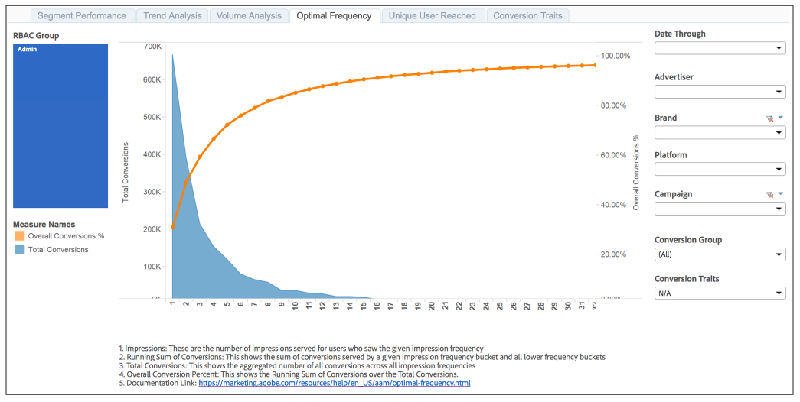

# Optimal Frequency Report{#optimal-frequency-report}

The Optimal Frequency report helps you discover the optimal balance between the number of served impressions and conversions. It allows you to adjust the number of impressions you would want to display before starting to see diminishing returns.

Conversion volume typically decreases with higher impression frequency buckets. Fewer users see the higher number of impressions. This means those higher frequency buckets have fewer conversions. However, the overall conversion % increases with each impression frequency bucket. More conversions are generated with each bucket, so the sum of conversions (the numerator) approaches the total number of possible conversions (the denominator) and therefore the % increases. As shown in the sample report, the intersection of the 2 line plots provides a guide to the "optimal" impression frequency, i.e. the optimal number of impressions that need to be served, before the customer starts to see diminishing returns.

**Sample Report**

