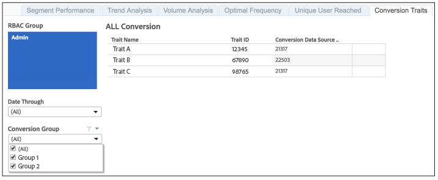

# Reported Conversion Traits{#reported-conversion-traits}

The Conversion Traits report shows you all the traits labeled as conversion traits for a conversion group at a certain date.

Conversion traits for conversion groups can change from reporting run to reporting run. The report displays conversion traits by conversion group for the selected reporting date.

To learn how to create conversion traits in Audience Manager, see the video below:

>[!VIDEO](https://video.tv.adobe.com/v/23431/)

## Sample Report

Your [!UICONTROL Reported Conversion Traits] report could look similar to the one below:

