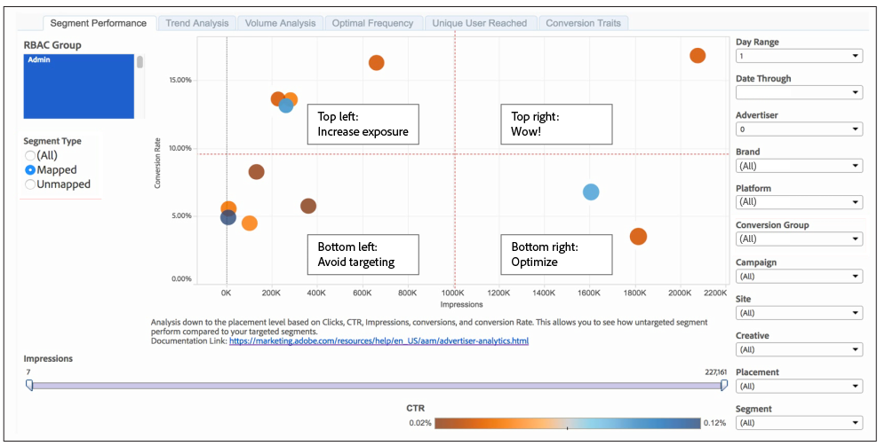
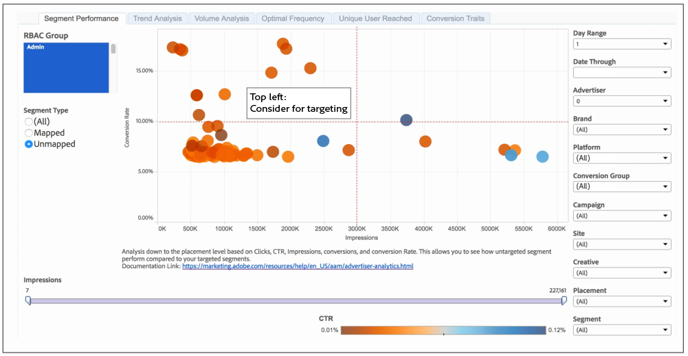

# Segment Performance Report{#segment-performance-report}

The Segment Performance report compares mapped and unmapped segments by impressions and conversion rates. A mapped segment is a segment you create and send to a destination for targeting. An unmapped segment is a segment that you've created but have not sent to a destination for targeting. Comparing these different segment types within and between reports helps you optimize existing campaigns and find overlooked segments that you may want to send to a destination for targeting.

## How to Read Your Mapped Segment Results {#section_991CFF12639B4E3B8E97B6289261E563}

The position of your mapped segments in a report can tell you a lot about which segments are performing well and where you might need to make some adjustments. To read the report, it helps divide the results into 4 sections with imaginary lines (in red) and the categories shown in the sample report below.

The labels in the example and the following table can help you understand segment performance and how to respond to these results.

<table id="table_A29253B30DFA4CD7B3B7C320DE0BDEA4"> 
 <thead> 
  <tr> 
   <th colname="col1" class="entry"> Position </th> 
   <th colname="col2" class="entry"> Placement Indicates </th> 
  </tr> 
 </thead>
 <tbody> 
  <tr> 
   <td colname="col1"> 
 <b>Top Left</b> 
 </td> 
   <td colname="col2"> 
Good conversion rates. 
 
You may be able to get more conversions by increasing impressions. 
 </td> 
  </tr> 
  <tr> 
   <td colname="col1"> 
 <b>Bottom Left</b> 
 </td> 
   <td colname="col2"> 
Low conversion rates. 
 
You may want to avoid targeting these segments. Segments in this section make great candidates for comparison with those in the unmapped segment results. Some of your unmapped segments may perform better than the segments you're already targeting. 
 </td> 
  </tr> 
  <tr> 
   <td colname="col1"> 
 <b>Top Right</b> 
 </td> 
   <td colname="col2"> 
Strong performance. Leave these segments alone. 
 </td> 
  </tr> 
  <tr> 
   <td colname="col1"> 
 <b>Bottom Right</b> 
 </td> 
   <td colname="col2"> 
Low conversion rates and high impressions. 
 
Segments in this section aren't performing well. You may want to shift budget away from these segments and into segments in the top left quadrant of the report. This will help reduce the impressions and may help improve conversion rates for segments in this bottom right section. Also, compare these mapped segments to your unmapped segments. Some of your unmapped segments may perform better than the segments you're already targeting. 
 </td> 
  </tr> 
 </tbody> 
</table>

## How to Read Your Unmapped Segment Results {#section_6EA5BF86702840ECB94C349DA7AAE3AA}

Looking at unmapped segments in a [!UICONTROL Segment Performance] report is a great way to find new segments you haven't considered for targeting. In fact, some of these segments may outperform your mapped segments. This is because an unmapped segment has to meet a set of qualification criteria to be included in this report. To be included in this report, an unmapped segment must:

* Have conversions greater than the average of all your mapped segments. 
* Be in the top 100 unmapped segments by conversion rate.

To read this report, it helps divide the results into 4 sections with imaginary lines (in red) and categories shown in the sample report below.

In this report, you just want to focus on those unmapped segments in the top left section. These unmapped segments exhibit high conversion rates for a low level of impressions when compared to segments in the other three sections.

>[!NOTE]
>
>7-day and 30-day look-back periods are only available for Sunday **[!UICONTROL Date Through]** dates.

