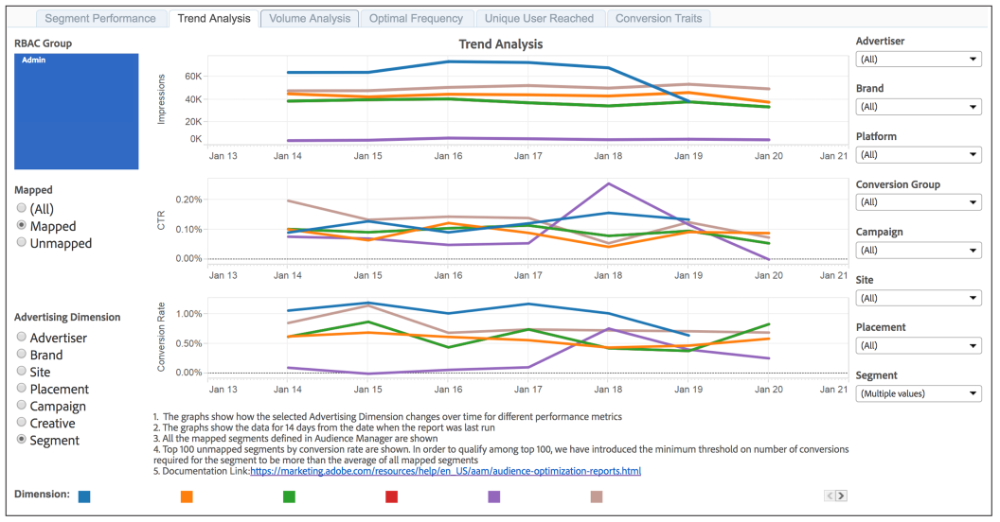
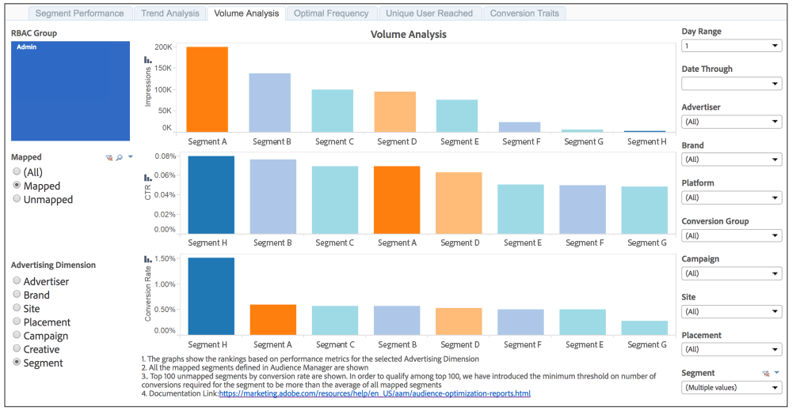

# Trend Analysis and Volume Analysis Reports{#trend-analysis-and-volume-analysis-reports}

These reports return data on impressions, click-through rates, and conversions for broad range of advertising dimensions. Compare trends and volume for your selected metrics to get a better picture of how your campaign performs over time.

## Sample Trend Analysis Report {#section_BE8FAF66993F4471A2C2A90720F911F4}

The [!UICONTROL Trend Analysis] report returns data in a line graph for a 14-day interval only. In this example, the report shows impression, click-through, and conversion trends for a set of mapped segments.

## Sample Volume Analysis Report {#section_0372D9019A5E4B40AF7C0A4C0FD53368}

The [!UICONTROL Volume Analysis] report returns data in a bar graph for your selected date range. In this example, the report shows impression, click-through, and conversions by volume for a set of mapped segments.

>[!NOTE]
>
>7-day and 30-day look-back periods are only available for Sunday **[!UICONTROL Date Through]** dates.

>[!TIP]
>
>For information about mapped and unmapped segments, see the [Segment Performance Report](../../../reporting/audience-optimization-reports/aor-advertisers/segment-performance.md#concept_16474D96F85C44BEBBE767E66F79D8DE) documentation.

