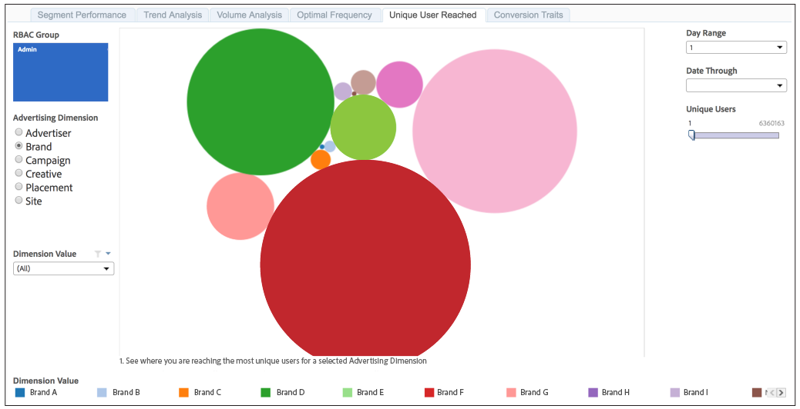

# Unique User Reach{#unique-user-reach}

The Unique User Reach report returns data in a bubble chart. Each bubble is sized in direct proportion to the number of unique users for your selected dimension. A larger bubble indicates greater reach than a smaller bubble.

The Unique User Reach report helps you find the advertiser, brand, campaign, creative, placement, or site that provides the broadest reach against your targeted users.

>[!NOTE]
>
>Keep in mind that:
>
>* The [!UICONTROL Unique User Reach] report displays information only for users with [!UICONTROL Admin] permission levels. Your [!DNL Audience Manager] consultant or Customer Care can provision your account with [!UICONTROL Admin] permissions. 
>
>* 7-day and 30-day look-back periods are only available for Sunday.

## Sample Report

Your [!UICONTROL Unique User Reach] report could look similar to the one below. In your report, click on a bubble to view the underlying data.

