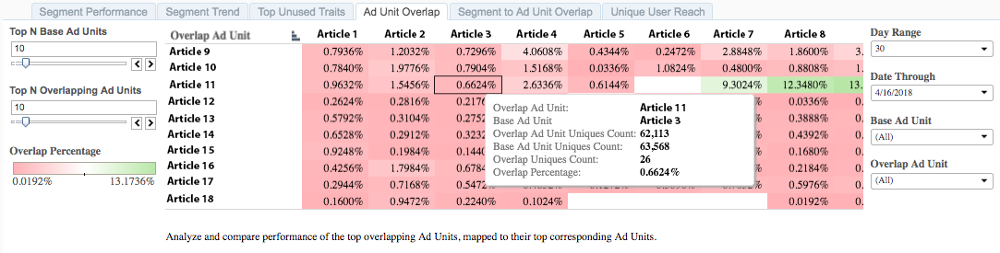

# Ad Unit Overlap{#ad-unit-overlap}

The Ad Unit Overlap report is displayed as a heat chart that highlights high and low overlaps between your Ad Units.

## Use Case {#section_23446DAFA3424CDBA8834816832EC2B0}

With the [!UICONTROL Ad Unit Overlap] report, you can gain insight into where your audience overlaps across your web properties. The report considers your 100 top related properties and shows you the overlap between them.

## Using the Ad Unit Overlap Report {#section_62E5C43C88EE4AE688285F759810F57F}

Use the **[!UICONTROL Top N Base Ad Units]** and **[!UICONTROL Top N Overlapping Ad Units]** controls to select your desired number of ad units for the overlap. You can select a maximum number of 100 items for each.

Use the **Day Range** and **Date Through** controls to adjust your look-back range. Note that the 7-day and 30-day look-back periods are only available for Sunday dates.

Use the **[!UICONTROL Base Ad Unit]** and the **[!UICONTROL Overlap Ad Unit]** controls to select which of your ad units you want to display in the overlap report.

>[!IMPORTANT]
>
>When enabling [!UICONTROL Audience Optimization for Publishers], you must include descriptive metadata for [!UICONTROL Ad Unit IDs], as described in Step 3 of [Import DFP Data Files Into Audience Manager](../../../reporting/audience-optimization-reports/aor-publishers/import-dfp.md#concept_32EC89A543BA4333B62DD4C0B3E7060A). By doing this, you assure that the report details the web property as [!UICONTROL Ad Unit] instead of the [!UICONTROL Ad Unit ID].

## Interpreting the Results {#section_CC66FBF6E9F349B8B0F3F70B05C411F0}

Your [!UICONTROL Ad Unit Overlap] report could look similar to the one below. Hover over any cell to obtain more information about that particular overlap. See descriptions for the additional information in the table below the sample report.

<table id="table_22340F45B1B94D3796174CB30A60E212"> 
 <thead> 
  <tr> 
   <th colname="col1" class="entry"> Item </th> 
   <th colname="col2" class="entry"> Description </th> 
  </tr>
 </thead>
 <tbody> 
  <tr> 
   <td colname="col1"> 
 Overlap Ad Unit 
 </td> 
   <td colname="col2"> 
The name of your inventory item. For example, this can be one of your websites or an article on your website. In the image above, the base ad units are Articles 9 - 18. 
 </td> 
  </tr> 
  <tr> 
   <td colname="col1"> 
 Base Ad Unit 
 </td> 
   <td colname="col2"> 
The name of your inventory item. For example, this can be one of your websites or an article on your website. In the image above, the base ad units are Articles 1 - 8. 
 </td> 
  </tr> 
  <tr> 
   <td colname="col1"> 
 Overlap Ad Unit Uniques Count 
 </td> 
   <td colname="col2"> 
The number of your users who have visited the ad unit items 9 - 18. This information is extracted from the DFP logs. 
 </td> 
  </tr> 
  <tr> 
   <td colname="col1"> 
 Base Ad Unit Uniques Count 
 </td> 
   <td colname="col2"> 
The number of your users who have visited the ad unit items 1 - 8. This information is extracted from the DFP logs. 
 </td> 
  </tr> 
  <tr> 
   <td colname="col1"> 
 Overlap Uniques Count 
 </td> 
   <td colname="col2"> 
The overlap between your users who have visited a  Base Ad Unit and  Overlap Ad Unit. 
 </td> 
  </tr> 
  <tr> 
   <td colname="col1"> 
 Overlap Percentage 
 </td> 
   <td colname="col2"> 
The overlap between your users who have visited a  Base Ad Unit and  Overlap Ad Unit. This is the  Overlap Uniques Count, expressed as a percentage of the  Base Ad Unit. 
 </td> 
  </tr> 
 </tbody> 
</table>

