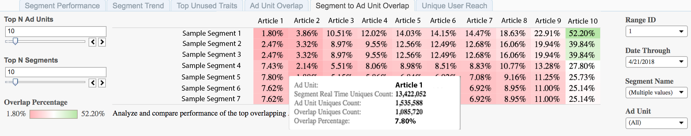

# Segment to Ad Unit Overlap{#segment-to-ad-unit-overlap}

The Segment to Ad Unit Overlap report is displayed as a heat chart that highlights high and low overlaps between your Ad Units and Audience Manager segments.

## Use Case {#section_23446DAFA3424CDBA8834816832EC2B0}

With the [!UICONTROL Segment to Ad Unit Overlap] report, you can understand which audiences visit your web properties. The report displays the overlap between members of your [!DNL Audience Manager] segments and the number of visitors to your web properties. A higher overlap means that many members of a segment visit your web property.

## Using the Segment to Ad Unit Overlap Report {#section_62E5C43C88EE4AE688285F759810F57F}

Use the **[!UICONTROL Top N Ad Units]** and **[!UICONTROL Top N Segments]** controls to select your desired number of ad units and segments for the overlap. You can select a maximum number of 100 items for each.

Use the **Day Range** and **Date Through** controls to adjust your look-back range. Note that the 7-day and 30-day look-back periods are only available for Sunday dates.

Use the **[!UICONTROL Segment Name]** and the **[!UICONTROL Ad Unit]** boxes to filter any of segments and ad units.

>[!IMPORTANT]
>
>When enabling [!UICONTROL Audience Optimization for Publishers], you must include descriptive metadata for [!UICONTROL Ad Unit IDs], as described in Step 3 of [Import DFP Data Files Into Audience Manager](../../../reporting/audience-optimization-reports/aor-publishers/import-dfp.md#concept_32EC89A543BA4333B62DD4C0B3E7060A). By doing this, you assure that the report details the web property as [!UICONTROL Ad Unit] instead of the [!UICONTROL Ad Unit ID].

## Interpreting the Results {#section_CC66FBF6E9F349B8B0F3F70B05C411F0}

Your [!UICONTROL Segment to Ad Unit Overlap] report could look similar to the one below. Hover over any cell to obtain more information about that particular overlap. See descriptions for the additional information in the table below the sample report.

<table id="table_22340F45B1B94D3796174CB30A60E212"> 
 <thead> 
  <tr> 
   <th colname="col1" class="entry"> Item </th> 
   <th colname="col2" class="entry"> Description </th> 
  </tr>
 </thead>
 <tbody> 
  <tr> 
   <td colname="col1"> 
 Ad Unit  
 </td> 
   <td colname="col2"> 
The name of your inventory item. For example, this can be one of your websites or an article on your website. 
 </td> 
  </tr> 
  <tr> 
   <td colname="col1"> 
 Segment Real Time Uniques Count 
 </td> 
   <td colname="col2"> 
The number of unique visitors seen in real-time for the specified time range and who were qualified for the segment at the moment they were seen by  Audience Manager. 
 </td> 
  </tr> 
  <tr> 
   <td colname="col1"> 
 Ad Unit Uniques Count 
 </td> 
   <td colname="col2"> 
The number of your visitors for this specific ad unit. This information is extracted from the DFP logs. 
 </td> 
  </tr> 
  <tr> 
   <td colname="col1"> 
 Overlap Uniques Count 
 </td> 
   <td colname="col2"> 
The members of your segment who were exposed to the ad unit item. 
 </td> 
  </tr> 
  <tr> 
   <td colname="col1"> 
 Overlap Percentage 
 </td> 
   <td colname="col2"> 
The overlap between ad unit and segment populations. This is the  Overlap Uniques Count, expressed as a percentage of the  Segment Real Time Uniques. 
 </td> 
  </tr> 
 </tbody> 
</table>

