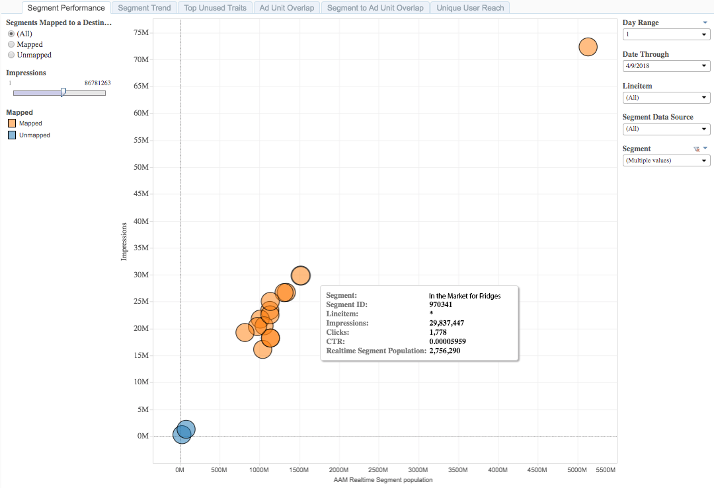
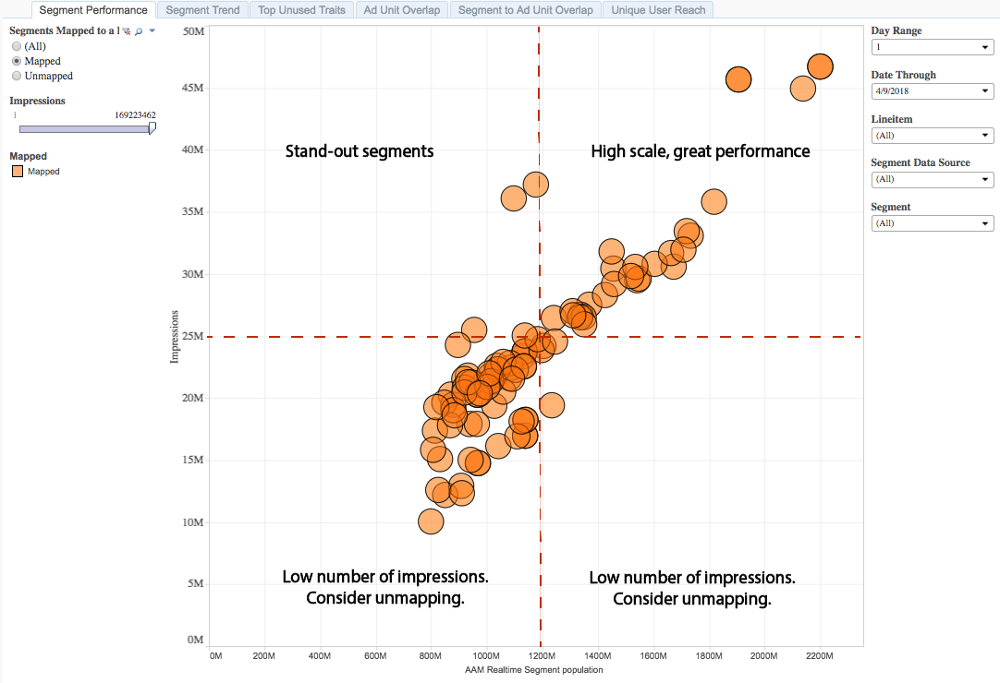
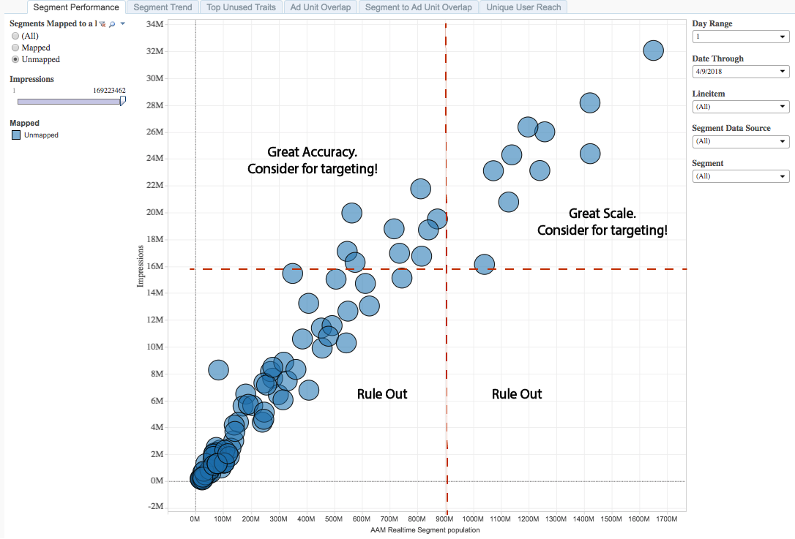

# Segment Performance Report{#segment-performance-report}

The Segment Performance report compares mapped and unmapped segments by impressions and Real-Time Segment Uniques. A mapped segment is a segment you create and send to a destination for targeting. An unmapped segment is a segment that you've created but have not sent to a destination for targeting. Comparing these different segment types within and between reports helps you optimize existing campaigns and find overlooked segments that you may want to send to a destination for targeting.

## Use Cases {#section_2DD668C39D32463C9330FF68E713C6F5}

With the [!UICONTROL Segment Performance] report, you can:

* Identify mapped audience segments that are driving scale or performance. 
* Identify unmapped segments to introduce in future campaigns, based on the contribution of an audience to past performance.

## Using the Segment Performance Report {#section_5C9691CCC0F54276BF90641F27ADB657}

Toggle between **[!UICONTROL Mapped]** and **[!UICONTROL Unmapped]** to select segments that are mapped to a destination or not. Select **[!UICONTROL All]** to include all your segments in the report.

Use the **Day Range** and **Date Through** controls to adjust your look-back range. Note that the 7-day and 30-day look-back periods are only available for Sunday dates.

Use the **[!UICONTROL Line Item]** drop-down box to select the web properties for which you want to return information.

In the **[!UICONTROL Segment Data Source]** drop-down box, select the data sources containing the segments you want to see in the report.

Use the **[!UICONTROL Segment]** drop-down box to select which segments you want to see in the report.

>[!IMPORTANT]
>
>When enabling [!UICONTROL Audience Optimization for Publishers], you must include descriptive metadata for [!UICONTROL Line Item IDs], as described in Step 3 of [Import DFP Data Files Into Audience Manager](../../../reporting/audience-optimization-reports/aor-publishers/import-dfp.md#concept_32EC89A543BA4333B62DD4C0B3E7060A). By doing this, you assure that the report details the web property as [!UICONTROL Line Item] instead of the [!UICONTROL Line Item ID].

## Interpreting the Results {#section_1B6327768A9D46FFB24DB9D5888B102D}

Your [!UICONTROL Segment Performance] report could look similar to the one below. In your report, click on a bubble to view the underlying data. See descriptions for the additional information in the table below the sample report.

<table id="table_AFE2540583C34835B04584693ADFD26A"> 
 <thead> 
  <tr> 
   <th colname="col1" class="entry"> Item </th> 
   <th colname="col2" class="entry"> Description </th> 
  </tr>
 </thead>
 <tbody> 
  <tr> 
   <td colname="col1"> 
Segment 
 </td> 
   <td colname="col2"> 
The alphanumerical name that you assigned to this segment. 
 </td> 
  </tr> 
  <tr> 
   <td colname="col1"> 
Segment ID 
 </td> 
   <td colname="col2"> 
The unique ID of this segment. 
 </td> 
  </tr> 
  <tr> 
   <td colname="col1"> 
Line item 
 </td> 
   <td colname="col2"> 
The web property for which you are seeing this report. 
 </td> 
  </tr> 
  <tr> 
   <td colname="col1"> 
Clicks 
 </td> 
   <td colname="col2"> 
The number of times that members of this trait have clicked on items in your web property. 
 </td> 
  </tr> 
  <tr> 
   <td colname="col1"> 
Impressions 
 </td> 
   <td colname="col2"> 
The number of times that members of this trait have been exposed to your inventory. 
 </td> 
  </tr> 
  <tr> 
   <td colname="col1"> 
CTR 
 </td> 
   <td colname="col2"> 
Click-through rate. 
 
This metric relays the percentage of impressions followed through by clicks. Divide Clicks by Impressions to obtain this metric. 
 </td> 
  </tr> 
  <tr> 
   <td colname="col1"> 
Realtime Segment Population 
 </td> 
   <td colname="col2"> 
The actual number of unique visitors seen in real-time for the specified time range and who were qualified for the segment at the moment they were seen by  Audience Manager. 
 </td> 
  </tr> 
 </tbody> 
</table>

## How to Read Your Mapped Segment Results {#section_C26B00478D2F4B06BADF8624C5C62677}

The position of your mapped segments in a report can tell you a lot about which segments are performing well and where you might need to make some adjustments. To read the report, it helps to divide the results into four sections with imaginary lines (in red) and the categories shown in the sample report below. The labels in the example can help you understand segment performance and how to respond to these results.

## How to Read Your Unmapped Segment Results {#section_915F11CF3E7A4A66B0D0E679F4126101}

Looking at unmapped segments in a [!UICONTROL Segment Performance] report is a great way to find new segments you haven't considered for targeting. In fact, some of these segments may outperform your mapped segments.

To read this report, it helps to divide the results into four sections with imaginary lines (in red) and categories shown in the sample report below.

