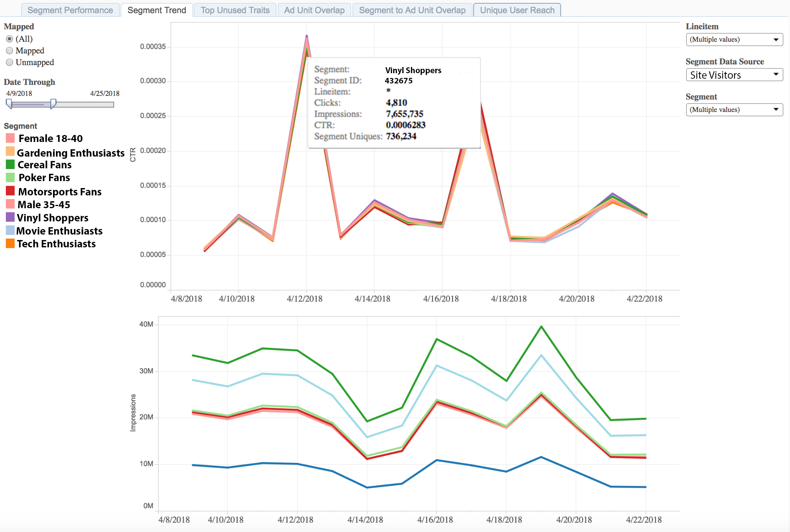

# Segment Trend Report{#segment-trend-report}

The Segment Trend report returns data on impressions and click-through rates of mapped and unmapped segments over time. 

A mapped segment is a segment you create and send to a destination for targeting. An unmapped segment is a segment that you've created but have not sent to a destination for targeting. 

Compare trends and volume for your selected metrics to get a better picture of how your audiences behave over time.

## Use Case {#use-cases}

Use the [!UICONTROL Segment Trend] report to validate a segment's performance over time and to pinpoint trends based on strong performance or scale.

With this report, you can understand which of your web properties show a dip or faulty increase and troubleshoot as necessary. This report is the next step after you identify your audience of interest in the [!UICONTROL Segment Performance] report, to ensure that the strong or poor performance you saw in the [!UICONTROL Segment Performance] tab is consistent over time.

## Using the Segment Trend Report {#using-the-report}

Toggle between **[!UICONTROL Mapped]** and **[!UICONTROL Unmapped]** to select segments that are mapped to a destination or not. Select **[!UICONTROL All]** to include all your segments in the report.

Adjust the look-back window with the **[!UICONTROL Date Through]** slider.

Click any of the segments under the **[!UICONTROL Date Through]** slider to bring up the option to keep only that segment in the report or exclude it.

Use the **[!UICONTROL Line Item]** drop-down box to select the properties in your portfolio for which you want to return information.

In the **[!UICONTROL Segment Data Source]** drop-down box, select the data sources containing the segments you want to see in the report.

Use the **[!UICONTROL Segment]** drop-down box to select which segments you want to see in the report.

>[!IMPORTANT]
>
>When enabling [!UICONTROL Audience Optimization for Publishers], you must include descriptive metadata for [!UICONTROL Line Item] IDs, as described in Step 3 of [Import DFP Data Files Into Audience Manager](../../../reporting/audience-optimization-reports/aor-publishers/import-dfp.md). By doing this, you assure that the report details the web property as [!UICONTROL Line Item] instead of the [!UICONTROL Line Item] ID.

## Interpreting the Results {#interpreting-results}

The [!UICONTROL Segment Trend] report returns data in a line graph for a 14-day interval only. In this example, the report shows impression and click-through trends for a set of mapped and unmapped segments.

Hover over any line to obtain more information about that particular segment trend. See descriptions for the additional information in the table below the sample report.

<table id="table_AFE2540583C34835B04584693ADFD26A"> 
 <thead> 
  <tr> 
   <th colname="col1" class="entry"> Item </th> 
   <th colname="col2" class="entry"> Description </th> 
  </tr>
 </thead>
 <tbody> 
  <tr> 
   <td colname="col1"> 
 Segment 
 </td> 
   <td colname="col2"> 
The alphanumerical name that you assigned to this segment. 
 </td> 
  </tr> 
  <tr> 
   <td colname="col1"> 
 Segment ID 
 </td> 
   <td colname="col2"> 
The unique ID of this segment. 
 </td> 
  </tr> 
  <tr> 
   <td colname="col1"> 
 Line item 
 </td> 
   <td colname="col2"> 
The web property for which you are seeing this report. 
 </td> 
  </tr> 
  <tr> 
   <td colname="col1"> 
 Clicks 
 </td> 
   <td colname="col2"> 
The number of times that members of this trait have clicked on items in your web property. 
 </td> 
  </tr> 
  <tr> 
   <td colname="col1"> 
 Impressions 
 </td> 
   <td colname="col2"> 
The number of times that members of this trait have been exposed to your inventory. 
 </td> 
  </tr> 
  <tr> 
   <td colname="col1"> 
 CTR 
 </td> 
   <td colname="col2"> 
Click-through rate. This metric relays the percentage of impressions followed through by clicks. Divide clicks by impressions to obtain this metric. 
 </td> 
  </tr> 
  <tr> 
   <td colname="col1"> 
 Segment Uniques 
 </td> 
   <td colname="col2"> 
The number of segment members, within the last 30 days. 
 </td> 
  </tr> 
 </tbody> 
</table>
