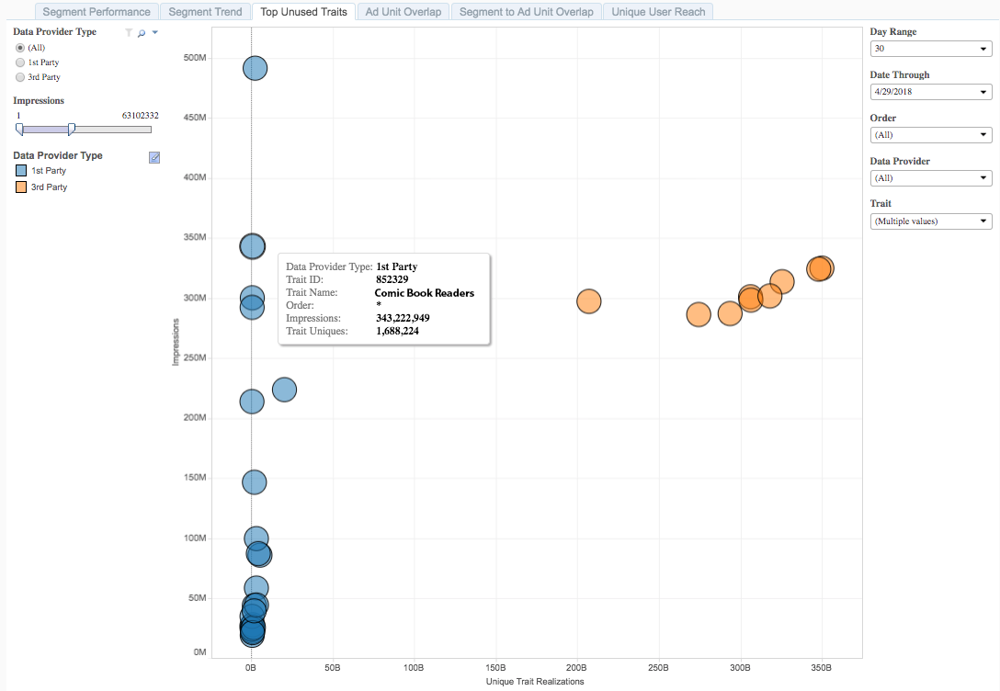

# Top Unused Traits{#top-unused-traits}

Top Unused Traits are represented as a scatter diagram of traits that are not yet members of a segment, based on trait type, data source, and performance.

## Use Case {#use-cases}

With the [!UICONTROL Top Unused Traits] report, you can analyze and compare the performance of first and third party traits that are currently not mapped to a segment. This view can point out the best traits to use in an audience segment for either campaign optimization or net new opportunities.

## Using the Top Unused Traits Report {#using-the-report}

Use the **[!UICONTROL Data Provider Type]** controls to toggle between first party and third party traits. Select **[!UICONTROL All]** to return first and third party traits in the report.

With the **[!UICONTROL Impressions]** slider, you can select a minimum and maximum value for returned impressions. Any traits responsible for less or more than the limits you set are not displayed in the report.

Use the **[!UICONTROL Day Range]** and **[!UICONTROL Date Through]** controls to adjust your look-back range. Note that only the 30-day look-back period is available for this report.

Use the **[!UICONTROL Order]** drop-down box to select the web properties in your portfolio for which you want to return information.

In the **[!UICONTROL Data Provider]** drop-down box, select the data sources containing the traits you want to see in the report.

Use the **[!UICONTROL Traits]** drop-down box to select which traits you want to see in the report.

>[!IMPORTANT]
>
>When enabling [!UICONTROL Audience Optimization for Publishers], you must include descriptive metadata for [!UICONTROL Order IDs], as described in Step 3 of [Import Google Ad Manager (formerly DFP) Data Files Into Audience Manager](../../../reporting/audience-optimization-reports/aor-publishers/import-dfp.md). By doing this, you assure that the report details the web property as [!UICONTROL Order] instead of the [!UICONTROL Order ID].

## Interpreting the Results {#interpreting-results}

**Sample Report**

Your [!UICONTROL Top Unused Traits] report could look similar to the one below. In your report, click on a bubble to view the underlying data.

See descriptions for the additional information in the table below the sample report.

<table id="table_AFE2540583C34835B04584693ADFD26A"> 
 <thead> 
  <tr> 
   <th colname="col1" class="entry"> Item </th> 
   <th colname="col2" class="entry"> Description </th> 
  </tr>
 </thead>
 <tbody> 
  <tr> 
   <td colname="col1"> 
 Data Provider Type 
 </td> 
   <td colname="col2"> 
Specifies whether the selected data source contains first party or third party traits. 
 </td> 
  </tr> 
  <tr> 
   <td colname="col1"> 
 Trait ID 
 </td> 
   <td colname="col2"> 
The unique ID of this trait. 
 </td> 
  </tr> 
  <tr> 
   <td colname="col1"> 
 Trait Name 
 </td> 
   <td colname="col2"> 
The alphanumerical name that you or the data provider assigned to this trait. 
 </td> 
  </tr> 
  <tr> 
   <td colname="col1"> 
 Order 
 </td> 
   <td colname="col2"> 
The web property for which you are seeing this report. 
 </td> 
  </tr> 
  <tr> 
   <td colname="col1"> 
 Impressions 
 </td> 
   <td colname="col2"> 
The number of times that members of this trait have been exposed to your inventory. 
 </td> 
  </tr> 
  <tr> 
   <td colname="col1"> 
 Trait Uniques 
 </td> 
   <td colname="col2"> 
The number of trait members, within the last 30 days. 
 </td> 
  </tr> 
 </tbody> 
</table>

The position of your traits in a report can tell you a lot about which traits you could use to optimize existing audience segments. 

The traits situated higher on the Impressions axis are the ones you want to use in your campaigns. For traits with a low number of impressions, it is unlikely that you're reaching this audience on your web property, based on your [!DNL Google Ad Manager] data. 

Look to the left of the [!UICONTROL Unique Trait Realizations] axis for highly accurate traits and to the right for traits that can drive scale.

<table id="table_A29253B30DFA4CD7B3B7C320DE0BDEA4"> 
 <thead> 
  <tr> 
   <th colname="col1" class="entry"> Position </th> 
   <th colname="col2" class="entry"> Placement Indicates </th> 
  </tr> 
 </thead>
 <tbody> 
  <tr> 
   <td colname="col1"> 
 <b>Top Left</b> 
 </td> 
   <td colname="col2"> 
High number of impressions, low number of trait realizations. 
 
This is a highly accurate audience that is not yet member of a segment. Consider for targeting. 
 </td> 
  </tr> 
  <tr> 
   <td colname="col1"> 
 <b>Bottom Left</b> 
 </td> 
   <td colname="col2"> 
Low number of impressions, low number of trait realizations. 
 
 Rule out these traits, as the members are not contributing to impressions on your web properties. 
 </td> 
  </tr> 
  <tr> 
   <td colname="col1"> 
 <b>Top Right</b> 
 </td> 
   <td colname="col2"> 
High number of impressions, high number of trait realizations. 
 
A high reach against an audience that is not denoted in a segment yet. This audience is a prime candidate for targeting due to the high number of impressions and the scale. 
 </td> 
  </tr> 
  <tr> 
   <td colname="col1"> 
 <b>Bottom Right</b> 
 </td> 
   <td colname="col2"> 
Low number of impressions, high number of trait realizations. 
 
 You can rule out these traits, as the members are not contributing to impressions on your web properties. 
 </td> 
  </tr> 
 </tbody> 
</table>
