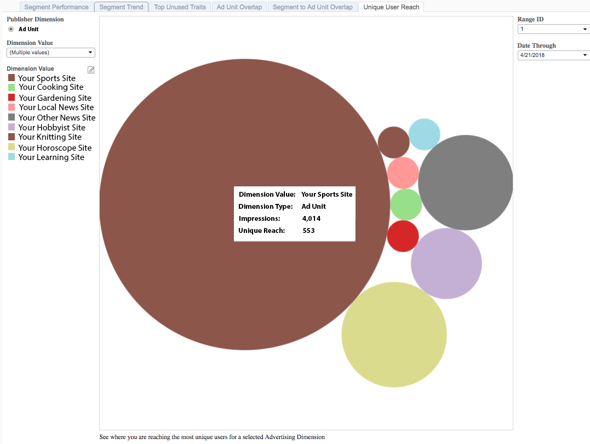

# Unique User Reach{#unique-user-reach}

The Unique User Reach report returns data in a bubble chart. Each bubble is sized in direct proportion to the number of unique users for your selected ad units. A larger bubble indicates greater reach than a smaller bubble. The Unique User Reach report helps you find the ad unit that provides the broadest reach against your targeted users.

## Use Case {#use-cases}

With the [!UICONTROL Unique User Reach] report, you can identify the properties in your portfolio that attract a high volume of unique users.

## Using the Unique Reach Report {#using-the-report}

Use the **[!UICONTROL Dimension Value]** box to select the ad units you want to display in the report. Click **[!UICONTROL All]** to display all your properties in the bubble chart.

Use the **Day Range** and **Date Through** controls to adjust your look-back range.

## Interpreting the Results {#interpreting-results}

**Sample Report**

Your [!UICONTROL Unique User Reach] report could look similar to the one below. In your report, click on a bubble to view the underlying data. See descriptions for the additional information in the table below.

|Item|Description|
|--- |--- |
|Dimension Value|The name of your web property.|
|Dimension Type|The type of publisher dimension. We currently only support Ad Unit as a dimension type.|
|Impressions|The number of impressions that were served for your web property within the specified look-back range.|
|Unique Reach|The unique number of users who were reached by the impressions on your web properties.|