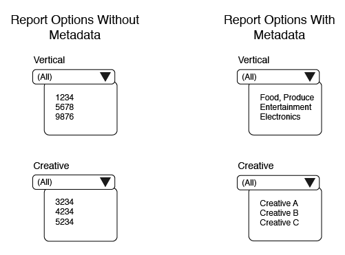
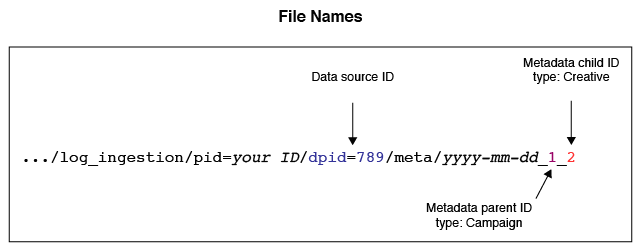
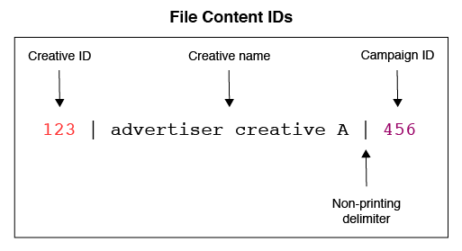

# Overview and Mappings for Metadata Files{#overview-and-mappings-for-metadata-files}

A metadata file links numeric IDs with names you can read and understand. The Audience Optimization reports display readable names in the various report options menus.

## Overview {#overview}

A review of metadata and how it's used. A metadata file must be accompanied by a data file. The metadata file contents match data file information to related, human-readable labels in the report menus. For more information, see [Data Files for Audience Optimization Reports and Actionable Log Files](../../../reporting/audience-optimization-reports/metadata-files-intro/datafiles-intro.md).

### Metadata Files Contain Data About Other Data

A metadata file contains information about other types of data. To help you understand how this works, let’s review how [!DNL Audience Manager] receives data. 

During an impression or click event, [!DNL Audience Manager] receives data in an URL string known as an *event call*. 

The event call organizes information into sets of defined key-value pairs. The values in a key-value pair contain of numeric data. The metadata file contains names and other readable information corresponding to the ID in each key-value pair.

### Metadata Links IDs to Readable Names

The metadata file is required to tie a numeric ID to a readable name. As an example, say an event call contains a creative ID in a key-value pair like this: `d_creative:1234`. Without a metadata file, this creative would show up as 1234 in an options menu. 

However, a properly formatted metadata file can tie this creative to back to a real name like “Advertiser Creative A,” which is a name you can read and recognize in a report.

### When Do You Need a Metadata File

First, a metadata file, and all of the parameters listed below, are required in an event call when you want to use the [Audience Optimization Reports](../../../reporting/audience-optimization-reports/audience-optimization-reports.md).

Second, you need a metadata file if you’re sending your own data to [!DNL Audience Manager] or if you want to see data in the reports from other providers we’re not integrated with. For example, [!DNL Audience Manager] has an integration with Google’s [Double-click Campaign Manager](../../../reporting/audience-optimization-reports/aor-advertisers/import-dcm.md) (DCM). Because of this relationship, [!DNL Audience Manager] can associate IDs with names and descriptions used by the report options. Without an integration, we can still ingest data, but the report options will show numeric IDs instead of descriptive name.

## File Mappings {#file-mappings}

The following table lists the key-value pairs that hold data used by the [!UICONTROL Audience Optimization] reports. If you need to use a metadata file, it would contain human-readable information that corresponds to the values in these key-value pairs. The values for these keys accept integers only (data type INT). Note, *italics* indicates a variable placeholder. Other elements are constants or keys and do not change.

>[!IMPORTANT]
>
>If you're using the [!UICONTROL Audience Optimization] reports, *all* of these values are required in the event call.

<table id="table_B2C8C493080E449CA71C4EF07D9476BD"> 
 <thead> 
  <tr> 
   <th colname="col1" class="entry"> Report Option </th> 
   <th colname="col2" class="entry"> Metadata Key-Value Pairs </th> 
  </tr> 
 </thead>
 <tbody> 
  <tr> 
   <td colname="col1"> 
Advertiser 
 </td> 
   <td colname="col2"> 
 <code>d_adsrc = <i>data source ID or integration code</i></code> 
 
This is the advertiser's data source ID or integration code provided when creating a data source. See <a href="../../../features/manage-datasources.md#create-data-source"> Create a Data Source</a>. 
 </td> 
  </tr> 
  <tr> 
   <td colname="col1"> 
Business Unit (BU) 
 </td> 
   <td colname="col2"> 
 <code>d_bu = <i>business unit ID</i></code> 
 </td> 
  </tr> 
  <tr> 
   <td colname="col1"> 
Campaign 
 </td> 
   <td colname="col2"> 
 <code>d_campaign = <i>campaign ID</i></code> 
 </td> 
  </tr> 
  <tr> 
   <td colname="col1"> 
Creative 
 </td> 
   <td colname="col2"> 
 <code>d_creative = <i>creative ID</i></code> 
 </td> 
  </tr> 
  <tr> 
   <td colname="col1"> 
Exchange 
 </td> 
   <td colname="col2"> 
Accepts 2 different key-value pairs: 
 
    <ul id="ul_3B3B751A8A134096B0912E81A0983B9D"> 
     <li id="li_57BAC45A7B274AB695945E174A4D8A35"> <code>d_exchange = <i>ID for the exchange that served the ad</i></code> </li> 
     <li id="li_CCDF00DE59D3451C8EF590DD3E1A806D"> <code>d_site = <i>ID for the site an ad served on</i></code> </li> 
    </ul> </td> 
  </tr> 
  <tr> 
   <td colname="col1"> 
Insertion Order (IO) 
 </td> 
   <td colname="col2"> 
 <code>d_io = <i>insertion order ID</i></code> 
 </td> 
  </tr> 
  <tr> 
   <td colname="col1"> 
Platform 
 </td> 
   <td colname="col2"> 
 <code>d_src = <i>data source ID</i></code> 
 
This is the <a href="../../../features/datasources-list-and-settings.md#data-sources-list-and-settings"> data source</a> ID for the platform providing metadata information (e.g., DFA, Atlas, GBM, MediaMath, etc.). 
 </td> 
  </tr> 
  <tr> 
   <td colname="col1"> 
Tactic 
 </td> 
   <td colname="col2"> 
 <code>d_tactic = <i>tactic ID</i></code> 
 </td> 
  </tr> 
  <tr> 
   <td colname="col1"> 
Vertical 
 </td> 
   <td colname="col2"> 
 <code>d_vert = <i>vertical ID</i></code> 
 </td> 
  </tr> 
 </tbody> 
</table>

## How Event Call IDs Shape File Names, Contents, and Delivery Paths {#how-ids-shape-file-names}

The IDs passed in by these key-value pairs help create the metadata file name and its contents. The following sections and illustrations demonstrate how this works. These examples build a file that contains the name of a creative in a campaign, but other combinations are possible.

### Event Call

In this example we'll create a metadata file that brings creative names in to an [!UICONTROL Audience Optimization] report. To do this, we need to extract creative, campaign, and data source IDs from an event call.

### File Name

The file name is based on the creative, campaign, and data source IDs. In this case, compare the differences here between the key-value data in an event call and how it's used in a file name.

In a file name:

* The data source key changes to `dpid` from `d_src`.

* The creative and campaign IDs represent a category rather than an actual identifier.

See [Naming Conventions for Metadata Files](../../../reporting/audience-optimization-reports/metadata-files-intro/metadata-file-names.md).

### File Contents

In this example, the file contents reflect the creative and campaign IDs passed in on the event call. The new element here is a readable name. Once processed, the name in this file will appear as an option in the Creative menu of an [!UICONTROL Audience Optimization] report.

See [Content Format for Metadata Files](../../../reporting/audience-optimization-reports/metadata-files-intro/metadata-file-contents.md).

### File Delivery

After you name and add data to a file, you send it to an Amazon S3 storage directory provided by [!DNL Audience Manager]. See [Delivery Methods for Metadata Files](../../../reporting/audience-optimization-reports/metadata-files-intro/metadata-delivery-methods.md).

>[!MORELIKETHIS]
>
>* [Data Files for Audience Optimization Reports](../../../reporting/audience-optimization-reports/metadata-files-intro/datafiles-intro.md)
>* [Capturing Campaign Click Data via Pixel Calls](../../../integration/media-data-integration/click-data-pixels.md)
>* [Capturing Campaign Impression Data via Pixel Calls](../../../integration/media-data-integration/impression-data-pixels.md)
