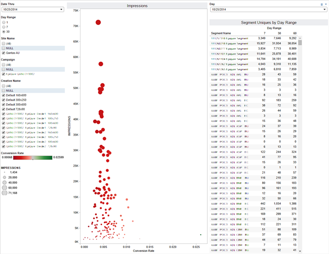

# Delivery and Performance Report

Returns segment-level data on impressions and click-through rates.

## Delivery and Performance Report {#concept_ED04A45759A6408D95222C7BE0EA301D}

Returns segment-level data on impressions and click-through rates.

<!-- c_delivery_reports.xml -->

The [!UICONTROL Delivery and Performance] report lets you evaluate how segments perform on different advertiser sites. As an optimization tool, this report helps you:

* Identify high-performance segments for re-use in other campaigns or on other sites. 
* Find and remove segments from underperforming sites. 
* Visually analyze segment impression size and click-through rates.

>[!NOTE]
>
>1-day views are updated daily. 7-day and 30-day look-back periods are updated weekly.

Select an individual point to view data details in a pop up window. Also, you can click and drag the cursor over a group of points to return data about those data elements only. These actions automatically update the report results. 

>[!MORE_LIKE_THIS]
>
>* [Improve Log File Processing Times with Lookup Tables](lookup-tables.md#concept_53C119A83E6F49D28451828C54CF4FC1)
>* [Filter Report Results With the Data Sliders](data-sliders.md#concept_00E60A0BDB274B07A1DD342EE5554C37)
>* [Delivery and Performance Data Pop Fields Defined](delivery-performance-report.md#reference_41E101D7320C465CBE04681C8FB28E0C)
>* [Shapes, Colors, and Sizes Used in Interactive Reports](interactive-report-technology.md#reference_25F1411379B34946B5AB8156A0F87626)

## Delivery and Performance Data Pop Fields Defined {#reference_41E101D7320C465CBE04681C8FB28E0C}

Describes the metrics displayed in the popup window when you click an individual data point. 

<!-- r_delivery_data_pop.xml -->

The popup for the [Delivery and Performance Report](../../reporting/dynamic-reports/delivery-performance-report.md#concept_ED04A45759A6408D95222C7BE0EA301D) report contains the following metrics:

|  Metric  | Description  |
|---|---|
|  **[!UICONTROL Date Range Start]** | Start date used by the report.  |
|  **[!UICONTROL Date Range End]** | End date used by the report.  |
|  **[!UICONTROL Segment ID]** | Unique numeric ID for that segment.  |
|  **[!UICONTROL Segment Name]** | Name of the segment.  |
|  **[!UICONTROL Clicks]** | Number of clicks recorded for that segment.  |
|  **[!UICONTROL Impressions]** | Number of impressions recorded for that segment.  |
|  **[!UICONTROL Reach]** | Number of unique visitors.  |
|  **[!UICONTROL Click Through]** | Number of times a visitor clicked on an ad.  |

>[!MORE_LIKE_THIS]
>
>* [Improve Log File Processing Times with Lookup Tables](lookup-tables.md#concept_53C119A83E6F49D28451828C54CF4FC1)
